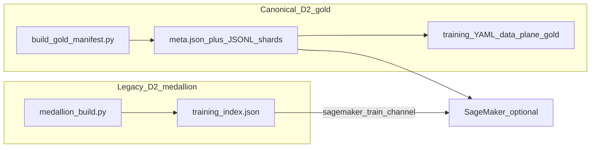
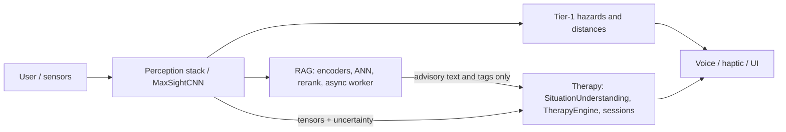

# MaxSight 3.0 - Removing Barriers for Vision & Hearing Disabilities

**Production-Grade Accessibility System** | **Multi-Task Deep Learning for Environmental Understanding**

**Last Updated**: 2026-05-30  
**Status**: Production-ready training and data pipeline. Use `python scripts/product/run.py` for canonical `train/validate/export/package/smoke/gate` (or call ops scripts directly under `scripts/ops/`). See **docs/status.md** and **docs/ops/production_remediation.md** for current contracts and remediation details.  
**Setup:** **[docs/DOWNLOAD_AND_START.md](docs/DOWNLOAD_AND_START.md)** (clone, install, data, simulator, train).

---

## Training and Runtime Contracts (2026-05)

Full reference: **[docs/ops/production_remediation.md](docs/ops/production_remediation.md)**

- **Local training:** Use `python scripts/product/run.py train --config <tier-yaml>` or `python scripts/ops/sagemaker_train.py --dry-run` for launcher validation before cloud execution.
- **SageMaker training:** `ml/training/sagemaker_entry.py` resolves `SM_CHANNEL_TRAIN` and `SM_CHANNEL_VAL` into `ResolvedTrainingConfig.data.*` paths and asserts both channels exist before launching.
- **Checkpoint contract:** Best checkpoint filename is `best_model.pt`. Saves use atomic writes (`write_atomic_torch`); corrupt resume files raise; missing files start fresh. Reproducibility manifest includes `checkpoint_hash` on best save.
- **Observability:** Each epoch emits `health_summary` logs with skipped-batch ratio. Structured events (`therapy.suppressed`, `rag.degraded`, `runtime.tier_resolved`) use JSON `event=` lines in `ml/training/observability.py`. CI validates schema via `scripts/infra/validate_train_loop_contracts.py`.
- **Runtime contracts:** `ml/runtime/contracts.py` — `RuntimeRequest`/`RuntimeResponse`, `ModelOutputContract`, `validate_model_outputs()`. JSON schema at `docs/contracts/schemas/model_output.json`.
- **Compute tiers:** Bronze/Silver/Gold routing via `ml/runtime/tier_router.py` and YAML under `ml/config/tiers/`.
- **Distributed training:** `ml/training/distributed.py` — DDP init, rank-0 checkpoint guard, FSDP wrapper (v2). Config section `distributed:` in tier YAML (`backend: none|ddp|fsdp`).
- **Training flags:** `training.use_compile` and `training.use_gradient_checkpointing` in `ResolvedTrainingConfig` / tier YAML (e.g. `ml/training/configs/t0_baseline.yaml`).
- **Personalization:** `app/personal_mode.py` — instantiate in session orchestration; call `update_preferences()` + `fuse_with_personalization()` per user.
- **Haptic backends:** `app/ui/haptic_feedback.py` → `app/ui/haptic_backends.py`. Set `MAXSIGHT_HAPTIC_BACKEND` to `auto`, `darwin`, `linux`, `log`, or `none`. Simulator uses `log` when `MAXSIGHT_ENABLE_HAPTICS_STUB=1`.
- **Model CI envelope:** ~393M params; bounds in `ml/runtime_constants.py` (`DEFAULT_MODEL_MAX_PARAMS`, `DEFAULT_MODEL_INT8_MAX_MB`).

### Quality baseline (Tier 1 production core)

Static analysis is **scoped by tier** — do not run `ruff .` or `mypy .` and expect meaningful gates. Tier 1 targets:

```
ml/therapy  ml/runtime  app/personal_mode.py
```

| Tier | Scope | Gate |
|------|--------|------|
| **1 — Production core** | `ml/therapy`, `ml/runtime`, `app/personal_mode.py` | Strict: 0 D-rated blocks, 0 mypy/ruff on scoped paths |
| **2 — Tools** | `tools/simulation/`, `scripts/infra/` | Moderate; high complexity expected |
| **3 — Research** | `scripts/research_archive/` | Excluded from mypy/ruff defaults |

**One-shot audit** (writes `docs/quality/baseline.json` and regression gate):

```bash
python scripts/infra/run_quality_audit.py
python scripts/product/run.py gate          # pre-SageMaker + train-loop + runtime contracts
pytest tests/test_therapy_safety.py tests/test_phase0_contracts.py tests/test_training_hardening.py -q
```

**Manual Tier 1 commands:**

```bash
mypy ml/therapy ml/runtime app/personal_mode.py --follow-imports=silent --ignore-missing-imports
ruff check ml/therapy ml/runtime app/personal_mode.py
radon cc ml/therapy ml/runtime app/personal_mode.py -s
xenon ml/therapy ml/runtime app/personal_mode.py --max-absolute B --max-average A --max-modules B 
```

CI: `.github/workflows/quality.yml`. Config: `pyproject.toml` (`pythonpath`, mypy excludes for Tier 3).

## Table of Contents

**Quick links:** [TB system governance (single source)](#tb-system-governance-single-source) · [Repository file index](#repository-file-index-complete-source-tree) · [Feature inventory](#complete-feature-inventory-at-a-glance) · [RAG mediation model](#rag-mediation-model-user-and-therapy-boundary) · [Roadmap & backlog](#roadmap-backlog--next-steps) · [Download & start](docs/DOWNLOAD_AND_START.md)

1. [Project Overview & Goals](#-project-overview--goals)
2. [Complete feature inventory (at a glance)](#complete-feature-inventory-at-a-glance)
3. [Therapy methods: training the senses](#therapy-methods-training-the-senses)
4. [RAG mediation model (user and therapy boundary)](#rag-mediation-model-user-and-therapy-boundary)
5. [Productization Summary (from reports)](#productization-summary-from-reports)
6. [Actions Taken - Complete Development History](#-actions-taken---complete-development-history)
7. [System Architecture - Deep Dive](#-system-architecture---deep-dive)
8. [Data Flow & Processing Pipeline](#-data-flow--processing-pipeline)
9. [Training Flow & Hyperparameter Strategy](#-training-flow--hyperparameter-strategy)
10. [Inference Flow & Real-Time Processing](#-inference-flow--real-time-processing)
11. [Effectiveness & Results](#-effectiveness--results)
12. [Repository Stack & Technology](#-repository-stack--technology)
13. [Roadmap, backlog & next steps](#roadmap-backlog--next-steps)
14. [Quick Start Guide](#-quick-start-guide)
15. [Main Components](#main-components) (includes [Component reference: what and why](#component-reference-what-each-does-and-why-its-there) and [Concrete reference: outputs, configs, env, CLI](#concrete-reference-outputs-configs-env-cli))
16. [Testing & Validation](#-testing--validation)
17. [Performance & Safety](#-performance--safety)
18. [Deployment & Export](#-deployment--export)
19. [Documentation](#-documentation)
20. [Repository file index (complete source tree)](#repository-file-index-complete-source-tree)

---

## TB system governance (single source)

Track **TB subgraph boundaries (L1–L9), AWS seam mapping, and gold vs medallion** here only. Do not add parallel governance markdown trees under `docs/` for the same rules; other docs may deep-link to this section.

### Meta (order and scope)

- Architectural truth is split across L1–L9. **Do not collapse layers** (e.g. no event semantics inside gold IR; no therapy policy inside the SageMaker estimator builder).
- Before edits: read **only** the subsection for the layer you touch. If a change crosses layers, read subsections **in order** L1 → L2 → L3/L4 → L5.
- Prefer **one subgraph per PR**; name tests or dry-runs you ran (e.g. `pytest tests/test_gold_manifest.py`, `python scripts/ops/sagemaker_train.py --dry-run`).

### L1 — Repo core (model + data + train + eval) — system prompt


- **Purpose:** Own `ml/models/*`, `ml/data/*` (including `ml/data/gold/*`), `ml/training/*`, `ml/evaluation/*`, and `ml/training/export.py`. Decide what the train loop may assume about batches and label spaces.
- **Hard boundaries:** Do **not** add boto3 or the SageMaker SDK under `ml/training/`, `ml/models/`, or `ml/data/`. Push AWS to `ml/infra/*` and `scripts/ops/*`. Do not embed **C1** event semantics or therapy copy policy into datasets or gold IR.
- **Layering:** Gold JSONL + `meta.json` is **Layer A** (fixed keys in `ml/data/gold/schema.py`). Collate and the model may emit **Layer B** fields (`distance`, `urgency`, …). Never require registry resolution inside meta-driven gold loading.
- **Contracts:** Training batches use **`images`** only (`ml/data/sample_contract.py`). With `data_plane=gold` and meta paths in YAML, the data plane is **gold meta + shards** only (`ml/training/run_config.py`, `ml/data/data_pipeline.py`). Keep `training.label_space`, model `num_classes`, and gold `class_map_hash` aligned.
- **Verification:** `pytest tests/test_gold_manifest.py`, `pytest tests/test_run_config_contract.py`, and a local training smoke after changing the train loop or metric log strings (they feed CloudWatch regexes in `ml/infra/sagemaker_utils.py`).

### L2 — Therapy + RAG (two runtime contracts)

- **Inference:** `ml/infra/inference_handler.py` may call `TherapyTaskIntegrator`; it must **not** import `ml/pipeline/sagemaker_entrypoint.py` or other offline-only mains.
- **Offline:** `ml/pipeline/pipeline_runner.py` and `sagemaker_entrypoint.py` serve Processing jobs—not the realtime inference contract.
- **RAG / retrieval:** Advisory-only; must not override hazard / urgency / distance authority (`docs/architecture.md`). No writes to gold shard schema from therapy or retrieval.

### L3 + L4 — Ops CLI and infra

**Important governing system**

- **L3:** `scripts/ops/*`, `scripts/product/*` — thin arg/env wrappers.
- **L4:** `ml/infra/*` — sessions, roles, `build_estimator`, `deploy_model`, S3 helpers, `model_registry.py`.
- **Boundaries:** Default **registry gate** on deploy (`scripts/ops/sagemaker_deploy.py`); `--skip-registry-check` is break-glass only. Role account check: `get_execution_role` / `MAXSIGHT_SKIP_ROLE_ASSERT` in `ml/infra/sagemaker_utils.py`.

### L5 — AWS cloud (repo touchpoints)

| TB / AWS concern | Repo location |
|------------------|----------------|
| Role + STS guard | `ml/infra/sagemaker_utils.py`, `infra/iam/sagemaker_execution_role.json` |
| Training job + DLC | `SMConfig`, `build_estimator` |
| VPC train / infer | `SM_SUBNET_IDS`, `SM_SECURITY_GROUP_IDS` → `build_estimator` / `deploy_model` |
| Volume KMS | `SM_VOLUME_KMS_KEY_ID` → `build_estimator` |
| S3 layout + encryption + lifecycle | [`infra/README.md`](infra/README.md), `infra/s3/bucket_lifecycle_example.json` |
| Input channels | `build_data_channels` — align S3 URIs with gold YAML + ops uploads |
| CW metric regex | `TRAINING_METRIC_DEFINITIONS` ↔ `ml/training/train_loop.py` log strings |
| CW alarm examples | `infra/cloudwatch/README.md` |
| Debugger (optional) | `_optional_debugger_hook` in `build_estimator` |
| Model package group | `MAXSIGHT_MODEL_PACKAGE_GROUP` → `ModelRegistry` → `PendingManualApproval` |
| Deploy registry gate | `sagemaker_deploy.py` (`--skip-registry-check` **forbidden** when `MAXSIGHT_ENV=production`) |
| Endpoint / batch / processing | `deploy_model`, `sagemaker_deploy.py`, `sagemaker_processing_submit.py` |
| Pre-integration gate | [`docs/ops/pre_integration_checklist.md`](docs/ops/pre_integration_checklist.md), `scripts/infra/validate_infra_stubs.py` |
| One-account runbook | [`docs/ops/aws_runbook.md`](docs/ops/aws_runbook.md) |

Org-specific knobs (FSx channel wiring, extra alarms) stay in your account runbook; record env names in [`infra/README.md`](infra/README.md) when you add them.

### L6–L9 — Edge, simulator, infra docs

- **L6–L7:** Post-train export / on-device stack are **downstream seams**; they must not change L1 gold IR or batch keys without an explicit L1 review.
- **L8:** `tools/simulation/*`, `ml/runtime/mode.py`, tests—parallel to cloud inference; keep payload and error shapes aligned with production where practical.
- **L9:** `infra/*.json` stubs and `docs/productization/*` are scope and gates, not runtime imports for training.

### Training data plane: gold JSONL + meta vs medallion index (D2)

| Path | Role |
|------|------|
| **Canonical (new pipelines, SageMaker-friendly)** | Sharded **JSONL + `meta.json`** from `scripts/ops/build_gold_manifest.py`; `training.data.data_plane: gold` and meta URIs in tier YAML; `ml/data/gold/*`. Meta-driven runs can be **registry-free** at runtime. |
| **Legacy (medallion D2)** | `datasets/medallion/gold/training_index.json` from `medallion_build.py` — path index for older local flows and `sagemaker_train.py` gold channel upload. Prefer gold JSONL + meta for new L3/L5 pipelines. |



---


## Project Overview & Goals

### Primary Mission

MaxSight 3.0 is a accessibility application that helps users with vision and hearing disabilities navigate and understand their environment through advanced computer vision and multimodal feedback. The system removes barriers by providing the same rich environmental information that sighted people process automatically. Trying to increase the awareness of the user and better understanding.

### Starting question

**"What are ways that those who cannot see or hear be able to interact with the world like those who can?"**

MaxSight answers this by implementing four barrier-removal methods from accessibility research:

1. **Environmental Structuring**: Labels surroundings in ways users can understand
2. **Clear Multimodal Communication**: Visual, audio, and haptic feedback
3. **Skill Development Across Senses**: Addresses different senses for information input
4. **Routine Workflow**: Adapts tasks to usage patterns and needs

### What Makes MaxSight Different

**Standard object detectors** answer: "What is this?" and "Where is it?"

**MaxSight 3.0** answers:
- **WHAT**: Object class (door, stairs, vehicle, person) - 91 COCO classes + 200+ accessibility classes
- **WHERE**: Precise bounding box position (for directional cues)
- **HOW FAR**: Distance zones (near/medium/far) + precise depth estimation
- **HOW URGENT**: Urgency level (safe/caution/warning/danger) for safety
- **HOW FINDABLE**: Object findability scores (for users with low vision)
- **SCENE CONTEXT**: Natural language scene descriptions
- **ACCESSIBILITY METRICS**: Contrast sensitivity, glare risk, navigation difficulty
- **TEMPORAL AWARENESS**: Motion tracking, predictive alerts, temporal consistency
- **PERSONALIZATION**: User-specific adaptations and preferences
- **THERAPY STATE**: Fatigue detection, depth/focus, contrast mapping

### Project Goals

#### Short-Term Goals (Completed)
-  Complete architecture implementation (Phases 0-9)
-  Full test suite green (250+ collected tests; run `pytest tests/` for the current count)
-  Training infrastructure ready
-  Data pipeline established
-  Hyperparameter configurations for all tiers

#### Medium-Term Goals (In Progress)
-  Data gathering script and train/val/test splits (see [Requirements before training](#requirements-before-training))
-  Full training runs (T0 baseline; use cloud GPU for production scale)
-  Performance benchmarking (see `ml/training/benchmark.py` and `pytest tests/`)
-  Model export (JIT/ONNX/CoreML; see `python -m ml.training.export --help`)

#### Long-Term Goals
-  Production training (all tiers T0-T5)
-  Transfer learning (T2 → T5)
-  Mobile deployment (iOS CoreML)
-  Real-world testing with users
-  Performance optimization
-  Accessibility certification

### Model Statistics

- **Parameters**: ~250M (comprehensive class system, T2 tier baseline); T0 ~29M, T5 ~320M.
- **Input**: `images` `[B, 3, 224, 224]` RGB (normalized with ImageNet mean/std); optional `audio_features` `[B, 128]` (e.g. MFCC); optional `condition_mode` string (e.g. `'glaucoma'`, `'amd'`, `'cataracts'`).
- **Output**: Single dict with 30+ keys. Core keys: `obj_scores` `[B, H*W]`, `cls_logits` `[B, H*W, num_classes]`, `box_preds` `[B, H*W, 4]`, `urgency` (per detection or scene), `distance` zones, `contrast_map`, `motion_flow`, `motion_magnitude`, `fatigue_score`, `blink_rate`, `fixation_stability`, `depth_map`, `uncertainty`, `therapy_state` (if provided by pipeline), `contrast_map`, `edge_map`, `roi_utility`, `navigation_difficulty`, `glare_risk_level`, `object_findability`, `uncertainty_score`, `hazard_probs`, `time_to_hazard`, `recommended_action`, plus scene/OCR/scene graph when enabled. Exact keys depend on tier and `enable_accessibility_features`.
- **Stage A Latency**: **≤ 80 ms** target (ResNet50+FPN only). Decision point: skip Stage B if Stage A &gt; 80 ms or `uncertainty_score` &gt; 0.7 (thresholds in tier/config). See `ml/runtime_constants.py` (LATENCY_MEDIAN_MS, LATENCY_P95_MS).
- **Stage B Latency**: &lt;500ms (opportunistic, tier-dependent).
- **Supported Classes**: 91 COCO + 200+ accessibility classes; class IDs and names in `COCO_CLASSES_DICT` / category list used by dataset and detection head.
- **Vision Conditions**: 13 supported (e.g. refractive errors, cataracts, glaucoma, AMD, diabetic_retinopathy, retinitis_pigmentosa, color_blindness, CVI, amblyopia, strabismus); condition affects `ml/utils/preprocessing.py` and optional dynamic conv.
- **Task Heads**: 30+ specialized heads; each head is a `nn.Module` with a `forward()` taking shared features (and sometimes dedicated inputs like `eye_features`). Built in `ml/models/maxsight_cnn.py` when tier and `enable_accessibility_features` allow.
- **Export Formats**: JIT (`.pt`), CoreML (`.mlpackage`), ONNX, ExecuTorch (`.pte`). Export stubs `global_encoder` (CLIP) and can disable scene graph for traceability; see `ml/training/export.py`.

---

## Complete feature inventory (at a glance)

This is the **master checklist** of what the repo implements today. Deep module tables live under [System architecture: every feature](#system-architecture-every-feature); therapy stack detail is in [Therapy methods](#therapy-methods-training-the-senses) and **docs/therapy_system.md** / **docs/therapy_architecture.md**.

### Perception, safety, and outputs

- **Two-stage inference**: Stage A (ResNet50+FPN, ≤80 ms target) for objectness, class, boxes, distance zones, urgency, uncertainty; optional Stage B skip on latency/uncertainty (`ml/models/maxsight_cnn.py`, `ml/runtime_constants.py`).
- **Progressive tiers T0–T5**: Baseline → attention → hybrid ViT → cross-task → cross-modal (audio) → temporal (ConvLSTM / TimeSformer on Stage A feature sequences).
- **30+ task heads**: Detection stack, contrast/edge, motion, depth, fatigue & therapy state, ROI/findability, navigation difficulty, glare, predictive alerts, OCR/text, scene description, scene graph, sound events, personalization, color when enabled.
- **Thirteen vision condition modes**: Simulated preprocessing per condition (`ml/utils/preprocessing.py`); optional dynamic conv and condition strings on forward.
- **MVP runtime contract**: `ModelOutputContract` + `validate_model_outputs()` in `ml/runtime/contracts.py` (sources `MVP_MODEL_OUTPUT_KEYS` from `ml/runtime_constants.py`). Prefer this over direct `filter_mvp_model_outputs()` in app paths.
- **Output scheduling**: `CrossModalScheduler` merges voice/haptic/visual with caps, cooldowns, and critical-urgency priority (`ml/utils/output_scheduler.py`).

### Temporal, video, and data production

- **Sequence batches**: `collate_fn` can emit `images` `[B, T, C, H, W]` and `frame_lengths` for variable-length clips (`ml/data/data_pipeline.py`).
- **Video / pseudo-panoptic utilities**: Fixed-stride windows, **adaptive temporal windows** from motion scores (`AdaptiveTemporalConfig`, `build_adaptive_windows`, `motion_to_temporal_window`), segment pruning, multi-frame IoU association (`ml/data/video_panoptic.py`).
- **Chunked video preprocessor**: `VideoPanopticPreprocessor` + `PanopticSegmenter` + `PreprocessingConfig` for offline or pipeline-style segmentation hooks (`ml/data/video_preprocessing.py`).
- **Panoptic COCO path**: `segments_info` → boxes, distance zones, urgency from semantic fields (`ml/data/dataset.py`).
- **Augmentation & splits**: Advanced augments, COCO split helpers, optional accessibility-oriented dataset modules (see `ml/data/`).

### Training, balancing, and export

- **Training loop**: Resume, EMA, AMP, checkpointing, validation metrics (`ml/training/train_loop.py`).
- **Multi-task losses**: `MultiHeadLoss` with configurable weights; **temporal weight schedules** (`ml/training/loss_weighting.py`, `ml/training/losses.py`).
- **GradNorm** and task balancing (`ml/training/task_balancing.py`).
- **Transfer T2 → T5**: `TierTransferManager`, configs under `ml/training/configs/t2_to_t5_transfer.yaml`; product command `run.py transfer`.
- **Self-supervised & continual hooks**: MAE/SimCLR-style paths, distillation, EWC (see training package and phase docs).
- **Quantization & mobile optimizations**: INT8 path, pruning helpers (`ml/training/quantization.py`, `ml/optimization/`).
- **Export**: JIT, CoreML, ONNX, ExecuTorch; packaging via `run.py package` / ops scripts (`ml/training/export.py`).

### Retrieval (RAG-style), advisory-only

- **Encoders + two-stage retrieval**: ANN then rerank; async worker so the critical path never waits (`ml/retrieval/`).
- **Contract**: Retrieval does **not** change hazard/urgency/distance; scene-description conditioning on retrieval chunks is plumbing-first (decoder may not yet consume retrieval memory—treat as enrichment path only).

### Therapy (two complementary layers)

- **Session-based sense training**: `SessionManager`, `TaskGenerator`, `TherapyTaskIntegrator`—logged tasks driven by contrast, motion, depth, gaze, ROI, fatigue rest, hazard-cue recognition (`ml/therapy/`).
- **Closed-loop behavioral layer**: `TherapyEngine`—situation understanding → decision → intervention → scheduler → inferred user response → evaluation → adaptation → memory (see expanded section below and **docs/therapy_architecture.md**).

### Simulation, validation, and cloud entrypoints

- **Web simulator (Flask)**: Multi-user sessions, rolling **temporal window** for T5 (`temporal_window_frames`, stride, max window in `tools/simulation/config.py`), inference engine, overlays, Patient/Clinician/Dev modes.
- **Input hardening**: `validate_frames_data`—frame count cap, aggregate base64 payload cap, strict decoding (`tools/simulation/validators.py`); config keys `max_frames_data_count`, `max_frames_payload_mb`.
- **Therapy perception enrichment in sim**: Rolling `temporal_consistency` history → `flicker_risk`, `temporal_reliability`; low reliability can suppress **low-priority** therapy prompts (`therapy_temporal_reliability_floor`, `therapy_temporal_history`); `therapy_feedback` exposes `temporal_support_signals` for debugging/contracts (`tools/simulation/web_simulator.py`).
- **SageMaker-oriented pipeline modules**: Hyperparameter/env-aware config, advisory RAG helper, training-style entrypoint surface (`ml/pipeline/sagemaker_config.py`, `rag_advisory.py`, `sagemaker_entrypoint.py`)—for packaging jobs consistently with the rest of `ml/`.

### Product, safety, and governance

- **Canonical CLI**: `python scripts/product/run.py` → `train`, `validate`, `export`, `package`, `smoke`, `transfer`.
- **Productization docs**: Scope/claims, mandatory safety gates (recall, false-safe, latency, directional/distance accuracy), runtime boundary spec, pilot protocol, production runbook (`docs/productization/`).
- **Benchmarks**: `python -m ml.training.benchmark` for inference timing experiments.

### What is explicitly out of scope or incomplete (still “features we want”—see roadmap)

- End-to-end **video dataset loader** emitting temporal supervision targets (IoU track proxy, flicker/consistency labels) wired into the main training entrypoint is **in progress**; utilities exist ahead of full wiring.
- **SageMaker**: use `scripts/ops/sagemaker_train.py` and `scripts/ops/sagemaker_processing_submit.py` with your bucket, role, and data channels (`ml/infra/sagemaker_utils.py`).
- On-device **CoreML** may not expose every modality (e.g. audio/temporal)—see **docs/status.md**.

---

## Therapy methods: training the senses

MaxSight includes a **therapy system** that uses structured exercises to train and sharpen the senses users rely on for environmental awareness. It supports one of the four barrier-removal methods from the overview: **skill development across senses**. Sessions are managed so users can practice contrast, motion, depth, gaze, and spatial attention with adaptive difficulty and rest when needed.

### Senses and skills trained

| Sense / skill | What it trains | Model signals used |
|--------------|----------------|--------------------|
| **Contrast** | Detecting edges and objects at different contrast levels | Contrast head → `contrast_map`, `edge_map` |
| **Motion** | Tracking moving objects and flow in the scene | Motion head → `motion_flow`, `motion_magnitude` |
| **Depth** | Judging near / medium / far and focus shifts | Therapy state head → `depth_map`, `zones`, `uncertainty` |
| **Gaze / fixation** | Stable focus and reducing drift | Therapy state head → `fixation_stability`, `blink_rate` |
| **Spatial / ROI** | Finding and prioritizing important regions | ROI priority head → `roi_utility`; scene description for context |
| **Fatigue awareness** | Pacing and rest so practice stays effective | Therapy state head → `fatigue_score`; triggers **FATIGUE_REST** when high |

Therapy tasks consume these model outputs (e.g. contrast maps, depth, motion) so exercises are driven by the same perception pipeline used for real-world assistance.

### Core therapy task types

**From TaskGenerator** (`ml/therapy/task_generator.py`) — adaptive, sense-focused tasks:

- **CONTRAST_MICRO** — Edge finding and low-contrast object detection.
- **MOTION_TRACKING** — Following motion and flow in the scene.
- **DEPTH_SHIFT** — Shifting focus near → far → near; depth zones and uncertainty.
- **GAZE_STABILIZATION** — Holding stable fixation; uses fixation_stability and gaze-related signals.
- **ROI_FINDABILITY** — Locating and attending to high-priority regions (roi_utility).
- **FATIGUE_REST** — Pause when `fatigue_score` &gt; 0.7; no new sense training until rest.

**From TherapyTaskIntegrator** (`ml/therapy/therapy_integration.py`) — scene- and hazard-aware tasks:

- **ATTENTION_TRAINING** — Focus on specific objects in the scene (from detections and scene description).
- **CONTRAST_RECOGNITION** — Identify objects or regions by contrast level.
- **EDGE_DETECTION** — Identify edges and boundaries (uses edge_map and contrast).
- **SPATIAL_AWARENESS** — Understand spatial relationships (left/right, in front, etc.).
- **WARNING_RECOGNITION** — Learn to associate audio/haptic cues with hazard types so alerts become meaningful over time.

TaskGenerator chooses the next task (including FATIGUE_REST) from recent performance and fatigue; TherapyTaskIntegrator builds concrete task configs from the current scene and detections.

### Sessions and adaptive difficulty

- **SessionManager** (`ml/therapy/session_manager.py`) starts a session, logs each task attempt (task type, config, success/failure, reaction time), and can save/load session state (e.g. to JSON). At session end it can produce a report with a skill curve and summary.
- **TaskGenerator** adjusts difficulty from user **uncertainty** and **fatigue_score**: higher uncertainty lowers difficulty; fatigue above a threshold forces a rest task. Duration, highlight strength, and target speed are set per task from the chosen difficulty.
- **TherapyTaskIntegrator** creates tasks from live scene data (detections, scene description, hazard type/urgency) so practice matches real-world cues (e.g. warning recognition for the hazards the user will hear in the app).

Together, these components turn model outputs into **structured, logged therapy sessions** that train contrast, motion, depth, gaze, spatial attention, and hazard-cue recognition. Full module and data-flow detail: **[docs/therapy_system.md](docs/therapy_system.md)**.

**Closed-loop therapy engine:** MaxSight also implements a **decision + adaptation** therapy subsystem (not just another neural network): **Situation Understanding** → **Therapy Decision Engine** → **Intervention Generator** → **Output Scheduler** → **User Response** → **Response Evaluation** → **Adaptation Engine** → **Therapy Memory**. Entry point: **`ml.therapy.TherapyEngine`** (`update(perception)` returns therapeutic actions; `on_user_response(perception_after)` closes the loop). Safety: max prompts/min, min gap, suppress when uncertainty &gt; 0.7, no medical language. See **[docs/therapy_architecture.md](docs/therapy_architecture.md)**.

### Therapy methods in depth (how the two layers fit together)

**Layer A — Structured skill training (exercise sessions).** Goal: repeatable drills that use the **same tensors** the user relies on outdoors. `TaskGenerator` picks the next exercise from **uncertainty**, **fatigue_score**, and recent performance; it emits difficulty knobs (duration, highlight strength, target speed). `TherapyTaskIntegrator` binds drills to **live scene structure**: detections, scene text, hazard type/urgency so drills like **WARNING_RECOGNITION** match real alert patterns. `SessionManager` records attempts, reaction time, and outcomes so difficulty and reporting stay evidence-based. This layer is ideal for **clinician-led or self-paced practice** with clear start/stop and exportable session JSON.

**Layer B — Closed-loop support (in-the-moment coaching).** Goal: **low-frequency**, **non-intrusive** prompts when the situation model says they help. `SituationUnderstanding` maps perception (objects, motion, crowd/noise proxies, navigation complexity, uncertainty) into **stress / cognitive load / task difficulty** estimates—deterministic rules, no extra NN required. `TherapyDecisionEngine` asks: intervene now? which family? how strong? Rules enforce **never competing with hazard alerts** and respect rate limits. `InterventionGenerator` turns a decision into a `TherapeuticAction`: channel (audio/haptic/visual placeholder), text, intensity, duration, priority—**supportive wording only** (no diagnosis or treatment claims). The user’s “response” is **inferred** from the next perception snapshot (e.g. stress proxy down, movement stabilized) via `ResponseEvaluation`; `AdaptationEngine` and **therapy memory** bias future decisions toward interventions that worked. **`TherapyEngine`** is the façade: call `update(perception)` each tick; after a short delay, `on_user_response(perception_after)` closes the loop.

**Delivery and safety (shared).** All spoken/haptic therapy competes with navigation and hazard output through **`CrossModalScheduler`**. Constants in **`ml/runtime_constants.py`** cap therapy prompts per minute, enforce minimum gaps, and **suppress therapy when perception uncertainty is high** so we do not coach confidently on garbage inputs. The **web simulator** adds **temporal reliability**: it tracks `temporal_consistency` over a short history, derives **flicker_risk** and **temporal_reliability**, and can hold back **low-priority** therapy when the stream is unstable—mirroring how a wearable should behave when the model’s temporal branch is inconsistent frame-to-frame.

**When to use which layer in product.** Use **Layer A** for scheduled training, onboarding, and measurable skill progress. Use **Layer B** for ambient reassurance and attention regulation when the situation engine fires sparingly. Both remain **assistive**; neither replaces orientation & mobility training or clinical care.

---

## RAG mediation model (user and therapy boundary)

Retrieval-augmented generation here means **retrieval + advisory policy**, not a second safety brain. RAG is the **mediation layer between stable perception signals and therapy wording/intensity**: it adds *external and historical context* so therapy and scene language feel grounded, while **hazards stay on the Tier-1 path** that never waits on retrieval.

### Data flow (strict roles)



- **Tier-1 path:** `P → T1 → OUT` is **not** gated on RAG completion. Retrieval may lag or fail; alerts still fire.
- **Therapy path:** `P` supplies fatigue, motion, uncertainty, scene structure. **RAG** supplies optional **similar-scene notes, playbook snippets, or policy hints** that only affect *how* supportive copy is framed or *which* low-priority drill is suggested—bounded by `CrossModalScheduler` and `ml/runtime_constants.py` therapy caps.
- **Stability coupling:** Low **temporal reliability** (simulator and video pipeline) downgrades advisory confidence; **`ml/pipeline/rag_advisory.py`** exposes `generate_therapy_advisory(...)` so jobs and services map **clip manifest + temporal_reliability + optional retriever** to an **advisory guidance label** (`advisory_only_unstable_perception`, `therapy_prompt_high_confidence`, etc.) without touching hazard logits.

### Hard invariants (non-negotiable)

1. RAG **must not** change objectness, classification, boxes, urgency, or distance used for safety.
2. RAG **must not** override `TherapyEngine` rules that suppress therapy under high uncertainty or rate limits.
3. Therapy **must not** treat retrieval hits as ground truth for obstacles; they are **hints** for language and coaching only.
4. Production retrieval stays **async** (`ml/retrieval/retrieval/async_retrieval.py`); the user-facing thread never blocks on index I/O.

### Code map

| Piece | Location | Role |
|-------|-----------|------|
| Advisory therapy helper | `ml/pipeline/rag_advisory.py` | `generate_therapy_advisory`, `AdvisoryRetriever` protocol |
| Full retrieval stack | `ml/retrieval/` | Encoders, stage1 ANN, stage2 rerank, async worker |
| Simulator hook (optional index) | `tools/simulation/retrieval_integration.py` | FAISS-backed similar-scene path for dev |
| Scene description (future RAG memory) | `ml/models/heads/scene_description_head.py` | Decoder conditioning on retrieval is planned; tensor path remains authoritative today |

For install and data before you run any of this, use **[docs/DOWNLOAD_AND_START.md](docs/DOWNLOAD_AND_START.md)**.

---

## Production runtime contracts (what runs, what can’t block, and why therapy/RAG stay safe)

MaxSight is designed around a strict **authority model**:

1. **Safety-critical path (never blocked)**: hazard-aware outputs (hazard/urgency/direction/distance) must always be produced within the critical latency budget, even when enhancement systems degrade.
2. **Secondary path (opportunistic)**: OCR, scene summaries, and other context can be reduced or skipped under load.
3. **Advisory-only enhancement (RAG-style retrieval)**: retrieval never drives safety decisions and never replaces hazard logic.
4. **Therapy as a behavioral controller**: therapy is layered on top of perception and context, with explicit guardrails so it remains supportive and non-intrusive.

### Feature-by-feature runtime authority (production contract)

| Feature / output | Primary module(s) | Purpose | Authority | Can retrieval (RAG) change it? | Therapy usage |
|---|---|---|---|---|---|
| Hazard detection + urgency | `ml/models/maxsight_cnn.py` (Stage A core heads) | Safety-critical awareness | Critical | No | Therapy only as context (never as safety logic) |
| Distance zones / precise distances | Stage A heads | Near / medium / far + distance cues | Critical | No | Therapy context (e.g., “near focus” drills) |
| Directional cues | Postprocess + scheduler inputs | Left/center/right guidance | Critical | No | Context only |
| Objectness + class logits + boxes | Stage A heads | “What is it?” + where | Critical for hazards, Secondary otherwise | No | Optional for therapy drills (findability/attention) |
| OCR/text regions | OCR head + postprocess | Read signs/labels on demand | Secondary | Indirect only | Therapy can use OCR content for attention drills |
| Scene description | `SceneDescriptionHead` | Natural language scene summary | Secondary | Advisory context only | Context only |
| Scene graph (relations) | `SceneGraphEncoder` | Spatial/semantic relation structure | Secondary | Advisory only | Context only |
| Motion (flow + magnitude) | Motion head + temporal encoder (T5) | Temporal awareness & stability | Secondary | Advisory only | Direct therapy signal for motion/focus tasks |
| Therapy state (fatigue + depth/contrast zones) | `TherapyStateHead` | User sensory/cognitive state proxies | Secondary (controller input) | No | Direct therapy input (closed-loop controller) |
| Contrast map + edge map | `ContrastMapHead` / therapy branches | Contrast sensitivity training | Secondary | No | Direct therapy input (contrast drills) |
| Gaze/fixation proxies | `FatigueHead` / therapy state head | Fixation stability and fatigue | Secondary | No | Direct therapy input |
| ROI utility + navigation difficulty | `ROIPriorityHead` / heads | Prioritize regions and estimate complexity | Secondary | Advisory only | Direct context for attention/finding drills |
| Predictive alerts | Predictive head | Advisory hazard anticipation | Secondary | No | Context only |
| Retrieval outputs (ANN → rerank → async results) | `ml/retrieval/*` | Similar-scene knowledge augmentation | Advisory-only | Self-contained | Not allowed to change therapy safety decisions; used for context enrichment only |

### RAG-style retrieval (async, advisory, non-blocking)

MaxSight implements a **retrieval subsystem** that follows a RAG-style architecture, optimized for wearable constraints:

- **Encoding**: embeddings from `ml/retrieval/encoders/` (global/patch/region + optional OCR/depth/audio encoders).
- **Stage 1 (ANN)**: fast approximate search (`ml/retrieval/retrieval/stage1_ann.py`) to get candidates.
- **Stage 2 (rerank)**: candidate reranking (`ml/retrieval/retrieval/stage2_rerank.py`).
- **Async execution**: non-blocking worker (`ml/retrieval/retrieval/async_retrieval.py`) so retrieval never delays safety-critical outputs.
- **Knowledge augmentation**: optional GNN-based augmentation (`ml/retrieval/retrieval/knowledge_augment.py`).

**Non-blocking guarantee**: retrieval runs on a secondary path and is skipped under critical budget pressure.  
**Advisory-only guarantee**: retrieval is forbidden from changing hazard detection/urgency/distance correctness.  
**Current wiring note**: the model requests `retrieval_results` asynchronously during scene-description generation, but the current `SceneDescriptionHead` builds its decoder inputs from `global_embedding` + `region_embeddings` (and OCR embeddings if enabled); it does not currently consume retrieval results as conditioned decoder memory. Treat retrieval outputs as context enrichment plumbing until direct decoder conditioning is wired.

### Panoptic + video meaning contract (data → model → therapy)

Quantization, temporal training, and therapy effectiveness all depend on training/inference seeing the **same semantic meaning** as the real world:

- **Panoptic meaning (objects + supervision)**: `ml/data/dataset.py` parses COCO-style panoptic annotations via `segments_info`, converts each segment bbox into normalized boxes, and derives **distance zones** and **urgency** via **`ml/data/assistive_supervision.py`** (same rule as gold builders and `generate_annotations`).
- **Video/sequence meaning (temporal stability)**: `ml/data/data_pipeline.py` supports sequence-aware batching by padding variable-length `frames` into `[B, T, C, H, W]` (with `frame_lengths`). This is the tensor contract expected by T5 temporal reasoning.

For wearable deployment, calibration batches for INT8 must be drawn from the same panoptic/video distributions (and the same `condition_mode`) so activation ranges reflect real meaning rather than synthetic noise.

### Production video utilities and SageMaker-facing modules

- **`ml/data/video_panoptic.py`**: Builds **fixed-stride** or **motion-adaptive** clip windows, prunes low-quality pseudo-panoptic segments, and associates segment tracks across frames with **multi-frame IoU** (proxy tracks for temporal consistency work).
- **`ml/data/video_preprocessing.py`**: `VideoPanopticPreprocessor` runs segmentation (pluggable) over chunks of frames for **pseudo-panoptic** generation or QA—not a replacement for ground-truth panoptic labels, but a production-shaped hook for scaling video pipelines.
- **`ml/pipeline/`**: **`sagemaker_config.py`** reads SageMaker-style environment/hyperparameters; **`rag_advisory.py`** keeps retrieval **advisory**; **`sagemaker_entrypoint.py`** runs the processing pipeline. Submit jobs with **`scripts/ops/sagemaker_processing_submit.py`** (Processing) or train via **`scripts/ops/sagemaker_train.py`** (Training).

---

## Productization Summary (from reports)

This section consolidates the important information from **docs/productization/** so release, safety, and product decisions are visible in one place. Full detail remains in the linked docs.

### Intended use and scope (V1)

MaxSight is an **assistive smart-glasses system** that helps visually impaired users understand nearby hazards, orientation cues, and everyday context through **spoken and haptic guidance**. V1 focus: safety-critical awareness (hazards, obstacle proximity, directional cues), daily independence (text reading, finding objects/signs, route cues), and low-verbosity situational summaries. **Explicit non-claims**: MaxSight is assistive guidance, not autonomous navigation; users should not rely on it as their only mobility safety aid; it does not provide medical diagnosis or treatment advice. See **docs/productization/01_product_scope_and_claims.md**.

### Mandatory safety gates (V1 release blockers)

All mandatory gates must pass before release. Failure on any blocks release.

| Gate ID | Metric | Threshold | Blocker if failed |
|--------|--------|-----------|--------------------|
| SG-01 | Hazard recall (critical hazards) | ≥ 0.95 | Yes |
| SG-02 | False-safe rate | ≤ 0.01 | Yes |
| SG-03 | Time-to-alert p95 | ≤ 80 ms | Yes |
| SG-04 | Time-to-alert median | ≤ 80 ms | Yes |
| SG-05 | Directional cue correctness | ≥ 0.90 | Yes |
| SG-06 | Distance zone accuracy (near/medium/far) | ≥ 0.85 | Yes |
| SG-07 | Critical hazards still surfaced under uncertainty | 100% | Yes |
| SG-08 | Overload guardrail (alerts/min in dense scenes) | ≤ 12 avg unless emergency | Yes |

Critical hazards include moving vehicles in crossing context, immediate collision obstacles, curb/drop-off hazards. **Release decision**: run gate suite → signed gate report → block on any failed mandatory gate; approve only with **safety owner sign-off**. See **docs/productization/02_safety_first_release_gates.md**.

### Canonical commands (product pipeline)

Use **`python scripts/product/run.py`** for the canonical surface. All paths from repo root.

| Command | Purpose | How to run |
|--------|---------|------------|
| **train** | Train production model | `run.py train --data-dir <path> [--config <yaml>]` |
| **validate** | Tests + optional checkpoint/data checks | `run.py validate [--checkpoint <path>] [--skip-export-tests]` |
| **export** | Checkpoint → CoreML/JIT/ONNX | `run.py export --checkpoint <path> --format coreml --output <path>` |
| **package** | Deployment bundle (model + config) | `run.py package --checkpoint <path> --output <dir>` |
| **smoke** | Short training + inference sanity | `run.py smoke [--epochs 2]` |
| **transfer** | T2 → T5 weight transfer | `run.py transfer --source <T2_ckpt> [--config ml/training/configs/t2_to_t5_transfer.yaml]` |

### T2 → T5 path (T5 MVP)

1. **T2 source**: Train with config that disables temporal/cross-task: `run.py train --data-dir <path> --config ml/training/configs/t2_hybrid_vit.yaml --train-annotation ... --val-annotation ...`. Checkpoint → `checkpoints/t2_hybrid_vit/`.
2. **Transfer**: `run.py transfer --source checkpoints/t2_hybrid_vit/best_model.pth --config ml/training/configs/t2_to_t5_transfer.yaml`. Writes e.g. `checkpoints/t5_temporal_transfer/t5_from_t2_init.pt`.
3. **T5 fine-tune**: `run.py train --data-dir <path> --resume-from checkpoints/t5_temporal_transfer/t5_from_t2_init.pt ...` (optionally with video/sequence data).

### MVP runtime contract (shipped app)

The shipped T5 MVP must depend only on **MVP output keys** in `ml.runtime_constants.MVP_MODEL_OUTPUT_KEYS` (classifications, boxes, objectness, text_regions, urgency_scores, distance_zones, precise_distances, uncertainty, temporal_consistency, etc.). The app should use **`ml.runtime_constants.filter_mvp_model_outputs(outputs, training=False)`** in the production inference path. Export/package use the full model; filtering is applied at runtime.

### Runtime boundaries and pilot

- **Critical path**: hazard detection, urgency, direction, distance, alert scheduling; always runs, never blocked by enhancement features.
- **Secondary path**: OCR, scene summaries, retrieval; never blocks critical path.
- **Pilot validation**: real-world scenarios, KPIs, and review loop are in **docs/productization/05_pilot_validation_protocol.md**. Deployment: train → export to CoreML → package bundle → integrate into glasses app → run pilot per protocol.

### Where the full reports live

| Doc | Content |
|-----|---------|
| **01_product_scope_and_claims.md** | Product boundaries, claims matrix, non-claims |
| **02_safety_first_release_gates.md** | Full gate definitions, evidence artifacts, roles |
| **03_pipeline_declutter_map.md** | Script consolidation and canonical surface |
| **04_runtime_boundary_spec.md** | Critical vs secondary contract, degraded modes |
| **05_pilot_validation_protocol.md** | Pilot scenarios, metrics, incident classification |
| **PRODUCTION_RUNBOOK.md** | Step-by-step production and deployment |

---

## Actions Taken - Complete Development History

### Phase 0: Backbone Networks 

**Actions**:
- Implemented ResNet50+FPN backbone for Stage A (safety-critical)
- Implemented Hybrid CNN-ViT backbone for Stage B (context enhancement)
- Implemented Vision Transformer components
- Implemented Dynamic Convolution for adaptive processing
- Created backbone abstraction layer

**Results**:
- Stage A backbone: ResNet50+FPN (always used, ≤ 80 ms target)
- Stage B backbone: Hybrid CNN-ViT (T2+), Temporal (T5+)
- Multi-scale feature extraction via FPN
- Support for progressive tier enablement

**Impact**: Foundation for two-stage inference pipeline established.

### Phase 1: Multimodal Fusion 

**Actions**:
- Implemented audio-visual fusion with attention mechanisms
- Created cross-modal attention layers
- Implemented haptic feedback integration
- Created fusion abstraction for multiple modalities

**Results**:
- Audio features integrated: `[B, 128]` MFCC features
- Cross-modal attention enables audio-aware detection
- Fusion layer supports multiple input modalities

**Impact**: System can process both visual and audio information simultaneously.

### Phase 2: Task Heads 

**Actions**:
- Implemented 30+ specialized task heads organized by criticality tiers
- Created Tier 1 heads: Objectness, Classification, Box Regression, Distance, Urgency, Uncertainty
- Created Tier 2 heads: Motion, Therapy State, ROI Priority, Navigation Difficulty, Findability
- Created Tier 3 heads: Scene Description, OCR, Scene Graph, Sound Events, Personalization, Predictive Alerts
- Implemented condition-specific adaptations for 13 vision conditions

**Results**:
- **250+ tests** in the suite covering heads, pipeline, therapy, and safety paths (run `pytest tests/` for the exact count)
- All heads validated with forward pass tests
- Tier-based execution model ensures safety-first approach

**Impact**: Comprehensive multi-task learning system that addresses all accessibility needs.

### Phase 3: Retrieval System 

**Actions**:
- Implemented FAISS-based two-stage retrieval system
- Created neural quantization for efficient indexing
- Implemented async retrieval worker (non-blocking)
- Created retrieval heads for knowledge augmentation
- Implemented concept-based and scene-based retrieval

**Results**:
- Two-stage retrieval: Stage 1 (ANN search) → Stage 2 (reranking)
- Async retrieval never blocks safety-critical inference
- Advisory-only design (never affects Tier 1 or Tier 2 decisions)

**Impact**: System can leverage similar scenes for context without compromising safety.

### Phase 4: Knowledge Integration 

**Actions**:
- Implemented Scene Graph Encoder for spatial/semantic relations
- Created GNN encoder for graph neural network processing
- Implemented spatial relation extraction (above, below, left, right, etc.)
- Implemented semantic relation extraction (contains, supports, etc.)
- Created batched scene graph processing

**Results**:
- Scene graphs enable rich spatial reasoning
- Relations extracted: spatial (geometric) + semantic (functional)
- Graph-based encoding supports complex scene understanding

**Impact**: System understands object relationships, not just individual objects.

### Phase 5: Training Infrastructure 

**Actions**:
- Implemented production-grade training loop with resume capability
- Created GradNorm multi-task loss balancing
- Implemented self-supervised pretraining (MAE, SimCLR)
- Created knowledge distillation framework
- Implemented Elastic Weight Consolidation (continual learning)
- Added mixed precision training support
- Created checkpointing and logging infrastructure
- Implemented EMA (Exponential Moving Average) for model weights
- Created validation framework with comprehensive metrics

**Results**:
- **Smoke training passed**: Loss decreased (0.7246 → 0.6013)
- Training loop supports resume from checkpoints
- GradNorm prevents gradient warfare between tasks
- All training components validated

**Impact**: Production-ready training system that can handle complex multi-task learning.

### Phase 6: Personalization 

**Actions**:
- Implemented Personalization Head for user-specific adaptations
- Created user preference system
- Implemented online learning framework
- Created adaptive assistance system

**Results**:
- User-specific model adaptations
- Preference-based output scheduling
- Online learning support (future integration)

**Impact**: System can adapt to individual user needs and preferences.

### Phase 7: Optimization 

**Actions**:
- Implemented quantization (INT8) for mobile deployment
- Created pruning framework
- Implemented mobile optimizations
- Created export pipeline (CoreML, ONNX, ExecuTorch)

**Results**:
- Model size reduction: ~250M params → <50MB quantized
- Export formats: CoreML (iOS), ONNX (cross-platform), ExecuTorch (mobile)
- Mobile-ready optimizations

**Impact**: System can run on mobile devices with acceptable performance.

### Phase 8: Simulator 

**Actions**:
- Implemented complete web-based simulator (Flask)
- Created multi-user session support
- Implemented real-time processing pipeline
- Created visual overlay rendering
- Implemented output scheduling (Patient, Clinician, Dev modes)
- Created performance benchmarking tools
- Implemented stress testing framework

**Results**:
- Web simulator for end-to-end testing
- Multi-user support with proper locking
- Real-time inference pipeline
- Visual feedback system

**Impact**: Complete product simulation without requiring iOS app.

### Phase 9: Evaluation 

**Actions**:
- Implemented comprehensive evaluation metrics
- Created multi-modal metrics
- Implemented accessibility-specific metrics
- Created robustness evaluation framework
- Implemented lighting-aware metrics analysis

**Results**:
- Comprehensive metrics: mAP, precision, recall, F1
- Accessibility metrics: urgency accuracy, distance accuracy
- Robustness metrics: noise tolerance, adversarial robustness

**Impact**: System can be evaluated across multiple dimensions.

### Recent Fixes & Improvements (2025-01-30)

**Test Suite Fixes**:
- Fixed 13 test failures (model size updates, API changes, missing methods)
- Updated model size thresholds for 250M parameter model
- Fixed training loss API tests (MAE, SimCLR, Knowledge Distillation, EWC)
- Added missing `extract_relations()` method to SceneGraphEncoder
- Fixed simulator output format tests (dev mode)
- Improved condition robustness test logic
- Made export validation test more lenient for expected failures

**Training Framework Improvements**:
- Fixed EMA state dict interface (supports distributed training)
- Preserved optimizer state when unfreezing backbone
- Improved validation metric safety (comprehensive shape validation)
- Enhanced GradNorm integration
- Added MPS seed setting support
- Improved loss defaulting warnings

**Data Pipeline Setup**:
- Created COCO dataset download script with multiple fallback methods
- Created data pipeline module (data loader creation, collation, class weights)
- Created training configuration files for all tiers (T0-T5)
- Created training pipeline test script
- Created COCO dataset splitter

**Hyperparameter Tuning**:
- Systematically updated all tier configurations with numerically precise values
- Applied learning rate scaling by model size
- Rebalanced loss weights (box regression: 5.0 → 3.0, semantic tasks: 0.1 → 0.3)
- Increased data loader workers (4 → 8)
- Added minimum learning rate (1e-6) to prevent late-stage collapse
- Extended warmup epochs for T5 (15 → 20)

**Transfer Learning Preparation**:
- Created T2 → T5 transfer learning plan
- Implemented selective weight transfer
- Created phased freeze/unfreeze schedule
- Implemented parameter-grouped learning rates
- Created phased loss unlock schedule
- Created comprehensive transfer documentation

---

## ️ System Architecture - Deep Dive

### End-to-end system map (depth)

**Training time.** Raw images (and optional audio) plus COCO or panoptic JSON flow into **`MaxSightDataset`** (`ml/data/dataset.py`), which normalizes boxes, attaches distance/urgency semantics from segments, and can expose single frames or sequences. **`create_data_loaders`** / **`collate_fn`** (`ml/data/data_pipeline.py`) batch tensors; video paths produce `[B, T, C, H, W]` and `frame_lengths`. Augmentation and condition simulation run in **`advanced_augmentation`** and **`preprocessing`**. **`MaxSightCNN`** (`ml/models/maxsight_cnn.py`) runs the forward described below; **`MultiHeadLoss`** + optional **GradNorm** (`ml/training/losses.py`, `task_balancing.py`) combine task losses, with optional **temporal weight schedules** (`loss_weighting.py`). Checkpoints, EMA, and validation metrics are handled by **`train_loop`**. **`scripts/product/run.py train`** (→ `scripts/ops/train_maxsight.py`) is the usual operator entry.

**Inference time (device or simulator).** A frame or short buffer is preprocessed to **224×224** RGB with the same condition policy as training. **Stage A** always runs: ResNet50+FPN → Tier 1 heads → a dict containing at least detections, urgency, distance, uncertainty. If latency and uncertainty allow, **Stage B** runs hybrid ViT (+ **temporal** encoder on feature sequences for T5) and Tier 2/3 heads. **Retrieval** may start asynchronously; results must not alter Tier 1/2 decisions. **Outputs** are filtered for MVP apps (`filter_mvp_model_outputs`), then **scheduled** (`output_scheduler`) into voice/haptic/visual queues with rate limits.

**Therapy time (parallel paths).** **Session-based** flows pull the same forwarded tensors into **`TaskGenerator` / `TherapyTaskIntegrator`** for drills. **Closed-loop** flows call **`TherapyEngine.update`**, which uses **`situation_understanding`** → **`therapy_decision_engine`** → **`intervention_generator`**; actions merge only through the scheduler and **therapy safety constants**. The **web simulator** adds **temporal_reliability** gating so low-stability streams do not spam low-priority therapy prompts.

**Ship time.** **`ml/training/export`** produces JIT/CoreML/ONNX/ExecuTorch artifacts; **`run.py package`** bundles configs for the glasses app. INT8 calibration should match real **panoptic/video/condition** distributions so quantized activations preserve semantic range.

**Authority summary (non-negotiable).** **Tier 1** (hazard, distance, direction cues) owns safety truth. **Tier 2/3** and **RAG** enrich; **therapy** supports—they never override hazard logic. Any new feature must declare which path it belongs to (see **Production runtime contracts** earlier in this README).

### Two-Stage Inference Pipeline

The main architectural decision is the **two-stage inference pipeline** that separates safety-critical predictions from enhancement features.

#### Stage A: Fast Safety Pass (≤ 80 ms, every frame)

**Purpose**: Provide safety-critical information that must never be blocked.

**Backbone**: **ALWAYS ResNet50 + FPN** (safety guarantee)
- ResNet50: Proven, fast, predictable
- FPN: Multi-scale feature extraction for objects of all sizes
- No hybrid backbone, no temporal processing (guarantees speed)

**Heads**: Tier 1 safety-critical heads only
- **Objectness**: Is there an object? `[B, H*W]`
- **Classification**: What object? `[B, H*W, 91]`
- **Box Regression**: Where is it? `[B, H*W, 4]`
- **Distance Zones**: How far? `[B, H*W, 3]`
- **Urgency**: How dangerous? `[B, 4]`
- **Uncertainty**: Model confidence `[B, 1]`

**Properties**:
- Highest loss priority in training
- Target: ≤ 80 ms per frame
- Never blocked by Tier 2 or Tier 3
- Always ResNet50+FPN backbone (no hybrid, no temporal)

**Decision point**: After Stage A completes, the code checks latency and uncertainty (e.g. `uncertainty_score` from uncertainty head). Skip Stage B if Stage A latency &gt; 80 ms or uncertainty &gt; 0.7 (thresholds in TierConfig / `ml/runtime_constants.py`). Implementation: in `maxsight_cnn.py` forward, after Tier 1 heads run, a conditional branch either returns Stage A outputs only or continues to Stage B backbone and Tier 2/3 heads. This ensures Stage A always completes, even under load.

#### Stage B: Context Pass (opportunistic, tier-dependent)

**Purpose**: Provide rich context and enhancement features when time permits.

**Backbone**: Hybrid CNN-ViT (T2+) + Temporal (T5+)
- Hybrid CNN-ViT: Combines CNN efficiency with ViT global attention
- Temporal: ConvLSTM + TimeSformer for temporal modeling (T5 only)
- Processes raw images (not Stage A features) for independent processing

**Heads**: Tier 2 & Tier 3 context-rich heads
- **Tier 2**: Motion, Therapy State, ROI Priority, Navigation Difficulty, Findability
- **Tier 3**: Scene Description, OCR, Scene Graph, Sound Events, Personalization, Predictive Alerts

**Properties**:
- Can be skipped if Stage A latency/uncertainty thresholds exceeded
- Graceful degradation: If Stage B fails, Stage A results still returned
- Asynchronous: Some Tier 3 heads run in background threads

### Tiered Head Architecture

Heads are organized into 3 tiers by criticality:

#### Tier 1: Safety-Critical (Never Disabled)

| Head | Purpose | Output Shape | Execution |
|------|---------|--------------|-----------|
| **Objectness** | Is there an object? | `[B, H*W]` | Every frame |
| **Classification** | What object? | `[B, H*W, 91]` | Every frame |
| **Box Regression** | Where is it? | `[B, H*W, 4]` | Every frame |
| **Distance Zones** | How far? | `[B, H*W, 3]` | Every frame |
| **Urgency** | How dangerous? | `[B, 4]` | Every frame |
| **Uncertainty** | Model confidence | `[B, 1]` | Every frame |

**Properties**:
- Highest loss priority in training
- Target: ≤ 80 ms per frame
- Never blocked by Tier 2 or Tier 3
- Always ResNet50+FPN backbone (no hybrid, no temporal)

#### Tier 2: Navigation & Context (Can Degrade)

| Head | Purpose | Output Shape | Execution |
|------|---------|--------------|-----------|
| **Motion** | Object movement | `[B, 2, H, W]` | Every N frames |
| **Therapy State** | Fatigue, depth, contrast | Dict | Every N frames |
| **ROI Priority** | Region prioritization | `[B, N]` | Every N frames |
| **Navigation Difficulty** | Scene complexity | `[B, 1]` | Every N frames |
| **Findability** | Object findability | `[B, H*W]` | Every N frames |

**Properties**:
- Can be throttled (every N frames)
- Can be delayed if Tier 1 needs resources
- Graceful degradation if disabled

#### Tier 3: Enhancement & Therapy

| Head | Purpose | Output Shape | Execution |
|------|---------|--------------|-----------|
| **Scene Description** | Natural language | List[str] | Background |
| **OCR** | Text detection/recognition | Dict | Background |
| **Scene Graph** | Spatial/semantic relations | Dict | Background |
| **Sound Events** | Audio classification | Dict | Background |
| **Personalization** | User adaptations | Dict | Background |
| **Predictive Alerts** | Hazard anticipation | Dict | Background |
| **Retrieval** | Knowledge augmentation | Advisory | Async, non-blocking |

**Properties**:
- Can be disabled when not needed
- Asynchronous (background thread)
- Never blocks Tier 1 or Tier 2
- **Advisory only** (never drives safety decisions)

### Capability Tiers

The system supports progressive tier enablement:

| Tier | Name | Features | Parameters | Device |
|------|------|----------|------------|--------|
| **T0** | BASELINE_CNN | ResNet50+FPN, Tier 1 heads | ~29M | Cloud GPU |
| **T1** | EDGE | + Attention, Tier 2 heads | ~50M | Cloud GPU |
| **T2** | HYBRID_VIT | + Hybrid CNN-ViT, Motion, Therapy | ~210M | Cloud GPU |
| **T3** | CROSS_MODAL | + OCR, Scene Description, Scene Graph | ~250M | Cloud GPU |
| **T4** | CROSS_MODAL | + Audio, Retrieval | ~280M | Cloud GPU |
| **T5** | TEMPORAL | + Temporal (ConvLSTM, TimeSformer) | ~320M | Cloud GPU |

**All tiers require cloud GPU (CUDA) for training.**

### Key Architectural Guarantees

1. **Stage A Always ResNet50+FPN**: No hybrid backbone, no temporal processing in Stage A.
   - **Implementation**: In `ml/models/maxsight_cnn.py`, Stage A forward path uses only the ResNet50 backbone and FPN (and optional SE/CBAM on FPN when T1+). No conditional that swaps in hybrid or temporal for Stage A. Method names may be e.g. `_forward_stage_a` or inline: images → backbone → FPN → Tier 1 heads.
   - **Why**: ResNet50+FPN is fast (≤ 80 ms target), predictable, and well-tested. Hybrid backbones are slower and less predictable.

2. **Stage B Uses Raw Images**: Hybrid backbone processes raw images, not Stage A features.
   - **Implementation**: When Stage B runs, the hybrid backbone (e.g. `HybridCNNViTBackbone`) is called with the same input `images` tensor `[B,3,224,224]`, not with the FPN or detection feature tensors from Stage A. So `backbone_B(images)` is independent of Stage A features.
   - **Why**: Ensures Stage B can extract different (complementary) features than Stage A.

3. **Temporal Only in Stage B**: Temporal processing uses Stage A features as input.
   - **Implementation**: The temporal encoder (e.g. `TemporalEncoder` in `ml/models/temporal/temporal_encoder.py`) is fed a sequence of feature maps that come from Stage A (e.g. FPN output or detection feature map) over time, i.e. `feature_frames` [B, C, T, H, W] where C is the Stage A feature dimension (e.g. 256). It does not receive raw image sequences in the same way as the hybrid backbone.
   - **Why**: Reusing Stage A features is more efficient than re-running a full backbone on each frame.

4. **Retrieval is Async**: Non-blocking, advisory only.
   - **Implementation**: Retrieval is invoked from a background thread or async worker (e.g. `ml/retrieval/retrieval/async_retrieval.py`). The main inference path does not wait for retrieval results; Tier 1 and Tier 2 outputs are produced without retrieval. Any use of retrieval (e.g. for scene description or knowledge augmentation) is advisory and does not change detection/urgency/distance.
   - **Why**: Retrieval can take 100–500ms; keeping it async avoids delaying safety-critical outputs.

5. **Safety First**: Stage A completes before Stage B decision.
   - **Implementation**: In the model forward, the order is: (1) Run Stage A (backbone + FPN + Tier 1 heads), (2) Read Stage A outputs (including e.g. uncertainty_score), (3) Apply decision rule (latency and uncertainty thresholds), (4) If not skip, run Stage B and merge outputs. So `t_A` is always measured before the skip decision.
   - **Why**: Safety predictions must be available before deciding whether to run Stage B.

6. **Fail-Safe**: High latency or uncertainty → skip Stage B, return Stage A only.
   - **Implementation**: Conditional in forward: if Stage A latency &gt; 80 ms (TierConfig.max_latency_ms) or if uncertainty_score &gt; 0.7, do not run Stage B; return the outputs dict containing only Stage A results (and optionally empty or None for Stage B-only keys). Thresholds can live in TierConfig (e.g. `max_latency_ms`) or in a separate inference config.
   - **Why**: If Stage A is slow or uncertain, Stage B is unlikely to help and wastes resources.

### Detailed Architecture: ResNet50+FPN (Stage A)

**ResNet50** (torchvision): Stem Conv 7×7 stride 2, BN, ReLU, MaxPool 3×3 stride 2. Layer1→C2 [B,256,56,56], Layer2→C3 [B,512,28,28], Layer3→C4 [B,1024,14,14], Layer4→C5 [B,2048,7,7]. **FPN**: Lateral 1×1 convs to 256 ch; top-down P5, P4=P4_lat+up(P5), P3=P3_lat+up(P4), P2=P2_lat+up(P3). P2–P5 all 256 ch at 56, 28, 14, 7. **Detection fusion**: P3, P4, P5 resized to 14×14, concat → [B,768,14,14] (768=256×3); this feeds detection heads and many Tier 2 heads. See **ml/models/maxsight_cnn.py** and **docs/architecture.md**.

### Detailed Architecture: Hybrid CNN-ViT (Stage B)

**CNN branch**: Same ResNet50+FPN structure; output FPN levels P2–P5 (256 ch each). Global pooling (e.g. adaptive avg pool per level then concat or mean) → F_cnn vector. **ViT branch**: Patch embedding 224/16 → 196 patches, dim 768; add positional embedding; 12 transformer blocks (multi-head self-attention + FFN, LayerNorm); CLS token or mean of patch tokens → Z_cls [B,768]. **Cross-layer** (in hybrid_backbone.py): CNN→ViT: project each FPN level to 768 dim, reshape to 14×14 or patch grid, add to ViT tokens with learnable scale α (e.g. 0.1). ViT→CNN: reshape ViT sequence to spatial map, project to 256 ch, add to FPN features. **Fusion**: AdaptiveFeatureFusion: project CNN and ViT to fused_dim, gating (softmax over two branches), output = gate_cnn * cnn_proj + gate_vit * vit_proj. CrossModalAttention (CNN↔ViT): two MultiheadAttention layers (CNN queries ViT, ViT queries CNN), residual + LayerNorm. See **ml/models/backbone/hybrid_backbone.py** and **docs/SYSTEMS.md**.

### Detailed Architecture: Temporal Processing (T5 Only)

ConvLSTM consumes Stage A feature sequences [B, T, C, H, W]; input/forget/output gates and cell update use convs. TimeSformer: patches over time, temporal then spatial attention, residual. Motion head outputs optical flow (u, v) and magnitude/direction. See **ml/models/temporal/temporal_encoder.py** and **ml/models/temporal/conv_lstm.py**.

### System architecture: every feature

Below is a feature-by-feature reference: module location, purpose, and main inputs/outputs. Use this to trace data flow and to run or write tests for each component.

#### Input and preprocessing

| Feature | Module | Purpose | Key I/O |
|--------|--------|---------|---------|
| **Image preprocessing** | `ml/utils/preprocessing.py` | Condition-specific normalization, resize (e.g. 224×224), RGB↔LAB, blur/contrast/mask per condition | In: image tensor; Out: normalized tensor, condition transforms |
| **Condition modes** | Same | Cataracts (blur, contrast), glaucoma (central mask), AMD (central darken), retinitis_pigmentosa (brighten, edge) | Condition name → transform pipeline |
| **Data loading** | `ml/data/dataset.py` | COCO/panoptic annotations, box normalization, distance/urgency from annotations | In: annotation JSON, image dir; Out: batch dict (images, labels, boxes, distance, urgency) |
| **Data augmentation** | `ml/data/advanced_augmentation.py` | Geometric/photometric augments, mixup, mosaic, condition-specific simulation | In: image + bbox; Out: augmented image + transformed bbox |
| **Data pipeline** | `ml/data/data_pipeline.py` | Collate, sequence-aware batching (video), create_data_loaders | In: train/val paths; Out: DataLoader(s) |
| **Video panoptic / adaptive T** | `ml/data/video_panoptic.py` | Windows, motion→T, IoU tracks, pseudo-panoptic QA | Config + frames/segments → windows, associations |
| **Video preprocessor** | `ml/data/video_preprocessing.py` | Chunked pseudo-panoptic / segmentation pipeline | Video path → segmenter outputs |
| **Temporal loss schedules** | `ml/training/loss_weighting.py` | Time-varying multi-task weights | Epoch/step → weight dict consumed by `MultiHeadLoss` |
| **SageMaker config / entry** | `ml/pipeline/sagemaker_config.py`, `sagemaker_entrypoint.py` | Env/hparams → config; job entry surface | Hyperparameters → Python config; training script imports |
| **Simulator frame validation** | `tools/simulation/validators.py` | Caps on `frames_data` count and payload size | Request body → validated frames or error |

#### Backbone and FPN

| Feature | Module | Purpose | Key I/O |
|--------|--------|---------|---------|
| **ResNet50** | `torchvision.models.resnet50` (Stage A) | Multi-scale CNN features C2–C5 | In: [B,3,H,W]; Out: C2–C5 feature maps |
| **FPN** | `ml/models/maxsight_cnn.py` | Top-down pyramid P2–P5, 256 ch | In: C2–C5; Out: P2–P5, 256 ch |
| **Detection fusion** | Same | P3,P4,P5 → 14×14 concat [B,768,14,14] | Feeds detection and many Tier 2 heads |
| **Hybrid CNN-ViT** | `ml/models/backbone/hybrid_backbone.py` | Stage B: CNN + ViT, AdaptiveFeatureFusion, CrossModalAttention | In: images; Out: F_cnn, Z_cls, fused features |
| **Dynamic convolution** | `ml/models/backbone/dynamic_conv.py` | Condition-adaptive convs (optional) | Condition → kernel modulation |
| **ViT backbone** | `ml/models/backbone/vit_backbone.py` | Patch embed, transformer blocks, CLS token | In: [B,3,224,224]; Out: [B,768] or patch tokens |

#### Tier 1 (safety-critical) heads

| Feature | Module | Purpose | Key I/O |
|--------|--------|---------|---------|
| **Detection head** | `ml/models/maxsight_cnn.py` (detection_head) | Shared conv for detection features | Fused → det_feats |
| **Objectness** | Same (obj_head) | Is there an object per location? | det_feats → [B, H*W] |
| **Classification** | Same (cls_head) | Class logits per location | det_feats → [B, H*W, num_classes] |
| **Box regression** | Same (box_head) | Bounding box coordinates per location | det_feats → [B, H*W, 4] |
| **Text/OCR regions** | Same (text_head) | Text probability per location | det_feats → text logits |
| **Urgency** | Same (urgency_head) | Safe/caution/warning/danger | Context → [B, 4] |
| **Distance zones** | Same (distance_head) | Near/medium/far per location | Context → [B, H*W, 3] |
| **Uncertainty** | `ml/models/heads/uncertainty_head.py` (GlobalConfidenceAggregator) | Model confidence | shared_scene_emb → uncertainty_score |

#### Tier 2 (navigation and therapy-related) heads

| Feature | Module | Purpose | Key I/O |
|--------|--------|---------|---------|
| **Contrast** | `ml/models/heads/contrast_head.py` (ContrastMapHead) | Contrast map and edges for contrast-sensitivity therapy | Features → contrast_map, edge_map |
| **Motion** | `ml/models/heads/motion_head.py` (MotionHead) | Optical flow and magnitude for motion-tracking therapy | Feature map → flow [B,2,H,W], magnitude |
| **Depth** | `ml/models/heads/depth_head.py` (DepthHead) | Depth map and uncertainty | Features → depth_map, uncertainty |
| **Fatigue** | `ml/models/heads/fatigue_head.py` (FatigueHead) | Fatigue score, blink rate, fixation stability | Eye/motion/depth/contrast features → fatigue_score, blink_rate, fixation_stability |
| **Therapy state** | `ml/models/heads/therapy_state_head.py` (TherapyStateHead) | Single head: fatigue branch, depth branch (zones, uncertainty), contrast branch | eye, motion, depth, contrast features → fatigue, depth_map, zones, contrast_map, edge_map |
| **ROI priority** | `ml/models/heads/roi_priority_head.py` (ROIPriorityHead) | Per-region importance for findability therapy | Scene + region features → roi_utility |
| **Predictive alert** | `ml/models/heads/predictive_alert_head.py` (PredictiveAlertHead) | Hazard anticipation, time-to-hazard | Features → hazard_probs, time_to_hazard, recommended_action |
| **Glare** | `ml/models/maxsight_cnn.py` (glare_head) | Glare risk level (e.g. 4 classes) | Features → glare_probs |
| **Findability** | Same (findability_head) | Object findability per location | Features → object_findability |
| **Navigation difficulty** | Same (navigation_difficulty_head) | Scene complexity scalar | Features → navigation_difficulty |

#### Tier 3 (enhancement) and optional heads

| Feature | Module | Purpose | Key I/O |
|--------|--------|---------|---------|
| **Scene description** | `ml/models/heads/scene_description_head.py` (SceneDescriptionHead) | Natural language scene summary | Embedding + optional retrieval → scene_description |
| **Scene graph** | `ml/models/scene_graph/scene_graph_encoder.py` (SceneGraphEncoder) | Object relations, edge_index, edge_attr | Top-K boxes + embeddings → scene_graph outputs, relations |
| **Sound events** | `ml/models/heads/sound_event_head.py` (SoundEventHead) | Audio event classification (when audio provided) | audio_emb → sound event logits |
| **Personalization** | `ml/models/heads/personalization_head.py` (PersonalizationHead) | User-specific adaptations | Features → personalization outputs |
| **Color** (optional) | `ml/models/maxsight_cnn.py` (color_head) | Color-condition head when enabled | Features → color-related outputs |

#### Fusion and temporal

| Feature | Module | Purpose | Key I/O |
|--------|--------|---------|---------|
| **Multimodal fusion** | `ml/models/fusion/multimodal_fusion.py` | Combine visual and audio features (T4+) | Visual + audio → fused embedding |
| **Temporal encoder** | `ml/models/temporal/temporal_encoder.py` (TemporalEncoder) | ConvLSTM + TimeSformer over Stage A feature sequences | feature_frames [B,T,C,H,W] → motion features, consistency, flicker |
| **ConvLSTM** | `ml/models/temporal/conv_lstm.py` | Recurrent temporal modeling on feature maps | Sequence → hidden state, output |

#### Retrieval (async, advisory)

| Feature | Module | Purpose | Key I/O |
|--------|--------|---------|---------|
| **Global encoder** | `ml/retrieval/encoders/global_encoder.py` | Scene embedding for retrieval | Features → query embedding |
| **Stage1 ANN** | `ml/retrieval/retrieval/stage1_ann.py` | Approximate nearest neighbor search | Query → candidate IDs |
| **Stage2 rerank** | `ml/retrieval/retrieval/stage2_rerank.py` | Rerank candidates | Candidates → ranked list |
| **Async retrieval** | `ml/retrieval/retrieval/async_retrieval.py` (AsyncRetrievalSystem) | Non-blocking retrieval for scene enhancement | Query → retrieval_results (advisory) |

#### Therapy system (sense training and sessions)

| Feature | Module | Purpose | Key I/O |
|--------|--------|---------|---------|
| **SessionManager** | `ml/therapy/session_manager.py` | Start/end session, log task attempts, metrics, skill curve, save/load JSON | start_session(), log_task_attempt(), end_session(), save_session() |
| **TaskGenerator** | `ml/therapy/task_generator.py` | Adaptive task type and difficulty from fatigue/uncertainty/history; FATIGUE_REST when fatigue &gt; 0.7 | generate_task(uncertainty, fatigue_score, recent_performance) → task_type, difficulty, duration, highlight_strength, target_speed |
| **TherapyTaskIntegrator** | `ml/therapy/therapy_integration.py` | Build task configs from scene/detections: attention, contrast, edge, spatial, warning recognition | create_attention_task(), create_contrast_task(), create_edge_task(), create_spatial_task(), create_warning_recognition_task(), generate_task_from_scene() |
| **Task types (generator)** | Same (TaskType) | CONTRAST_MICRO, MOTION_TRACKING, DEPTH_SHIFT, GAZE_STABILIZATION, ROI_FINDABILITY, FATIGUE_REST | Used by SessionManager and runners |
| **Task types (integrator)** | Same (TherapyTaskType) | ATTENTION_TRAINING, CONTRAST_RECOGNITION, EDGE_DETECTION, SPATIAL_AWARENESS, WARNING_RECOGNITION | Scene- and hazard-aware tasks |
| **TherapyEngine (closed loop)** | `ml/therapy/` (`therapy_engine.py` and linked modules) | `update(perception)` → actions; `on_user_response(...)` closes loop | Perception dict → list of `TherapeuticAction` |
| **Situation understanding** | `ml/therapy/situation_understanding.py` | Stress/cognitive load/navigation complexity from perception | Deterministic features → therapy decision input |
| **Therapy decision** | `ml/therapy/therapy_decision_engine.py` | Should intervene, type, strength | Rules + policy hooks → `TherapyDecision` |
| **Intervention generator** | `ml/therapy/intervention_generator.py` | Map decision to audio/haptic/visual action specs | Decision → `TherapeuticAction` |
| **Response evaluation** | `ml/therapy/response_evaluation.py` | Effectiveness vs before/after perception | Before/after context → effectiveness score |
| **Adaptation + memory** | `ml/therapy/adaptation_engine.py`, memory helpers | Prefer interventions that worked; persist preferences | Feeds next `TherapyDecision` |

Therapy components consume model outputs (contrast_map, motion_flow, depth_map, fatigue_score, roi_utility, etc.) so exercises train the same senses used for real-world assistance. See **[Therapy methods: training the senses](#therapy-methods-training-the-senses)** and **docs/therapy_system.md**.

#### Output scheduling and runtime

| Feature | Module | Purpose | Key I/O |
|--------|--------|---------|---------|
| **CrossModalScheduler** | `ml/utils/output_scheduler.py` | Rate-limit and prioritize audio/haptic/visual outputs; critical urgency threshold; alerts/min cap | Model outputs + OutputConfig → ScheduledOutput list |
| **Runtime constants** | `ml/runtime_constants.py` | LATENCY_MEDIAN_MS (80), LATENCY_P95_MS (80), CRITICAL_URGENCY_THRESHOLD, MVP output keys, filter_mvp_model_outputs() | Used by scheduler and app |

#### Export and packaging

| Feature | Module | Purpose | Key I/O |
|--------|--------|---------|---------|
| **Export (JIT/CoreML/ONNX/ExecuTorch)** | `ml/training/export.py` | Checkpoint → trace-friendly format; flatten/stub dict outputs | --checkpoint, --format, --output |
| **Package (bundle)** | `scripts/ops/export_for_xcode.py` or `run.py package` | Checkpoint + configs → deployment bundle | --checkpoint, --output dir |

All of the above can be tested in isolation (per-head, per-module) or via the full model and pipeline. Therapy tests: **pytest tests/test_therapy.py**. Full suite: **pytest tests/ -v**.

---

## Data Flow & Processing Pipeline

### Complete Data Flow

```
┌─────────────────────────────────────────────────────────────────┐
│                        INPUT LAYER                              │
│  Images [B, 3, 224, 224] + Audio [B, 128] when provided        │
└────────────────────────────┬────────────────────────────────────┘
                             │
                             ▼
┌─────────────────────────────────────────────────────────────────┐
│                    PREPROCESSING                                │
│  - Normalization (ImageNet stats)                              │
│  - Condition-specific adaptations (if enabled)                 │
│  - Audio feature extraction (MFCC)                             │
└────────────────────────────┬────────────────────────────────────┘
                             │
                             ▼
┌─────────────────────────────────────────────────────────────────┐
│                    STAGE A BACKBONE                             │
│  ResNet50 + FPN → fpn_features, fused_features, scene_context  │
│  Latency: ≤ 80 ms target                                        │
└────────────────────────────┬────────────────────────────────────┘
                             │
                             ▼
┌─────────────────────────────────────────────────────────────────┐
│                    STAGE A HEADS (Tier 1)                       │
│  - Objectness [B, H*W]                                         │
│  - Classification [B, H*W, 91]                                 │
│  - Box Regression [B, H*W, 4]                                  │
│  - Distance Zones [B, H*W, 3]                                  │
│  - Urgency [B, 4]                                              │
│  - Uncertainty [B, 1]                                          │
└────────────────────────────┬────────────────────────────────────┘
                             │
                             ▼
                    ┌────────┴────────┐
                    │  DECISION POINT │
                    │  latency >80ms  │
                    │  OR uncertainty │
                    │  >0.7?          │
                    └────────┬────────┘
                             │
                ┌────────────┴────────────┐
                │                         │
                ▼                         ▼
        ┌──────────────┐         ┌──────────────┐
        │  SKIP STAGE B │         │  RUN STAGE B │
        │  Return Stage │         │  (if tier ≥T2)│
        │  A only       │         │               │
        └──────────────┘         └───────┬───────┘
                                          │
                                          ▼
                          ┌───────────────────────────────┐
                          │    STAGE B BACKBONE           │
                          │  Hybrid CNN-ViT (T2+)         │
                          │  + Temporal (T5+)             │
                          └───────────────┬───────────────┘
                                          │
                                          ▼
                          ┌───────────────────────────────┐
                          │    STAGE B HEADS (Tier 2/3)   │
                          │  - Motion                      │
                          │  - Therapy State               │
                          │  - Scene Graph                 │
                          │  - OCR                         │
                          │  - Scene Description           │
                          │  - Sound Events                │
                          │  - Personalization             │
                          │  - Predictive Alerts            │
                          └───────────────┬───────────────┘
                                          │
                                          ▼
                          ┌───────────────────────────────┐
                          │    ASYNC RETRIEVAL (Tier 3)   │
                          │  - Knowledge augmentation      │
                          │  - Scene similarity search     │
                          │  - Non-blocking               │
                          └───────────────┬───────────────┘
                                          │
                                          ▼
                          ┌───────────────────────────────┐
                          │    OUTPUT ASSEMBLY            │
                          │  Dictionary with 30+ outputs  │
                          │  + metadata                    │
                          └───────────────────────────────┘
```

### Data Pipeline Components

#### 1. Dataset Loading (`ml/data/dataset.py`)

**Class**: `MaxSightDataset`. **Constructor**: takes annotation path(s), image root dir, optional `condition_mode` (string), transform, and optional audio config.

**COCO annotation structure**: Top-level keys `images`, `annotations`, `categories`. Each image: `id`, `file_name`, `width`, `height`. Each annotation: `id`, `image_id`, `category_id`, `bbox` `[x, y, width, height]` in pixels, optional `area`, `iscrowd`. Categories: `id`, `name`, optional `supercategory`. Paths in `file_name` are resolved relative to the image root directory passed to the dataset.

**Returned item keys** (typical): `images` (tensor `[3, H, W]` after transform), `labels` (class IDs per object), `boxes` (normalized boxes: center format or xyxy depending on pipeline), `num_objects` (int per image), `distance` (zone per object or per image if present), `urgency` (if present), optional `audio` (tensor), optional `condition_mode`. Batch collation then produces batched tensors; variable-length lists (e.g. per-image annotations) are padded or list-of-dict in the batch.

**Box normalization**: From COCO `bbox` (x, y, w, h) in pixels, conversion to center format: `x_center = (x + w/2) / image_width`, `y_center = (y + h/2) / image_height`, `width_norm = w / image_width`, `height_norm = h / image_height`, all in [0, 1]. Used by detection loss and head targets.

**Distance zones**: Typically derived from relative box area (e.g. box_area &gt; 0.1 → near, &gt; 0.01 → medium, else far) or from annotation field if present. **Urgency**: From category (e.g. person=caution, car=warning) or annotation field; used for urgency head target.

**Preprocessing** (condition-specific): Applied in dataset or via `ml/utils/preprocessing.py`. Examples: **cataracts** — Gaussian blur (e.g. kernel 5, sigma 1.5), reduce contrast; **glaucoma** — central mask (e.g. 30% radius), darken periphery; **AMD** — darken central region (e.g. 20% radius); **retinitis_pigmentosa** — brighten, edge enhance. Normalization: ImageNet mean and std (e.g. mean [0.485, 0.456, 0.406], std [0.229, 0.224, 0.225]) and resize to 224×224 (or configurable size).

**Audio**: If used, MFCC or spectrogram features (e.g. 128-dim vector per sample) loaded or computed; shape typically `[T, F]` or `[F]` per sample, then batched. **Synthetic annotations**: Optional path to generate or fill labels when annotations are missing; implementation detail in dataset or separate script.

**Key methods**: `__getitem__(idx)` returns one sample dict; `__len__` returns number of images. See **docs/training-data-loading.md** and **ml/data/dataset.py**.

#### 2. Data Augmentation (`ml/data/advanced_augmentation.py`)

**Image**: Geometric — rotation (e.g. ±15°), scale (0.8–1.2), translation (e.g. ±10% of size), horizontal flip (p=0.5); applied with bbox transform so boxes stay aligned. Photometric — brightness/contrast/saturation/hue jitter, Gaussian noise (e.g. std 0.01). Advanced — cutout (random erase), mixup (combine two images with λ from Beta), mosaic (4-image grid). **Audio**: Time stretch (e.g. 0.8–1.2×), pitch shift (e.g. ±2 semitones), time shift, gain (±6 dB); frequency-domain: add noise to MFCC, time/frequency masking. **Synchronized**: Same geometric choice (e.g. flip) applied to image and audio (e.g. swap stereo channels on flip). **Condition-specific**: Per-condition transforms (cataracts blur level, glaucoma peripheral loss %, AMD scotoma size, diabetic retinopathy spots count, retinitis pigmentosa tunnel radius) to simulate that condition during training. **Entry point**: Typically a transform class or function called from the dataset or training script; see **ml/data/advanced_augmentation.py**.

#### 3. Data Loader (`ml/data/data_pipeline.py`)

**Functions**: `create_data_loaders()` (or equivalent) builds train and val `DataLoader`; takes train/val annotation paths, image dir, batch_size, num_workers, optional condition_mode, optional collate_fn. **Collate**: Custom collate stacks `images` to `[B, 3, H, W]`; pads variable-length annotations (e.g. to max_objects per batch) or keeps as list of dicts; pads audio to max length if present. **Output batch keys**: e.g. `images`, `labels`, `boxes`, `num_objects`, `distance`, `urgency`, optional `audio_features`, optional `condition_mode`; shapes match what the model and loss expect (e.g. `boxes` `[B, max_objects, 4]`).

**Class weights**: Formula `w_i = N_total / (N_classes * N_i)` with small constant to avoid div-by-zero; then normalize so max weight is 1.0. Used for weighted cross-entropy in classification or distance/urgency. **Auto-detection of image dir**: Checks common subdirs (e.g. `images/train2017`, `images/val2017`, `train`, `val`, `test`) under data root; falls back to root if it contains images. **DataLoader kwargs**: num_workers=8, pin_memory=True, persistent_workers=True, prefetch_factor=2, shuffle=True for train, collate_fn=custom_collate_fn. **Batch sizes**: T0 often 16, T2 8, T5 4 with gradient_accumulation_steps (e.g. 8) for effective batch 32. See **ml/data/data_pipeline.py** and **docs/training-data-loading.md**.

---

## Training Flow & Hyperparameter Strategy

### Mathematical Foundations

#### Loss Functions - Complete Formulations

**Files**: **ml/training/losses.py** (per-head loss functions and combiners), **ml/training/head_losses.py** (head-specific helpers). **Total loss**: Weighted sum over heads; weights come from config (e.g. `ml/training/configs/t5_temporal.yaml`) or GradNorm-updated task weights.

**Per-head**: **Objectness** — Focal loss, α=0.25, γ=2; input logits and binary target (object vs background). **Classification** — Focal cross-entropy, same α, γ; num_classes from config. **Box regression** — Smooth L1 (Huber), β=1.0; predicted vs target box coordinates (e.g. center format). **Distance** — Weighted cross-entropy over 3 zones (near/medium/far); class weights from dataset or fixed. **Urgency** — Focal loss with class weights [1.0, 1.5, 2.0, 3.0] for safe/caution/warning/danger. **Depth** — Uncertainty-weighted L1 (Kendall & Gal): `|d - d_gt| * exp(-u) + u`; depth head must output uncertainty. **Motion** — L2 on predicted vs target flow plus smoothness term, λ_smooth=0.1. **Therapy / contrast / scene / OCR / etc.**: Config keys (e.g. `therapy_state`, `scene_description`) control whether loss is computed and at what weight; see tier YAMLs (e.g. `therapy_state: 0.8`).

**Label assignment**: **ml/training/matching.py** — e.g. Hungarian matcher for assigning ground-truth boxes to predictions for loss computation. **Config keys**: Loss weights typically in `loss_weights` or per-head keys in training config; rebalanced values (e.g. box_regression 3.0, scene_description 0.3) in tier configs.

#### GradNorm Algorithm

**File**: **ml/training/task_balancing.py**. **Class**: Typically a balancer that holds task weights and updates them. **Steps**: (1) For each task i, compute weighted loss `w_i * L_i`, then gradient of that loss w.r.t. shared parameters (backbone, FPN); gradient norm G_i = L2 norm of flattened gradients. (2) On first iteration, record initial losses L_i^0. (3) Relative loss L_i^rel = L_i / L_i^0. (4) Target norm G_i^target = Ḡ * (L_i^rel)^α where Ḡ = mean of G_i, α=1.5 (restoring force). (5) GradNorm loss = Σ_i |G_i - G_i^target|. (6) Backprop GradNorm loss w.r.t. task weights w_i; update w_i with learning rate η=0.025 (or from config). (7) Clamp w_i to [0.1, 10.0]. **Update interval**: Every N steps (e.g. 100). **Extreme gradient dampening**: If G_i &gt; 10*Ḡ, reduce w_i (e.g. ×0.5). **Shared parameters**: Usually backbone + FPN; list passed to balancer or inferred from model.

#### Two-Stage Inference - Mathematical Guarantees

**Stage A: Safety Guarantee**
```
t_A = time(ResNet50 + FPN + Tier1_Heads)
P(skip_B) = {
  1  if t_A > 80 ms OR uncertainty > 0.7
  0  otherwise
}
```

**Where:**
- `t_A` = Stage A latency
- `uncertainty` = model confidence (0-1)
- `P(skip_B)` = probability of skipping Stage B

**Mathematical Guarantee**: Stage A always completes before Stage B decision. This ensures safety-critical predictions are never blocked.

**Stage B: Opportunistic Enhancement**
```
if P(skip_B) == 0:
  t_B = time(Hybrid_CNN_ViT + Tier2_3_Heads)
  outputs = StageA_outputs ∪ StageB_outputs
else:
  outputs = StageA_outputs
```

**Where:**
- `t_B` = Stage B latency (if executed)
- `∪` = union of outputs

**Mathematical Guarantee**: Stage B outputs never override Stage A safety predictions. Stage B only adds enhancement features.

#### FPN Feature Extraction - Mathematical Formulation

**Feature Pyramid Network (FPN) extracts multi-scale features:**

```
C2, C3, C4, C5 = ResNet50_stages(images)

P5 = Conv1x1(C5)  # Top-down pathway
P4 = Conv1x1(C4) + Upsample(P5)
P3 = Conv1x1(C3) + Upsample(P4)
P2 = Conv1x1(C2) + Upsample(P3)

Where:
- C2, C3, C4, C5 = ResNet50 feature maps at different scales
- P2, P3, P4, P5 = FPN feature maps (all same channels, different resolutions)
- Upsample = bilinear upsampling
```

**Fused Features for Detection:**
```
P3_resized = Interpolate(P3, size=P4.shape[2:])
P5_resized = Interpolate(P5, size=P4.shape[2:])
Fused = Concat([P3_resized, P4, P5_resized], dim=1)
```

**Where:**
- `Interpolate` = bilinear interpolation to match spatial dimensions
- `Concat` = channel-wise concatenation
- Result: Multi-scale features at same spatial resolution

#### Hybrid CNN-ViT Backbone - Mathematical Operations

**CNN Branch:**
```
X_cnn = ResNet50(images)
F_cnn = FPN(X_cnn)  # [P2, P3, P4, P5]
F_cnn_global = GlobalAvgPool(F_cnn)  # [B, C_cnn]
```

**ViT Branch:**
```
Patches = PatchEmbed(images)  # [B, N, D_vit]
  Where: N = (224/16)² = 196 patches, D_vit = 768

Z_0 = Patches + PositionEmbedding
Z_l = TransformerBlock_l(Z_{l-1})  # l = 1...12
Z_cls = Z_0[CLS_token]  # [B, D_vit]
```

**Cross-Layer Connections:**
```
# CNN → ViT
F_cnn_proj = Conv1x1(F_cnn)  # Project to ViT dimension
F_cnn_pooled = AdaptivePool(F_cnn_proj, size=patch_grid)
Z_l = Z_l + α * F_cnn_pooled  # Residual connection

# ViT → CNN
Z_vit_spatial = Reshape(Z_l, spatial_dims)  # [B, D_vit, H, W]
F_vit_proj = Conv1x1(Z_vit_spatial)  # Project to CNN dimension
F_cnn = F_cnn + α * F_vit_proj  # Residual connection

Where:
- α = 0.1 (learnable cross-layer scaling factor)
- AdaptivePool = adaptive average pooling to match spatial dimensions
```

**Fusion:**
```
# Weighted fusion (default, most stable)
F_fused = β * F_cnn_global + (1 - β) * Z_cls

# Cross-attention fusion (research mode)
Q = Linear(F_cnn_global)  # Query from CNN
K, V = Linear(Z_cls)  # Key, Value from ViT
Attn = Softmax(QK^T / √d) * V
F_fused = FFN(Attn)

Where:
- β = learnable weight (default 0.5)
- d = dimension of attention (typically 512)
- FFN = feedforward network
```

**Checkpoint format**: Saved dict with at least `model_state_dict`, `optimizer_state_dict` (optional), `epoch`, `val_loss` (optional). Paths: e.g. `checkpoints/best_model.pt`, `checkpoints_<condition>/best_model.pt` for per-condition export. **Resume**: Scripts accept e.g. `--resume-from` or load checkpoint and restore model (and optionally optimizer) before continuing. **Optimizer**: Typically AdamW; learning rate from config (e.g. 7.5e-5 for T5). **Scheduler**: Often cosine or step; warmup epochs (e.g. 20 for T5) and min_lr (e.g. 1e-6) in config. **Gradient clipping**: `clip_grad_norm_(parameters, max_norm=1.0)` after backward. **Config files**: `ml/training/configs/` — e.g. `t1_attention.yaml`, `t2_hybrid_vit.yaml`, `t3_cross_task.yaml`, `t4_cross_modal.yaml`, `t5_temporal.yaml`, `t5_temporal_2phase.yaml`, `t2_to_t5_transfer.yaml`; each contains model (tier, num_classes, condition_mode), data (paths, batch_size, num_workers), training (epochs, lr, weight_decay, loss_weights, gradnorm, warmup, min_lr), and optionally transfer (freeze schedule, loss unlock schedule).

### Training Pipeline Flow

```
┌─────────────────────────────────────────────────────────────────┐
│                    DATA LOADING                                 │
│  MaxSightDataset → DataLoader → Batches                        │
└────────────────────────────┬────────────────────────────────────┘
                             │
                             ▼
┌─────────────────────────────────────────────────────────────────┐
│                    FORWARD PASS                                  │
│  Model(images, audio_features) → outputs                        │
│  All heads predict simultaneously                                │
└────────────────────────────┬────────────────────────────────────┘
                             │
                             ▼
┌─────────────────────────────────────────────────────────────────┐
│                    LOSS COMPUTATION                             │
│  Per-head losses → GradNorm balancing → Total loss              │
└────────────────────────────┬────────────────────────────────────┘
                             │
                             ▼
┌─────────────────────────────────────────────────────────────────┐
│                    BACKWARD PASS                                │
│  loss.backward() → Gradients computed                           │
└────────────────────────────┬────────────────────────────────────┘
                             │
                             ▼
┌─────────────────────────────────────────────────────────────────┐
│                    GRADIENT CLIPPING                            │
│  clip_grad_norm_(1.0) → Prevents gradient explosion            │
└────────────────────────────┬────────────────────────────────────┘
                             │
                             ▼
┌─────────────────────────────────────────────────────────────────┐
│                    OPTIMIZER STEP                                │
│  optimizer.step() → Model weights updated                       │
└────────────────────────────┬────────────────────────────────────┘
                             │
                             ▼
┌─────────────────────────────────────────────────────────────────┐
│                    SCHEDULER STEP                               │
│  scheduler.step() → Learning rate updated                        │
└────────────────────────────┬────────────────────────────────────┘
                             │
                             ▼
┌─────────────────────────────────────────────────────────────────┐
│                    VALIDATION (every N batches)                 │
│  Metrics computed: mAP, precision, recall, F1                   │
└────────────────────────────┬────────────────────────────────────┘
                             │
                             ▼
┌─────────────────────────────────────────────────────────────────┐
│                    CHECKPOINTING (every N epochs)               │
│  Save model, optimizer, scheduler, EMA state                    │
└─────────────────────────────────────────────────────────────────┘
```

### Hyperparameter Strategy

#### Learning Rate Scaling by Model Size

| Tier | Parameters | Learning Rate | Rationale |
|------|------------|---------------|------------|
| T0 | 29M | 1.5e-3 | Can tolerate higher LR |
| T1 | 50M | 1.2e-4 | Moderate for attention |
| T2 | 210M | 8.0e-5 | Hybrid architecture |
| T3 | 250M | 9.0e-5 | Cross-task learning |
| T4 | 280M | 8.0e-5 | Cross-modal fusion |
| T5 | 320M | 7.5e-5 | **Sweet spot** for 300-400M params at batch 32 |

Config key is typically `lr` or `learning_rate` under `training` in the tier YAML. Base LR for T5 is 7.5e-5; transfer learning uses parameter groups with multipliers (e.g. cnn 0.2×, vit 0.5×, detection 0.6×, temporal 1.0×, new_heads 1.3×).

**Why 7.5e-5 for T5?**
- 1e-4 is slightly hot for:
  - Stacked attention layers
  - Temporal gradients (backprop through time)
  - Dynamic convolution updates
- 7.5e-5 balances:
  - Fast enough convergence
  - Stable gradient flow
  - Prevents attention collapse

#### Weight Decay: 0.05 (Not 0.0001)

**Problem with 0.0001**: Too low for 300M+ parameter models; high overfitting risk; model too expressive without regularization.

**Why 0.05 works**: Strong enough to prevent overfitting; not so strong it kills learning; standard for large transformer-like models. Set in config as `weight_decay` (e.g. in `ml/training/configs/t5_temporal.yaml`).

#### Loss Weight Rebalancing

**Previous problem**: box_regression 5.0 dominated; scene_description and scene_graph at 0.1 stayed muted; semantic tasks never got enough gradient signal; GradNorm could not fully fix the imbalance.

**Rebalanced solution** (in tier configs): box_regression 3.0; scene_description 0.3; scene_graph 0.3; other semantic/auxiliary heads raised to at least 0.3 where applicable. Config keys are typically under `training.loss_weights` or per-head keys (e.g. `therapy_state: 0.8` in t5_temporal.yaml).

**Activation threshold (0.3)**: Weights below ~0.3 tend to give too little gradient; above 0.3 tasks get real signal; GradNorm can then fine-tune relative magnitudes.

#### Data Loader: num_workers = 8

**Why increase from 4?**
- Model is **compute-bound** (GPU waits for data)
- Starving GPU murders throughput
- 8 workers keeps GPU fed during forward/backward

**Trade-off**:
- More memory usage
- Worth it for 2-3x throughput improvement

#### Warmup: 20 epochs (T5)

**Why longer warmup?**
- Gives GradNorm time to stabilize
- Temporal models need gradual ramp-up
- Prevents early collapse of attention mechanisms

#### min_lr: 1e-6

**Why add minimum LR?**
- Prevents late-stage collapse
- Temporal heads can overfit late in training
- Keeps model learning even at end

### Task Balancing: GradNorm

**GradNorm** (`ml/training/task_balancing.py`):
- Adaptive loss balancing across all heads
- Prevents gradient warfare
- Auto-dampening for problematic heads

**Why This Matters**: Without balancing, detection head dominates, other heads fail. With balancing, all heads learn together.

Implementation: gradient norms per task, relative losses vs initial, target norms, GradNorm L1 loss, weight update with clamp (0.1–10.0). Extreme gradients are dampened (e.g. weight ×0.5 if norm > 10× average). See **ml/training/task_balancing.py**.

### Transfer Learning: T2 → T5

**Strategy**: Copy T2 spatial weights (CNN, FPN, ViT, detection/distance/urgency heads) into T5; leave temporal encoder, cross-task/cross-modal attention, and new T5 heads randomly initialized. Parameter groups use different learning rates (e.g. cnn 0.2×, vit 0.5×, detection 0.6×, temporal 1.0×, new_heads 1.3× base_lr). **Freeze schedule**: Epochs 0–5 freeze backbone and detection, train only new T5 components; epochs 5–15 unfreeze detection/classification; later epochs unfreeze backbone progressively. See **ml/training/transfer_learning.py** (TierTransferManager, transfer_weights, validate_source_checkpoint) and **docs/transferlearning.md**.

Phased unfreeze and loss-unlock schedules are defined in transfer configs and training scripts (e.g. detection first, then navigation, then therapy/scene/OCR/sound/personalization/predictive). Parameter groups and loss weights per epoch: see **ml/training/transfer_learning.py** and tier configs in **ml/training/configs/** (e.g. t2_to_t5_transfer.yaml). Phase 2 (epochs 10-25) unlocks motion, navigation_difficulty, roi_priority; later phases unlock therapy_state, scene_graph, OCR, scene_description, sound_events, personalization, predictive_alerts.

---

## Inference Flow & Real-Time Processing

### Real-Time Inference Pipeline

```
┌─────────────────────────────────────────────────────────────────┐
│                    FRAME CAPTURE                                │
│  Camera → Image [3, 224, 224] + Audio [128] when provided     │
└────────────────────────────┬────────────────────────────────────┘
                             │
                             ▼
┌─────────────────────────────────────────────────────────────────┐
│                    PREPROCESSING                                │
│  - Normalization                                                │
│  - Condition-specific adaptations (if enabled)                 │
│  - Audio feature extraction (if audio available)               │
└────────────────────────────┬────────────────────────────────────┘
                             │
                             ▼
┌─────────────────────────────────────────────────────────────────┐
│                    STAGE A INFERENCE                            │
│  ResNet50+FPN → Tier 1 Heads                                    │
│  Target: ≤ 80 ms                                                │
└────────────────────────────┬────────────────────────────────────┘
                             │
                             ▼
                    ┌────────┴────────┐
                    │  DECISION POINT │
                    │  latency >80ms  │
                    │  OR uncertainty │
                    │  >0.7?          │
                    └────────┬────────┘
                             │
                ┌────────────┴────────────┐
                │                         │
                ▼                         ▼
        ┌──────────────┐         ┌──────────────┐
        │  SKIP STAGE B │         │  RUN STAGE B │
        │  Return Stage │         │  (if tier ≥T2)│
        │  A only       │         │               │
        └──────────────┘         └───────┬───────┘
                                          │
                                          ▼
                          ┌───────────────────────────────┐
                          │    STAGE B INFERENCE          │
                          │  Hybrid CNN-ViT → Tier 2/3    │
                          │  Target: <500ms                │
                          └───────────────┬───────────────┘
                                          │
                                          ▼
                          ┌───────────────────────────────┐
                          │    OUTPUT PROCESSING           │
                          │  - Format outputs              │
                          │  - Apply thresholds            │
                          │  - Generate descriptions       │
                          └───────────────┬───────────────┘
                                          │
                                          ▼
                          ┌───────────────────────────────┐
                          │    MULTIMODAL FEEDBACK         │
                          │  - Visual overlays             │
                          │  - Voice announcements    │
                          │  - Haptic feedback            │
                          └───────────────────────────────┘
```

### Performance Targets

- **Stage A Latency**: ≤ 80 ms (target for time-to-alert and Stage A)
- **Stage B Latency**: <500ms (opportunistic)
- **Model Size**: <50MB (quantized)
- **Battery Drain**: <12% per hour normal use
- **Detection Accuracy**: >85% in varied environments

### Safety Metrics (More Important Than Accuracy)

- **False Reassurance Rate**: <1% (danger predicted as safe)
- **Alert Latency**: ≤ 80 ms (time to first warning)
- **Information Overload Events**: <2 per minute
- **Silence Correctness**: >95% (when staying quiet was right)
- **Tier 1 Availability**: >99.9% (safety heads never disabled)
- **Uncertainty Calibration**: Well-calibrated (uncertainty correlates with actual error)

**Why Safety Metrics Matter**: mAP and accuracy don't capture safety. A 95% accurate system that gives false reassurance is worse than an 85% accurate system that's safe.

---

## Effectiveness & Results

### Test Results

**Test Suite Status**: **250+ tests collected** | some skipped (environment/export-specific) | run `pytest tests/ -v` for current counts

**Test Coverage**:
- Phase 0 (Backbone): All tests passing
- Phase 1 (Fusion): All tests passing
- Phase 2 (Heads): All tests passing
- Phase 3 (Retrieval): All tests passing
- Phase 4 (Knowledge): All tests passing
- Phase 5 (Training): All tests passing
- Integration tests: All passing
- Performance tests: All passing

**Recent Test Fixes** (2025-01-30):
- Fixed 13 test failures (model size updates, API changes, missing methods)
- Updated model size thresholds for 250M parameter model
- Fixed training loss API tests (MAE, SimCLR, Knowledge Distillation, EWC)
- Added missing `extract_relations()` method to SceneGraphEncoder
- Fixed simulator output format tests (dev mode)
- Improved condition robustness test logic
- Made export validation test more lenient for expected failures

### Training Results

**Smoke Training** (Proof of Life):
-  **Loss decreased**: 0.7246 → 0.6013 (2 epochs, 5 batches)
-  Forward pass validated across all tiers (T0-T5)
-  GradNorm integration working
-  Checkpointing/resume working

**Training Framework Status**:
-  Production training loop implemented
-  Resume capability verified
-  EMA state dict interface fixed
-  Optimizer state preservation verified
-  Validation metric safety improved
-  GradNorm integration enhanced
-  MPS support added

### Model Performance

**Model Statistics**:
- **Parameters**: ~250M (comprehensive class system)
- **Model Size**: ~1GB (FP32) → <50MB (INT8 quantized)
- **Forward Pass**: Validated across all tiers
- **Export**: CoreML, ONNX, ExecuTorch formats supported

**Architecture Validation**:
-  Two-stage inference pipeline verified
-  Tier-based head execution verified
-  Safety-first guarantees verified
-  Graceful degradation verified

### Component Effectiveness

**Backbone Networks**:
-  ResNet50+FPN: Fast, predictable (≤ 80 ms target)
-  Hybrid CNN-ViT: Rich context features
-  Temporal Encoder: Motion tracking working

**Task Heads**:
-  All 30+ heads validated
-  Tier-based execution working
-  Condition-specific adaptations working

**Retrieval System**:
-  Two-stage retrieval working
-  Async retrieval non-blocking
-  Advisory-only design verified

**Training Infrastructure**:
-  GradNorm preventing gradient warfare
-  Multi-task learning working
-  Self-supervised pretraining ready

---

## ️ Repository Stack & Technology

### Technology Stack

#### ML Framework
- **PyTorch**: 2.9.1+ (with MPS support for Apple Silicon)
- **TorchVision**: 0.24.1+
- **TorchAudio**: 2.9.1+
- **PyTorch Geometric**: Graph neural networks for scene graphs

#### Data Processing
- **NumPy**: 2.2.6+ (numerical operations)
- **Pandas**: 2.3.3+ (data manipulation)
- **Pillow**: 12.0.0+ (image processing)
- **OpenCV**: 4.8.0+ (image preprocessing)

#### Optimization & Deployment
- **TorchAO**: 0.14.1+ (model optimization)
- **FAISS**: 1.13.2+ (efficient similarity search)
- **CoreML**: iOS deployment (image input only; audio/temporal not in export — see docs/status.md)
- **ONNX**: Cross-platform deployment
- **ExecuTorch**: Mobile deployment

#### Scientific Computing
- **SciPy**: 1.11.0+ (optimization, Hungarian matching)
- **Scikit-learn**: 1.3.0+ (clustering, OCR text pixel clustering)

#### Development Tools
- **Pytest**: 9.0.1+ (testing framework)
- **Matplotlib**: 3.10.7+ (visualization)
- **Tqdm**: 4.66.0+ (progress bars)

#### Web Simulator
- **Flask**: 3.0.0+ (web framework)
- **Flask-CORS**: 4.0.0+ (CORS support)

### Key Files & Their Purposes

| File | Purpose | Status |
|------|---------|--------|
| `ml/models/maxsight_cnn.py` | Main CNN architecture |  Active |
| `ml/training/train_loop.py` | Production training loop |  Active |
| `ml/training/task_balancing.py` | GradNorm multi-task balancing |  Active |
| `ml/training/transfer_learning.py` | T2→T5 transfer logic |  Active |
| `ml/data/dataset.py` | MaxSightDataset |  Active |
| `ml/data/data_pipeline.py` | Data loader creation |  Active |
| `ml/models/backbone/hybrid_backbone.py` | Hybrid CNN-ViT backbone |  Active |
| `ml/models/temporal/temporal_encoder.py` | Temporal processing |  Active |
| `ml/models/scene_graph/scene_graph_encoder.py` | Scene graph encoding |  Active |
| `ml/training/export.py` | Model export (iOS-ready) |  Active |
| `ml/retrieval` | Retrieval system (advisory) |  Active |
| `ml/optimization/mobile_optimizations.py` | Mobile optimizations |  Active |

---

## Roadmap, backlog & next steps

This section merges **what to do next operationally** with the **engineering backlog** (features we want to add or finish). Items marked **done in repo** are implemented in code; **in progress** means utilities or partial wiring exist; **planned** means agreed direction but not landed.

### Immediate next steps (today / this week)

1. **Data**: Run `python scripts/ops/gather_training_data.py` if you haven’t (creates `datasets/cleaned_splits/` and uses `datasets/coco_raw/`). Use `--skip-download` / `--skip-extract` if COCO is already present. For **bronze → silver → gold** splits and a single training index, see **[docs/medallion_data.md](docs/medallion_data.md)** (`medallion_build.py`, `train_from_gold_index.py`, `train_medallion_models.py`).
2. **Smoke check**: `python scripts/product/run.py smoke --epochs 2` (or `python scripts/ops/smoke_train.py --epochs 2 --force-cpu`).
3. **Full training**: Use the command from [Full Training](#full-training-annotation-based-cloud-gpu-recommended) with `--data-dir`, `--train-annotation`, `--val-annotation`, `--image-dir` (cloud GPU recommended).
4. **Export**: `python -m ml.training.export --checkpoint <path> --format <jit|coreml|onnx|executorch> --output <path>`.
5. **Simulator**: Set `MAXSIGHT_CHECKPOINT_PATH` or `model_checkpoint_path` in `tools/simulation/config.py`. See **tools/simulation/README.md**.

### Engineering backlog (features to add or complete)

| Theme | Item | Status | Notes |
|--------|------|--------|--------|
| **Video contract** | Document and freeze **fixed-stride** (e.g. T=8) video-panoptic **manifest schema** (paths, metadata, quality flags) | **Done (v1)** | **docs/video_panoptic_manifest.md**, **docs/schemas/video_panoptic_manifest_v1.schema.json**, `validate_manifest_v1()`. |
| **Offline tooling** | Scripts for **clip sampling**, **pseudo-panoptic** generation/conversion from video | **Done** | **`scripts/ops/sample_video_clips.py`**, **`scripts/ops/build_pseudo_panoptic_manifest.py`** (`--use-stub-segmenter`). |
| **Dataset** | **Sequence-native** `Dataset` emitting `frames`, `frame_lengths`, and **temporal supervision targets** | **Done** | **`VideoClipManifestDataset`** + **`collate_fn`** stacks **`temporal_consistency`** / **`flicker`** (targets for **`ScalarMSELoss`**). |
| **Labels** | **IoU track proxy** targets, **consistency / flicker** supervision derived from multi-frame association | **Done** | **`derive_temporal_clip_targets`**, dataset targets **`temporal_consistency`** / **`flicker`**; optional **`TemporalWeightSchedule`** for other heads. |
| **Training** | Wire **temporal losses** into **train_maxsight** + GradNorm | **Done** | **`ScalarMSELoss`**, **`--temporal-supervision`**, **`flicker`** on model outputs; GradNorm **`OUTPUT_KEY_MAP`** updated. |
| **Testing** | Contract tests for **T=8 (or adaptive T) data**, label integrity, **therapy + safety gates** under video input | Planned | Extend `tests/test_video_*`, `tests/test_frames_data_validation.py`, runtime safety tests. |
| **Retrieval** | Optional **decoder conditioning** on retrieval memory in `SceneDescriptionHead` (still advisory) | Planned | Must preserve non-blocking and non-safety authority. |
| **SageMaker** | Training: `scripts/ops/sagemaker_train.py` (channels, `source_dir`, CloudWatch **metric_definitions**, optional Debugger); Processing: `scripts/ops/sagemaker_processing_submit.py` + `ml/pipeline/sagemaker_entrypoint.py` | **Done** | Set bucket/role; gold index upload unchanged. |
| **Export** | **CoreML + advisory bundle** (model + manifest of what RAG may attach) for app store review clarity | Planned | Keep tensor path independent of retrieval. |
| **Tracking** | **Appearance-assisted** association beyond IoU for crowded scenes | Planned | Research; may feed therapy temporal signals. |
| **Product** | **Pilot / beta** per **docs/productization/05_pilot_validation_protocol.md** | Planned | Gates in **02_safety_first_release_gates.md** stay mandatory. |

### Short-term goals (2–4 weeks)

- **COCO and splits**: Confirmed download/extract; train/val/test JSONs in `datasets/cleaned_splits/`.
- **Loader + loop validation**: DataLoader stress tests, resume/metrics checks (`pytest tests/`).
- **Training runs**: T0/T1 smoke → T2 runs → benchmark (`ml/training/benchmark.py`).
- **Export matrix**: CoreML / ONNX / ExecuTorch on representative checkpoints; document failures in **docs/status.md**.

### Medium-term goals (1–3 months)

- **Tier ladder**: T2 hybrid ViT → T3 → T4 (audio) → T5 temporal with real sequence data.
- **Transfer**: T2 → T5 init + fine-tune; tune freeze/unfreeze from configs.
- **Optimization**: Stage A latency, model size, battery-focused profiling on target silicon.
- **Real-world validation**: Internal dogfood + pilot cohort; accessibility review.

### Long-term goals (3–6 months)

- **Production deployment**: iOS / glasses app integration, CoreML on-device, telemetry (privacy-preserving).
- **Certification & governance**: WCAG-oriented UX, safety gate sign-off process, incident taxonomy from pilot doc.
- **Continuous improvement**: Model refresh cadence, user preference learning (within privacy bounds), therapy outcome analytics.

---

## Quick Start Guide

### Prerequisites

- **Python**: 3.12+
- **PyTorch**: 2.5.0+ (with MPS support for Apple Silicon)
- **Hardware**: 
  - **Local Development**: Apple Silicon M1+ (MPS) or CPU
  - **Training**: Cloud GPU (CUDA) required for models >10k parameters
- **macOS**: Apple Silicon M1+ (for iOS development)

### Installation

```bash
# Clone repository
git clone <repository-url>
cd 2026-Prototype

# Create virtual environment
python3.12 -m venv venv
source venv/bin/activate

# Install dependencies
pip install --upgrade pip
pip install -r requirements.txt

# Verify installation
python -c "import torch; print(f'PyTorch {torch.__version__}, MPS: {torch.backends.mps.is_available()}')"
```

### AWS / SageMaker integration (setup checklist)

- **Dependencies**: `pip install -r requirements.txt` (includes `boto3` + `sagemaker` for `scripts/ops/*`).
- **AWS credentials**: Configure via AWS SSO/profile or env vars so `aws sts get-caller-identity` works.
- **IAM + policies**:
  - **Start here**: `infra/README.md`
  - **Templates**: `infra/iam/sagemaker_execution_role.json`, `infra/iam/s3_bucket_policy.json`, `infra/iam/ecr_policy.json`, `infra/iam/kms_training_volume_policy.json`, `infra/iam/ssm_parameters_read_policy.json`, `infra/s3/bucket_encryption_sse_s3.json`
  - **Gate**: `docs/ops/pre_integration_checklist.md`; **stub check**: `python scripts/infra/validate_infra_stubs.py`
  - **Note**: Replace placeholders (`{{ACCOUNT_ID}}`, `{{BUCKET}}`, `{{REGION}}`, `{{SAGEMAKER_ROLE_NAME}}`) before applying.
- **Required env vars**:
  - `AWS_DEFAULT_REGION` (defaults to `us-east-1`)
  - `MAXSIGHT_S3_BUCKET` (training artefacts + checkpoints + medallion layers)
  - `MAXSIGHT_S3_PREFIX` (defaults to `maxsight`)
  - `SAGEMAKER_ROLE_ARN` (required for real job submission; can be omitted for `--dry-run`)
- **Safety check**: `ml/infra/sagemaker_utils.py` rejects wrong-account role ARNs by default. Set `MAXSIGHT_SKIP_ROLE_ASSERT=1` only for intentional cross-account use.
- **Dry runs**:
  - Training: `python scripts/ops/sagemaker_train.py --bucket "$MAXSIGHT_S3_BUCKET" --role "$SAGEMAKER_ROLE_ARN" --dry-run`
  - Processing: `python scripts/ops/sagemaker_processing_submit.py --bucket "$MAXSIGHT_S3_BUCKET" --role "$SAGEMAKER_ROLE_ARN" --input-s3 s3://... --output-s3 s3://... --dry-run`

### Device Selection Policy

**Automatic device selection based on model size:**

- **Models < 10k parameters**: Automatically use **CPU** (smoke tests, small experiments)
- **Models >= 10k parameters**: Require **Cloud GPU (CUDA)** for training

**All MaxSight tiers (210M+ parameters) require cloud GPU for training.**

See **docs/status.md** for device and hardware notes.

### Requirements before training

1. **Install deps**: `pip install -r requirements.txt`
2. **Prepare data**: Run once: `python scripts/ops/gather_training_data.py` (`--skip-download` / `--skip-extract` if COCO is already present). This creates `datasets/cleaned_splits/maxsight_train.json`, `maxsight_val.json`, `maxsight_test.json`.
3. **Hardware**: For full training use a CUDA GPU; for smoke/short runs CPU or MPS is fine.

See **docs/status.md** and **docs/downloads.md** for setup and data requirements.

### Smoke Training (Proof of Life)

```bash
# Tier choices: T0_BASELINE_CNN, T1_ATTENTION, T2_HYBRID_VIT, T3_CROSS_TASK, T4_CROSS_MODAL, T5_TEMPORAL
python scripts/ops/smoke_train.py --epochs 2 --batches 5 --force-cpu

# Force CPU (short run only)
python scripts/ops/smoke_train.py --epochs 2 --batches 3 --force-cpu
```

### Full Training (annotation-based; Cloud GPU recommended)

```bash
# After running gather_training_data.py, use the paths it prints:
python scripts/ops/train_maxsight.py \
  --data-dir datasets/coco_raw \
  --train-annotation datasets/cleaned_splits/maxsight_train.json \
  --val-annotation datasets/cleaned_splits/maxsight_val.json \
  --image-dir datasets/coco_raw \
  --epochs 100 \
  --batch-size 32 \
  --device cuda \
  --use-gradnorm
```

Optional: run **AutoML** (Optuna) first, then train with best params:  
`python scripts/AutoMLType.py --data-dir ... --train-annotation ... --val-annotation ... --image-dir ...`  
Then: `python scripts/ops/train_maxsight.py ... --hyperparameters checkpoints_tuning/best_hyperparameters.json`

### One-shot production training

To run env check, dataset check, data-pipeline validation when desired, full training, and export when desired in one go:

```bash
./scripts/ops/run_production_training.sh
```

Options: `--skip-env`, `--skip-data-check`, `--no-export`, `--dry-run`. Override via env: `DATA_DIR`, `EPOCHS`, `BATCH_SIZE`, `LR`, `DEVICE`, `HYPERPARAMETERS` (path to `best_hyperparameters.json` from AutoMLType.py).  
Optional **Phase 3 data validation** (no invalid values; class weights):  
`python scripts/ops/validate_data_pipeline.py --train-annotation datasets/cleaned_splits/maxsight_train.json --image-dir datasets/coco_raw`

### Validation and benchmarking

Use the test suite and training benchmark: `pytest tests/` and `python -m ml.training.benchmark`. See **docs/status.md** for current status.

---

## Main Components

### 1. MaxSightCNN (`ml/models/maxsight_cnn.py`)

**Purpose**: Main multi-task vision model (250M parameters, T2 tier)

**Architecture**:
- **Stage A Backbone**: ALWAYS ResNet50 + FPN (safety guarantee)
- **Stage B Backbone**: Hybrid CNN-ViT (T2+) + Temporal (T5+)
- **Heads**: 30+ specialized task-specific heads organized by criticality tiers

**Key Features**:
- Anchor-free detection (FCOS-style)
- Multi-scale feature extraction (FPN)
- Audio-visual fusion
- Condition-specific adaptations (13 vision conditions)
- Two-stage inference (safety-first)
- MPS-stable mode for Apple Silicon development

**Input**: `[B, 3, 224, 224]` RGB images + `audio_features [B, 128]` when provided  
**Output**: Dictionary with 30+ task outputs

### 2. Backbone Components

- **ResNet50+FPN**: ResNet50 from `torchvision` (e.g. `ResNet50_Weights.IMAGENET1K_V2`); outputs C2–C5 at strides 4, 8, 16, 32. FPN in `maxsight_cnn.py` builds P2–P5 (256 channels each); lateral 1×1 convs and top-down bilinear upsample. Fused detection features: P3, P4, P5 resized to same spatial size (e.g. 14×14) and concatenated → 768 channels. Used for all Tier 1 heads and as base for Tier 2/3 when Stage B runs.
- **Hybrid CNN-ViT** (`ml/models/backbone/hybrid_backbone.py`): Class `HybridCNNViTBackbone`. Args: img_size=224, patch_size=16, etc. CNN branch: ResNet-like; ViT branch: patch embed (196 patches, 768 dim), 12 transformer blocks, CLS token. `AdaptiveFeatureFusion(cnn_dim, vit_dim, fused_dim)` does gated fusion; `CrossModalAttention(dim, num_heads)` does CNN↔ViT cross-attention. Used when `tier_config.use_hybrid_backbone` is True.
- **Vision Transformer** (`ml/models/backbone/vit_backbone.py`): Standalone ViT; used if pipeline is configured for ViT-only or extra ViT path.
- **Dynamic Convolution** (`ml/models/backbone/dynamic_conv.py`): Condition-adaptive conv layers; condition (e.g. string or embedding) modulates kernel or channel weights. Used in Stage B when `tier_config.use_dynamic_conv` is True.

### 3. Head Components

Heads are `nn.Module` subclasses with `forward(...)`; built in `maxsight_cnn.py` when `enable_accessibility_features` and tier allow. Shared feature input is typically detection features `det_feats` `[B, 256, H, W]` (e.g. H=W=14) or fused context.

- **Therapy State Head** (`ml/models/heads/therapy_state_head.py`): Class `TherapyStateHead`. Args: eye_dim=4, motion_dim=256, temporal_dim=128, in_channels_depth=256, in_channels_contrast=256, use_lstm=True, use_depth_multi_scale=True, use_edge_aware=True. **Forward**: `eye_features` [B,4], `motion_features` [B,D] or [B,D,H,W], `depth_features` [B,256,H,W], `contrast_features` [B,256,H,W], optional `fpn_features` dict. **Outputs**: fatigue_score, blink_rate, fixation_stability, shared_features, depth_map [B,H,W], uncertainty [B,H,W], zones [B,3], contrast_map [B,H,W], optional edge_map. Does not return `therapy_state` or `progress`; pipeline may read those keys as None.
- **Fatigue Head** (`ml/models/heads/fatigue_head.py`): `FatigueHead(eye_dim=4, temporal_dim=128, hidden_dim=64, use_lstm=True)`. Forward: eye_features [B,4], motion_features [B,temporal_dim]. Outputs: fatigue_score, blink_rate, fixation_stability, shared_features.
- **Contrast Head** (`ml/models/heads/contrast_head.py`): `ContrastMapHead(in_channels=256, motion_dim=256, use_edge_aware=True)`. Forward: feature map. Outputs: contrast_map, optional edge_map.
- **Motion Head** (`ml/models/heads/motion_head.py`): Forward: feature map. Outputs: flow [B,2,H,W], magnitude [B,1,H,W]. Used for motion tasks and as motion_features for therapy and predictive heads.
- **OCR Head** (`ml/models/heads/ocr_head.py`): Text detection/recognition from image or patches; output format per implementation.
- **Scene Description Head** (`ml/models/heads/scene_description_head.py`): Consumes global or fused features; produces natural language (e.g. list of strings or token ids).
- **Sound Event Head** (`ml/models/heads/sound_event_head.py`): Classifies audio features to sound event classes when audio is provided.
- **Personalization Head** (`ml/models/heads/personalization_head.py`): User embedding or modulation; input/output shape per implementation.
- **Predictive Alert Head** (`ml/models/heads/predictive_alert_head.py`): Input: scene features, motion features (e.g. magnitude). Outputs: hazard_probs, time_to_hazard, recommended_action.
- **Uncertainty Head** (`ml/models/heads/uncertainty_head.py`): `GlobalConfidenceAggregator(scene_dim=256, hidden_dim=128)`. Consumes scene embedding; outputs uncertainty_score [B,1]. Used for Stage B skip decision and alert suppression.
- **ROI Priority Head** (`ml/models/heads/roi_priority_head.py`): Input: scene_embedding [B,1,256], roi_features [B,H*W,256]. Output: roi_utility [B,H*W].
- **Glare / Navigation difficulty / Findability**: Implemented in main model (small MLP or conv); glare 4 classes, navigation_difficulty scalar, findability per location. **Depth head** (`ml/models/heads/depth_head.py`): Standalone depth-from-features if needed in addition to therapy state head.
- **Head registry** (`ml/models/heads/__init__.py`): `HEAD_REGISTRY` maps 'contrast', 'depth', 'fatigue', 'motion', 'roi_priority', 'uncertainty' to classes; `create_head(head_type, **kwargs)` factory. TherapyStateHead is not in registry; instantiated directly in maxsight_cnn.

### 4. Temporal Processing

- **Temporal Encoder** (`ml/models/temporal/temporal_encoder.py`): Class `TemporalEncoder`. Args: in_channels=256, num_frames=8, hidden_dim=256, use_conv_lstm=True, use_timesformer=True. Forward: `feature_frames` 5D [B,C,T,H,W] or [B,T,C,H,W]; optional ViT patch tokens. Outputs dict: motion features, consistency score, flicker score, etc. ConvLSTM output feeds motion head and therapy/predictive heads.
- **ConvLSTM** (`ml/models/temporal/conv_lstm.py`): Input [B,T,C,H,W]; hidden/cell states; output hidden state sequence. Kernel size 3, 2 layers by default.
- **TimeSformer**: Long-range temporal attention over patch sequence; used when use_timesformer=True (optional import from temporal_transformer).

### 5. Scene Graph & Retrieval

- **Scene Graph Encoder** (`ml/models/scene_graph/scene_graph_encoder.py`): Class `SceneGraphEncoder`. Object embeddings [N, object_embed_dim], boxes [N,4]. Spatial relations (e.g. left, right, above, below, near, far) and semantic relations from trainable classifiers; `SceneRelation` dataclass (subject, predicate, object, confidence, src, dst). Batched; MPS-stable mode detaches edge_attr for compatibility. Often stubbed for export (non-traceable types).
- **Retrieval**: Encoders in `ml/retrieval/encoders/` (patch, region, global, OCR, depth, audio); indexing in `ml/retrieval/indexing/` (neural_index_builder, index_manager); retrieval in `ml/retrieval/retrieval/` (stage1_ann, stage2_rerank, async_retrieval, concept_retrieval, knowledge_augment). Two-stage: ANN search then rerank; async so it never blocks inference.
- **Retrieval Heads** (`ml/models/retrieval_heads_production.py`): Multi-vector retrieval heads for production pipeline.

### 6. Training Infrastructure

- **Losses** (`ml/training/losses.py`): Per-head loss functions; combiner for total weighted loss. **Head losses** (`ml/training/head_losses.py`): Helpers for detection, therapy, etc. **Matching** (`ml/training/matching.py`): Hungarian or similar for box-to-prediction assignment.
- **Metrics** (`ml/training/metrics.py`): mAP, precision, recall, F1; aggregation over batches. **Validation** (`ml/training/validation.py`): Validation step and metric computation. **Evaluation** (`ml/training/evaluation.py`): Lighting-aware or condition-specific evaluation reports.
- **Task Balancing** (`ml/training/task_balancing.py`): GradNorm (and optionally PCGrad); task weights, gradient norms, update every N steps.
- **Transfer** (`ml/training/transfer_learning.py`): `TierTransferManager(source_checkpoint_path, target_model, config)`. Methods: `validate_source_checkpoint()`, `transfer_weights(strict=False)`. Copies matching state dict keys; leaves new modules (e.g. temporal) randomly initialized.
- **Stability** (`ml/training/stability_manager.py`): Gradient clipping, loss scaling. **Regularization** (`ml/training/regularization.py`): Weight decay, auxiliary losses. **Quantization** (`ml/training/quantization.py`): Quantization-aware training for export.
- **Export** (`ml/training/export.py`): `export_to_jit`, `export_to_coreml`, `export_to_onnx`, `export_to_executorch` (or similar); wrapper strips non-tensor outputs; stubs global_encoder and can disable scene graph for tracing.

### 7. Data & Augmentation

- **Dataset** (`ml/data/dataset.py`): Class `MaxSightDataset`; __getitem__ returns dict with images, labels, boxes, num_objects, distance, urgency, optional audio, condition_mode. See Data Pipeline section above for COCO keys and normalization.
- **Data pipeline** (`ml/data/data_pipeline.py`): `create_data_loaders()` (or equivalent), custom collate, class weight computation, optional auto-detect image dirs.
- **Advanced Augmentation** (`ml/data/advanced_augmentation.py`): Geometric, photometric, cutout/mixup/mosaic; condition-specific; see Data Pipeline section.
- **Multi-Modal Augment** (`ml/data/multi_modal_augment.py`): Vision + audio joint augmentation when both present.

### 8. Optimization & Evaluation

- **Mobile Optimizations** (`ml/optimization/mobile_optimizations.py`): Pruning (e.g. structured by channel), quantization, edge-cloud split. **Evaluation Metrics** (`ml/evaluation/metrics.py`): Multi-modal and accessibility-specific metrics (e.g. urgency accuracy, distance accuracy).

### Component reference: what each does and why it’s there

Below, every major component is described in two ways: **what it does** and **why it’s there**. For full implementation detail (inputs, outputs, file paths), see **docs/SYSTEMS.md**.

**MaxSightCNN** — **What:** Runs two-stage inference (Stage A: ResNet50+FPN + Tier 1 heads; Stage B: optional hybrid/temporal + Tier 2/3 heads) and returns 30+ outputs (detections, urgency, distance, therapy state, etc.). **Why:** Single entry point that guarantees safety-first (Stage A always runs) and allows rich context when resources allow (Stage B).

**ResNet50+FPN (Stage A)** — **What:** Extracts multi-scale feature maps (C2–C5, then P2–P5) from RGB input. **Why:** Fast, well-understood backbone for low-latency safety-critical predictions; FPN lets the model see objects at many scales.

**Hybrid CNN–ViT (Stage B)** — **What:** Combines a CNN branch (spatial features) and a ViT branch (patch tokens + transformer) with learnable fusion and optional CNN↔ViT cross-attention. **Why:** CNN gives local detail; ViT gives global context; together they support better scene understanding and Tier 2/3 heads without touching Stage A.

**Dynamic convolution** — **What:** Modulates conv kernels or channels by vision condition (e.g. glaucoma, AMD). **Why:** Lets the same model adapt preprocessing/features to the user’s condition for better accessibility.

**CBAM / SE (T1)** — **What:** Channel and spatial attention (CBAM) or channel-only (SE) on FPN feature maps. **Why:** Lightweight way to emphasize informative channels and locations without changing the safety path.

**Cross-modal attention (vision/audio/haptic)** — **What:** Projects vision, audio, and optional haptic to a common dimension and applies multi-head attention between modalities. **Why:** So that sound (and haptic) can disambiguate or focus visual predictions (e.g. “sound from the left” drives visual attention).

**Cross-task attention (T3)** — **What:** Lets detection, scene, therapy, and other tasks share context via attention over task features. **Why:** Improves consistency and reasoning across tasks (e.g. scene graph and detection agree on relations).

**Detection heads (objectness, classification, box, distance, urgency)** — **What:** Anchor-free (FCOS-style) object detection plus per-object or per-scene distance zones and urgency levels. **Why:** Core safety output: what is there, where, how far, and how urgent so the user can navigate and prioritize.

**Contrast head** — **What:** Produces a contrast map (and optional edge map) from backbone features, with optional motion conditioning and edge-aware modulation. **Why:** Supports contrast-sensitivity therapy and accessibility (e.g. highlighting low-contrast obstacles).

**Motion head** — **What:** Predicts optical flow (and magnitude) from feature maps. **Why:** Feeds motion tracking therapy, predictive alerts, and optional motion conditioning in therapy/depth/contrast heads.

**Fatigue head** — **What:** From eye + motion features (1D), predicts fatigue_score, blink_rate, fixation_stability via shared MLP and optional LSTM. **Why:** Informs pacing and rest (e.g. TaskGenerator suggests FATIGUE_REST when fatigue is high).

**Therapy state head** — **What:** Single head with three branches: (1) fatigue/gaze (same as fatigue head), (2) depth (depth map, uncertainty, near/medium/far zones), (3) contrast (contrast map, optional edge map). **Why:** One place for all therapy-related signals so session/task logic can use fatigue, depth, and contrast together.

**ROI priority head** — **What:** From scene embedding and region features, outputs per-region importance (roi_utility). **Why:** Lets the system emphasize the most relevant regions for the user and therapy focus.

**Predictive alert head** — **What:** From scene and motion features, predicts hazard_probs, time_to_hazard, recommended_action. **Why:** Proactive safety (e.g. “vehicle approaching”) instead of only describing the current frame.

**Uncertainty head** — **What:** Aggregates confidence across outputs into a single uncertainty_score. **Why:** Used to skip or dampen Stage B and to suppress low-confidence alerts so the user isn’t overloaded or misled.

**Scene description / OCR / Scene graph** — **What:** Scene description: natural language summary of the scene. OCR: text in the image. Scene graph: spatial and semantic relations between objects. **Why:** Rich context for narration, wayfinding, and relational reasoning; Tier 3 so they never block safety.

**Sound event head** — **What:** Classifies sound events from audio features. **Why:** When audio is available, supports “what you hear” in addition to “what you see” for multimodal accessibility.

**Personalization head** — **What:** Produces or modulates features by user (e.g. embedding or light weights). **Why:** Lets the system adapt to individual preferences and needs over time.

**Glare / Navigation difficulty / Findability** — **What:** Glare: 4-class glare level. Navigation difficulty: scene complexity scalar. Findability: per-location score for how findable objects are. **Why:** Accessibility metrics to adapt feedback (e.g. simplify when navigation is hard, emphasize findability for low vision).

**Temporal encoder (ConvLSTM + TimeSformer)** — **What:** Consumes sequences of Stage A features; ConvLSTM for motion, TimeSformer for long-range temporal attention; outputs motion and consistency/flicker signals. **Why:** T5 needs time-aware reasoning for motion tasks, predictive alerts, and smoother therapy state.

**Multimodal fusion (EnhancedAudioEncoder, MultimodalFusion, SpatialSoundMapping)** — **What:** Encodes audio (and optionally stereo), fuses vision/audio/depth/haptic via transformer over modality tokens, maps sound to spatial attention on the image. **Why:** Single representation that combines seeing and hearing so downstream heads can use both.

**Scene graph encoder** — **What:** Builds spatial and semantic relations (e.g. left_of, contains) from boxes and object embeddings; batched GNN-style encoding. **Why:** Enables “A is left of B” style reasoning and scene graph outputs; T3, often stubbed for export.

**Retrieval (encoders, indexing, two-stage ANN + rerank)** — **What:** Encodes patches, regions, global, OCR, depth, audio; builds neural indexes; retrieves similar scenes then reranks. **Why:** Advisory context (e.g. “similar to a kitchen”) without ever driving Tier 1/2 safety decisions; async so it never blocks inference.

**Therapy system (SessionManager, TaskGenerator, TherapyTaskIntegrator)** — **What:** SessionManager tracks sessions and logs task attempts; TaskGenerator picks next task (e.g. contrast_micro, fatigue_rest) from fatigue/uncertainty and history; TherapyTaskIntegrator builds concrete tasks from scene/detections. **Why:** Turns model outputs (fatigue, contrast, depth, motion) into structured therapy sessions and adaptive task flow.

**Output scheduler** — **What:** Schedules when and how to present information on audio, haptic, and visual channels; rate-limits and respects uncertainty. **Why:** Avoids overload and ensures critical alerts get through; supports user preferences (channel, verbosity).

**Preprocessing** — **What:** Condition-specific normalization, resize, and augmentations (e.g. blur for cataracts, central mask for glaucoma). **Why:** Training and inference should match the user’s vision condition so the model and therapy are relevant.

**Data pipeline (MaxSightDataset, create_data_loaders, collate)** — **What:** Loads COCO-format annotations and images, applies preprocessing and augmentation, batches with variable-length handling. **Why:** Single way to feed training with the right shapes and condition mode.

**Training (train_loop, losses, task_balancing, transfer_learning)** — **What:** Training loop with per-head losses, GradNorm (or similar) for task balancing, and TierTransferManager for T2→T5 transfer. **Why:** Multi-task learning without one head dominating; reuse of T2 weights for faster and stabler T5 training.

**Export (JIT, CoreML, ONNX, ExecuTorch)** — **What:** Traces or converts the model to mobile- and cross-platform formats; stubs non-traceable parts (e.g. CLIP, scene graph) when needed. **Why:** Enables deployment on iOS and other targets without running full Python.

**Simulator (tools/simulation)** — **What:** Web-based simulator with inference engine, overlay, scheduler, voice/haptic hooks, and configurable checkpoint. **Why:** End-to-end testing and demos without the iOS app.

### Concrete reference: outputs, configs, env, CLI

**Model output dict (representative keys)**  
Exact keys depend on tier and `enable_accessibility_features`. Common keys: `obj_scores` [B, H*W], `cls_logits` [B, H*W, num_classes], `box_preds` [B, H*W, 4], `detections` (post-processed list or tensor), `urgency`, `distance`, `contrast_map` [B,1,H,W] or [B,H,W], `edge_map`, `motion_flow` [B,2,H,W], `motion_magnitude` [B,1,H,W], `fatigue_score` [B,1], `blink_rate` [B,1], `fixation_stability` [B,1], `depth_map` [B,H,W], `uncertainty` [B,H,W], `zones` [B,3], `therapy_state`, `therapy_progress` (often None), `roi_utility` [B,H*W], `navigation_difficulty` [B,1], `glare_risk_level` [B], `glare_probs` [B,4], `object_findability` [B,H*W], `uncertainty_score` [B,1], `hazard_probs`, `time_to_hazard`, `recommended_action`, `shared_scene_embedding` [B,256], plus scene graph, OCR, scene description when enabled.

**TierConfig** (`ml/models/maxsight_cnn.py`)  
Fields: `tier`, `enabled`, `use_se_attention`, `use_cbam_attention`, `use_hybrid_backbone`, `use_dynamic_conv`, `use_cross_task_attention`, `use_cross_modal_attention`, `use_temporal_modeling`, `use_retrieval`, `max_latency_ms` (e.g. 300), `min_confidence` (e.g. 0.5). `TierConfig.for_tier(tier)` returns config; current code is T5-only.

**Training config YAML** (`ml/training/configs/*.yaml`)  
Typical keys: `model` (num_classes, tier, condition_mode), `data` (data_dir, train_annotation, val_annotation, image_dir, batch_size, num_workers), `training` (epochs, lr, weight_decay, loss_weights dict, gradnorm_update_interval, warmup_epochs, min_lr, accumulate_grad_batches, mixed_precision), optional `transfer` (freeze schedule, loss unlock by epoch). Loss weight keys: e.g. detection, classification, box_regression, distance, urgency, motion, therapy_state, scene_description, scene_graph, ocr, etc.

**Environment variables**  
`MAXSIGHT_CHECKPOINT_PATH` — used by simulator or scripts for checkpoint path. `model_checkpoint_path` in `tools/simulation/config.py` overrides for simulator. Data paths often passed via CLI rather than env.

**Script CLI (main entry points)**  
- **scripts/train_maxsight.py**: `--data-dir`, `--train-annotation`, `--val-annotation`, `--image-dir`, `--epochs`, `--batch-size`, `--device` (cuda/cpu/mps), `--use-gradnorm`, `--resume-from`, optional `--hyperparameters` (path to JSON from AutoMLType).  
- **scripts/smoke_train.py**: `--tier` (e.g. T0_BASELINE_CNN, T5_TEMPORAL), `--epochs`, `--batches`, `--force-cpu`.  
- **scripts/gather_training_data.py**: Creates train/val/test JSONs in e.g. `datasets/cleaned_splits/`; uses `datasets/coco_raw/`; `--skip-download`, `--skip-extract` if COCO already present.  
- **python -m ml.training.export**: `--checkpoint`, `--format` (jit/coreml/onnx/executorch), `--output`.  
- **run.py package**: `--checkpoint`, `--output` for deployment bundle.  
- **scripts/ops/export_for_xcode.py**: Same bundle output (checkpoint + output dir). Top-7 condition scripts live under `scripts/research_archive/` if needed.

**Therapy (application layer)**  
- **SessionManager** (`ml/therapy/session_manager.py`): `start_session(session_config=None)` → session_id; `log_task_attempt(task_type, task_config, result)` (result has success, reaction_time, etc.); `end_session()` → report dict (skill_curve, summary); `save_session(filepath)`.  
- **TaskGenerator** (`ml/therapy/task_generator.py`): `generate_task(uncertainty, fatigue_score, recent_performance)` → dict with task_type, difficulty, duration, highlight_strength, target_speed; if fatigue_score &gt; 0.7 returns task_type FATIGUE_REST. TaskType enum: CONTRAST_MICRO, MOTION_TRACKING, DEPTH_SHIFT, GAZE_STABILIZATION, ROI_FINDABILITY, FATIGUE_REST. `update_performance(task_result)` appends to history.  
- **TherapyTaskIntegrator** (`ml/therapy/therapy_integration.py`): Creates task configs from scene description and detections; TherapyTaskType: ATTENTION_TRAINING, CONTRAST_RECOGNITION, EDGE_DETECTION, SPATIAL_AWARENESS, WARNING_RECOGNITION. Methods: `create_attention_task`, `create_contrast_task`, `create_edge_task`, `create_spatial_task`, `create_warning_recognition_task`, `generate_task_from_scene`.

**Output scheduler** (`ml/utils/output_scheduler.py`)  
`OutputChannel`: AUDIO, HAPTIC, VISUAL, HYBRID. `AlertFrequency`: LOW, MEDIUM, HIGH. `OutputConfig`: preferred_channel, alert_frequency, audio_volume, haptic_intensity, uncertainty_threshold, verbosity. `CrossModalScheduler(config)` schedules outputs; rate-limiting (e.g. min 300 ms between outputs); uses sound processing if available.

**Preprocessing** (`ml/utils/preprocessing.py`)  
ImagePreprocessor: normalization (ImageNet), resize (e.g. 224×224), condition-specific transforms. Condition names match dataset/training (e.g. cataracts, glaucoma, amd, retinitis_pigmentosa). RGB↔LAB and other color helpers; cached matrices for performance.

**Where each module lives (file and class/function)**  
- **MaxSightCNN**: `ml/models/maxsight_cnn.py` class `MaxSightCNN`.  
- **ResNet50 + FPN**: Same file; backbone from torchvision, FPN built in constructor.  
- **Hybrid backbone**: `ml/models/backbone/hybrid_backbone.py` `HybridCNNViTBackbone`, `AdaptiveFeatureFusion`, `CrossModalAttention` (CNN–ViT).  
- **Dynamic conv**: `ml/models/backbone/dynamic_conv.py`.  
- **CBAM/SE**: `ml/models/attention/attention.py` `CBAM`, `SEBlock`, `ChannelAttention`, `SpatialAttention`.  
- **Cross-modal (vision/audio)**: `ml/models/attention/attention.py` `CrossModalAttention` (vision_dim, audio_dim, haptic_dim).  
- **Cross-task attention**: `ml/models/attention/cross_task_attention.py`.  
- **Therapy state head**: `ml/models/heads/therapy_state_head.py` `TherapyStateHead`.  
- **Fatigue head**: `ml/models/heads/fatigue_head.py` `FatigueHead`.  
- **Contrast head**: `ml/models/heads/contrast_head.py` `ContrastMapHead`.  
- **Motion head**: `ml/models/heads/motion_head.py` `MotionHead`.  
- **Temporal encoder**: `ml/models/temporal/temporal_encoder.py` `TemporalEncoder`; `ml/models/temporal/conv_lstm.py` `ConvLSTM`.  
- **Multimodal fusion**: `ml/models/fusion/multimodal_fusion.py` `EnhancedAudioEncoder`, `MultimodalFusion`, `SpatialSoundMapping`, `HapticEmbedding`, `HapticVisualAttention`.  
- **Scene graph**: `ml/models/scene_graph/scene_graph_encoder.py` `SceneGraphEncoder`, `SceneRelation`.  
- **Retrieval**: `ml/retrieval/encoders/`, `ml/retrieval/indexing/`, `ml/retrieval/retrieval/` (stage1_ann, stage2_rerank, async_retrieval).  
- **SessionManager / TaskGenerator / TherapyTaskIntegrator**: `ml/therapy/session_manager.py`, `ml/therapy/task_generator.py`, `ml/therapy/therapy_integration.py`.  
- **Output scheduler**: `ml/utils/output_scheduler.py` `CrossModalScheduler`, `OutputConfig`, `ScheduledOutput`.  
- **Dataset**: `ml/data/dataset.py` `MaxSightDataset`.  
- **Data loaders**: `ml/data/data_pipeline.py` `create_data_loaders`, collate_fn.  
- **Losses**: `ml/training/losses.py`, `ml/training/head_losses.py`; **matching**: `ml/training/matching.py`.  
- **Task balancing**: `ml/training/task_balancing.py` (GradNorm).  
- **Transfer**: `ml/training/transfer_learning.py` `TierTransferManager`.  
- **Export**: `ml/training/export.py` `export_to_jit`, `export_to_coreml`, etc.  
- **TierConfig / TierManager**: `ml/models/maxsight_cnn.py` (bottom) `TierConfig`, `TierManager`, `CapabilityTier`.

---

## Testing & Validation

### Test Suites

```bash
# Full suite
pytest tests/

# Tier 1 safety + contracts (fast gate)
pytest tests/test_therapy_safety.py tests/test_phase0_contracts.py tests/test_training_hardening.py -q

# Infra gates (7/7 pre-SageMaker + train-loop + runtime contracts)
python scripts/product/run.py gate
python scripts/infra/run_quality_audit.py

# Phase-specific tests
pytest tests/test_phase0_backbone.py
pytest tests/test_phase1_fusion.py
pytest tests/test_phase2_heads.py
pytest tests/test_phase3_retrieval.py
pytest tests/test_phase4_knowledge.py
pytest tests/test_phase5_training.py

# Smoke training (proof of life)
python scripts/ops/smoke_train.py --tier T2_HYBRID_VIT --epochs 2 --batches 5

# Benchmark inference (ml/training/benchmark.py)
python -m ml.training.benchmark
```

**Tier 1 quality snapshot** (committed under `docs/quality/`): `baseline.json`, `baseline_cc.txt`, `baseline_ruff.txt`, `mypy_baseline.txt`. Re-run `run_quality_audit.py` before PRs that touch therapy/runtime.

### Validation Status

 **All phases (0-9) complete**  
 **Forward pass validation passed**  
 **Smoke training passed** (loss decreased: 0.7246 → 0.6013)  
 **Function flow verified**  
 **MPS-stable mode implemented**  
 **Device selection policy implemented**  
 **250+ tests collected** | skips depend on environment | run `pytest tests/` locally

---

## Performance & Safety

### Performance Targets

- **Stage A Latency**: ≤ 80 ms (target for time-to-alert and Stage A)
- **Stage B Latency**: <500ms (opportunistic)
- **Model Size**: <50MB (quantized)
- **Battery Drain**: <12% per hour normal use
- **Detection Accuracy**: >85% in varied environments

### Safety Metrics (More Important Than Accuracy)

- **False Reassurance Rate**: <1% (danger predicted as safe)
- **Alert Latency**: ≤ 80 ms (time to first warning)
- **Information Overload Events**: <2 per minute
- **Silence Correctness**: >95% (when staying quiet was right)
- **Tier 1 Availability**: >99.9% (safety heads never disabled)
- **Uncertainty Calibration**: Well-calibrated (uncertainty correlates with actual error)

**Why Safety Metrics Matter**: mAP and accuracy don't capture safety. A 95% accurate system that gives false reassurance is worse than an 85% accurate system that's safe.

---

## Deployment & Export

### Product: a day in the life (MaxSight glasses)

**Big picture.** (1) You convert PyTorch model checkpoints to CoreML (e.g. with the Colab script or `ml.training.export`) and add the `.mlpackage` files to the MaxSight app that runs on smart glasses. (2) A visually impaired person wears the glasses; the camera sees what they're looking at, the app runs the right CoreML model on that video, and the result becomes spoken descriptions and/or haptic alerts. (3) So: script → .mlpackage → glasses app → wearer gets real-time environmental awareness (objects, text, hazards) and more independence. The details below are the full day-in-the-life and benefits.

**Who.** People with low vision or blindness (e.g. AMD, glaucoma, diabetic retinopathy, CVI). The glasses are tuned to their condition so descriptions and alerts match how they see (or don't see) the world.

**How they use it.** They wear the glasses; the camera sees from their perspective. No phone to hold, no pointing — they look where they want information. They use **voice** ("What's in front of me?", "Read that," "Describe the room") or a **tap on the temple** for on-demand read/describe so they don't have to speak in public. **Modes:** continuous (quiet scene updates + hazard alerts) or on-demand (ask when they need detail). They can choose voice only, **haptics** only (e.g. temple buzz for caution/danger), or both.

**What it does.** Names objects and positions ("door ahead left," "stairs in 2 meters," "person on your right"); **reads text** (signs, menus, labels, screens) when they look at it; **alerts for safety** (curb, vehicle, obstacle, drop-off) with urgency (safe / caution / warning / danger) via voice or haptic; **scene summary** ("kitchen, sink ahead, table left") in unfamiliar places; **findability** cues so they can locate the right pill bottle or product. All from first-person view — they just look.

**Morning.** In the bathroom they ask "What's on the counter?" or look at the shelf; the glasses list items and positions. **Benefit:** they take the right medication without asking a family member or risking a mix-up. In the kitchen they get "stove clear," "cup to your right," and a buzz for obstacles. **Impact:** they make breakfast and move around without bumping or burning — more independence at the start of the day.

**Leaving home.** "Path clear," "stairs in 2 meters." At the curb: "safe to cross" or "vehicle approaching — wait" (voice or haptic). **Benefit:** they cross the street without a sighted guide or guessing by sound alone. On the sidewalk: "person on your left," "obstacle ahead" + buzz. **Impact:** fewer collisions, less anxiety in crowds, ability to walk familiar and new routes on their own.

**Transit and errands.** They look at the bus sign; the glasses read line, destination, and time. **Benefit:** they choose the right bus without asking a stranger. In the store they get aisle and product names when they look at labels. **Impact:** they shop for themselves without depending on staff or a companion. At the till they can have the total or keypad read — pay correctly and privately.

**Work and social.** In a meeting they ask "What's on the whiteboard?" or get a short summary of who's in the room. **Benefit:** they participate on equal footing instead of missing visual cues. At lunch they look at the menu or their plate and hear it read. **Impact:** more confidence in social and work settings without extra burden on colleagues.

**Evening.** At home they find the remote, the right pill bottle, the light switch; "sofa ahead," "coffee table in front of you." **Benefit:** they wind down and prepare for bed without groping or calling for help. **Impact:** less reliance on family or carers for everyday tasks; dignity and autonomy at home.

**Benefit & impact (summary).** **Independence:** cross streets, shop, travel, and work with less or no need for a sighted guide. **Safety:** fewer falls and collisions thanks to obstacle and curb alerts. **Privacy:** text and environment read to them alone; processing on-device, no cloud. **Confidence:** go out, try new routes, join in at work and socially. **Dignity:** do daily tasks (medication, cooking, finding things) without asking for help every time.

**Under the hood.** One CoreML model per vision condition; condition set once (or per profile). On-device only — works offline, privacy-preserving.

**Pipeline for you (developer):** Train condition-specific models, convert to CoreML via `ml.training.export` or `run.py export`, then package and integrate `.mlpackage` (or other formats) into the glasses app. The app selects the right model at runtime and runs it on each frame.

### Quick Links
- **Training Runbook**: [TRAINING_RUNBOOK.md](TRAINING_RUNBOOK.md) - Training commands and monitoring
- **Pre-Train Checklist**: [PRE_TRAIN_CHECKLIST.md](PRE_TRAIN_CHECKLIST.md) - Verification before training
- **Web Simulator**: [tools/simulation/README.md](tools/simulation/README.md) - Simulator setup and usage

### Export Formats

- **CoreML**: iOS deployment (primary target)
- **ExecuTorch (.pte)**: Mobile deployment (recommended for iOS)
- **JIT (.pt)**: PyTorch mobile fallback
- **ONNX**: Cross-platform deployment

### Export and package

**Bundle (model + config for app):**
```bash
python scripts/product/run.py package --checkpoint checkpoints/final_model.pt --output maxsight_bundle
```

**Individual formats:**
```bash
python -m ml.training.export --checkpoint checkpoints/final_model.pt --format coreml --output exports/maxsight.mlpackage
python -m ml.training.export --checkpoint checkpoints/final_model.pt --format executorch --output exports/maxsight.pte
python -m ml.training.export --checkpoint checkpoints/final_model.pt --format jit --output exports/maxsight.pt
```

### Running the simulator with a trained model

- **Web simulator**: Set `MAXSIGHT_CHECKPOINT_PATH` environment variable or `model_checkpoint_path` in `tools/simulation/config.py`
- **See**: [tools/simulation/README.md](tools/simulation/README.md) for setup instructions

### Mobile Optimization

- **Quantization**: INT8 quantization reduces model size by ~4x
- **Pruning**: Removes redundant parameters
- **Model Size**: ~250M params → <50MB quantized

---

## Documentation

### Documentation (docs/)

- **TB subgraph governance (L1–L9, AWS seams, gold vs medallion):** [this README section](#tb-system-governance-single-source) — single tracking location; do not add parallel `docs/systems/` prompt trees.
- **Per-file source tree report:** [Repository file index (complete source tree)](#repository-file-index-complete-source-tree) — every path under `app/`, `ml/`, `scripts/`, `tools/`, `tests/`, `infra/`, `docs/`, `.cursor/` plus root project files (excludes bulk `datasets/**`, checkpoints, logs).
- **[SYSTEMS.md](docs/SYSTEMS.md)**: All systems in one detailed reference (tiers, backbone, heads, fusion, temporal, therapy, retrieval, preprocessing, training, export, scene graph)
- **`ml/pipeline/`**: SageMaker-style config, advisory RAG helper, entrypoint imports for cloud jobs (see [Complete feature inventory](#complete-feature-inventory-at-a-glance))
- **[architecture.md](docs/architecture.md)**: Model and system architecture overview
- **[therapy_system.md](docs/therapy_system.md)**: Therapy sessions, task generator, integration
- **[therapy_architecture.md](docs/therapy_architecture.md)**: Closed-loop therapy engine (decision + adaptation, safety, memory)
- **[training_architecture.md](docs/training_architecture.md)**: Training loop, losses, balancing, config
- **[training-data-loading.md](docs/training-data-loading.md)**: Data pipeline and dataset
- **[algorithmic_efficiency.md](docs/algorithmic_efficiency.md)**: Signal-per-compute tactics mapped to this repo (freeze backbone, tiers, video stride, KD/SSL hooks)
- **[medallion_data.md](docs/medallion_data.md)**: Bronze/silver/medallion path index (`training_index.json`); canonical sharded gold + `meta.json` is documented in [TB system governance](#tb-system-governance-single-source) above
- **[ml_lifecycle_s3.md](docs/ml_lifecycle_s3.md)**: S3 client validation, structured event logs, retries, partial sync results (large-scale buckets); gold prefix notes
- **[docs/ops/aws_runbook.md](docs/ops/aws_runbook.md)**: One-account train → deploy → invoke → CloudWatch validation
- **[docs/ops/pre_integration_checklist.md](docs/ops/pre_integration_checklist.md)**: Ordered gate before deeper AWS integration (IAM, S3, registry, VPC, CI)
- **[git_workflow.md](docs/git_workflow.md)**: Feature branches, merges to `main`, staging discipline
- **[transferlearning.md](docs/transferlearning.md)**: Tier transfer and checkpoint loading
- **[status.md](docs/status.md)**: Project status, health, device policy, limitations
- **[downloads.md](docs/downloads.md)**: Dataset and asset downloads
- **[video_and_navigation_datasets.md](docs/video_and_navigation_datasets.md)**: COCO plus Kinetics-700, YouTube-8M, HowTo100M, WebVid-10M, BDD100K, Epic-Kitchens-100, MOSE, YouTube-VOS (roles and integration notes)
- **[DOWNLOAD_AND_START.md](docs/DOWNLOAD_AND_START.md)**: Clone → install → download data → simulator → train (canonical first-run path)
- **[caching.md](docs/caching.md)**: Caching (Redis, usage)
- **[productization/](docs/productization/README.md)**: Productization docs (scope, safety gates, declutter, runtime boundaries, pilot protocol). **[PRODUCTION_RUNBOOK.md](docs/productization/PRODUCTION_RUNBOOK.md)** for production and real-world runbook; **`scripts/product/run.py`** for canonical train/validate/export/package/smoke.

**Warnings & Critical Cautions** (below): Production deployment warnings and fixes (read before deploying).

### Advanced Topics & Implementation Details

**Training from scratch**: Use `ml.models.maxsight_cnn.MaxSightCNN`, `ml.training.train_loop`, `ml.data.data_pipeline.create_data_loaders`, and tier configs under `ml/training/configs/`. **Transfer learning (T2→T5)**: `ml.training.transfer_learning.TierTransferManager`, `transfer_weights`, `validate_source_checkpoint`; parameter groups and freeze schedules in configs. **Inference**: Model forward accepts `images`, optional `audio_features`, `use_temporal`; outputs dict with detections, urgency, distance_zones, etc. **Export**: `ml.training.export` (export_to_coreml, export_to_jit, export_to_onnx, export_to_executorch). See **docs/SYSTEMS.md** and **scripts/train_maxsight.py --help**, **python -m ml.training.export --help**.

#### Troubleshooting Guide

**OOM**: Reduce batch_size, increase gradient accumulation, use gradient checkpointing or mixed precision, or use a lower tier. **Loss not decreasing**: Check learning rate (e.g. lr_finder), GradNorm metrics, loss weights (e.g. ≥0.3 for semantic tasks), data/annotations, and frozen parameters. **Stage B always skipped**: Profile Stage A latency; reduce input size or FPN levels or use INT8; raise uncertainty/latency thresholds in config. **GradNorm issues**: Verify shared params, retain_graph in task_balancing, gradnorm_update_interval, and that task losses are finite. **Export failures**: CoreML may need script instead of trace; ONNX needs input/output names and dynamic_axes; use export_to_executorch for .pte. See **docs/status.md** and **ml/training/export.py**.

**Optimization**: Quantization (INT8 via ml.training.quantization), pruning (ml.optimization.mobile_optimizations), knowledge distillation (ml.training.self_supervised_pretrain). **Custom heads/losses/augmentation**: Extend base classes in ml.models.heads, ml.training.losses, ml.data.advanced_augmentation; see HEAD_REGISTRY and existing heads for patterns.

### Repository Index (Production-Focused)

For a **line-by-line path list** with one-line roles, see [Repository file index (complete source tree)](#repository-file-index-complete-source-tree) above the License section.

- **Product pipeline**:
  - `scripts/product/run.py`: canonical entrypoint for `train`, `validate`, `export`, `package`, `smoke`. Use this instead of chaining individual scripts.
  - `scripts/ops/`: operational utilities (data prep, long-run training, export helpers) that call into library code under `ml/` and `app/`.
  - `scripts/research_archive/`: experimental and legacy scripts for reference only; not part of the production path.
  - `scripts/pilot_eval/`: pilot- and study-specific evaluation helpers.
- **Docs** (`docs/`):
  - `architecture.md`: model and system architecture.
  - `SYSTEMS.md`: all systems in one detailed reference.
  - `training_architecture.md`: training loop, losses, balancing, config.
  - `training-data-loading.md`: dataset and pipeline.
  - `transferlearning.md`: T2→T5 and other transfer paths.
  - `status.md`: health, limitations, device policy.
  - `productization/`: scope, safety gates, declutter map, runtime boundaries, pilot protocol, production runbook.
- **Tests** (`tests/`): unit, integration, performance, and safety tests (see Testing & Validation section).
- **Tools** (`tools/`): simulator, quantization, and other developer tools that are not on the device runtime path.
- **Configs** (`ml/training/configs/`): tier and condition YAML configs for learning rates, loss weights, data paths, and transfer schedules.
- **Comment style**: see `.cursor/rules/comment-style.mdc` and `docs/COMMENT_STYLE*.md` (intent-focused, single-line comments).

### Detailed reference (specifications)

#### Latency targets (critical path)

All time-to-alert and Stage A latency targets are **80 ms** (median and p95). Implemented in:

- `ml/runtime_constants.py`: `LATENCY_MEDIAN_MS = 80`, `LATENCY_P95_MS = 80`
- `ml/models/maxsight_cnn.py`: `TierConfig.max_latency_ms = 80.0`; Stage B is skipped if Stage A exceeds 80 ms
- Safety gates SG-03 and SG-04: ≤ 80 ms (see [Productization Summary](#productization-summary-from-reports))
- Simulator and inference engine thresholds: 80 ms

Release is blocked if time-to-alert exceeds 80 ms on the mandatory gate suite.

#### Directory structure (key paths)

```
ml/
  models/          maxsight_cnn.py (T5 model, TierConfig), backbone/, temporal/, attention.py
  data/            dataset.py (MaxSightDataset, COCO/panoptic), data_pipeline.py (collate_fn, create_data_loaders)
  training/        train_loop.py, losses.py, task_balancing.py, transfer_learning.py, export.py, configs/*.yaml
  utils/           output_scheduler.py, preprocessing.py, runtime_constants.py
  retrieval/       stage1_ann, indexing (advisory-only)
app/               overlays, personal_mode (runtime/UI helpers)
scripts/
  product/         run.py (train, validate, export, package, smoke, transfer)
  ops/             train_maxsight.py, gather_training_data.py, medallion_build.py, train_from_gold_index.py, train_medallion_models.py, validate_data_pipeline.py, smoke_train.py, ...
  pilot_eval/      test_therapy_effectiveness.py
  research_archive/  legacy/experimental scripts (not production path)
tests/             test_*.py (phase, model, runtime_safety_gates, data_panoptic_and_video, ...)
tools/simulation/  web_simulator, config, simulator/ (inference_engine, overlay, scheduler)
docs/              architecture, status, training_architecture, productization/
```

#### Canonical CLI (`scripts/product/run.py`)

| Subcommand | Required args | Optional args | Description |
|------------|----------------|---------------|-------------|
| **train** | `--data-dir` | `--checkpoint-dir`, `--epochs`, `--batch-size`, `--device`, `--config`, `extra...` | Train model; pass-through to train_maxsight.py |
| **validate** | — | `--checkpoint`, `--data`, `--skip-export-tests` | Run pytest; optionally validate data pipeline and checkpoint forward |
| **export** | `--checkpoint`, `--output` | `--format` (jit\|coreml\|onnx\|executorch) | Export checkpoint to format |
| **package** | — | `--checkpoint`, `--output` | Build deployment bundle |
| **transfer** | `--source` (T2 ckpt path) | `--config` (t2_to_t5_transfer.yaml) | T2→T5 weight transfer; writes init checkpoint for fine-tune |
| **smoke** | — | `--epochs` | Short training + inference sanity |

All commands run from **repo root**. Example: `python scripts/product/run.py train --data-dir ./data --config ml/training/configs/t2_hybrid_vit.yaml --epochs 50`.

#### Training script (`scripts/ops/train_maxsight.py`) — main flags

- **Paths**: `--data-dir` (required), `--checkpoint-dir`, `--train-annotation`, `--val-annotation`, `--image-dir`
- **Training**: `--epochs`, `--batch-size`, `--learning-rate`, `--weight-decay`, `--grad-clip`, `--grad-accumulation-steps`, `--scheduler-type`, `--warmup-epochs`, `--early-stopping-patience`, `--checkpoint-interval`
- **Config**: `--config` (YAML path, e.g. `ml/training/configs/t2_hybrid_vit.yaml`) — overrides checkpoint dir and tier flags from `model` and `checkpoint` sections
- **Hardware**: `--device` (cpu|cuda|mlx|auto), `--compile`, `--use-amp`
- **Resume**: `--resume`, `--resume-from`, `--resume-model-only`
- **Model**: `--num-classes`, `--tier` (T5), `--use-audio`, `--condition-mode`
- **Loss**: `--use-gradnorm`
- **Backup**: `--backup` (post-training artifact backup)

Run `python scripts/ops/train_maxsight.py --help` for full list.

#### Config YAML (model and checkpoint)

Under `ml/training/configs/` (e.g. `t2_hybrid_vit.yaml`, `t5_temporal_2phase.yaml`, `t2_to_t5_transfer.yaml`):

- **model**: `tier`, `num_classes`, `use_se_attention`, `use_cbam_attention`, `use_hybrid_backbone`, `use_dynamic_conv`, `use_cross_task_attention`, `use_cross_modal_attention`, `use_temporal_modeling`, `use_retrieval` — all booleans or scalars; `TierConfig.from_dict()` reads these.
- **checkpoint**: `save_dir` — used by train_maxsight when `--config` is set.
- **data**: `train_annotation_file`, `val_annotation_file`, `image_dir`, `batch_size`, `num_workers`, `max_objects`, `condition_mode`, `tag_lighting_metadata`, `lighting_pixel_augmentation`.
- **training**: `num_epochs`, `learning_rate`, `weight_decay`, `optimizer`, `scheduler`, `warmup_epochs`, `gradient_clip_norm`, `mixed_precision`, `accumulate_grad_batches`.
- **loss**: `use_gradnorm`, `loss_weights` (detection, classification, box_regression, distance, urgency, motion, …).

Transfer configs add **source**/ **target** (checkpoint paths) and **transfer** (validate_source, strict_transfer, freeze schedule).

#### Data formats

- **COCO**: JSON with `images`, `annotations` (bbox in [x, y, w, h]), `categories`. Used by `MaxSightDataset`; annotations grouped by image_id.
- **Panoptic**: Same as COCO but annotations include `segments_info` (list of `{id, category_id, bbox}`). Dataset derives bounding boxes and labels from segments; single-image and sequence collate supported.
- **Sequence (video)**: Batch can provide `frames` (T, C, H, W) per sample; `collate_fn` produces `images` [B, T, C, H, W] and `frame_lengths`. Model forward accepts 5D input for temporal mode.

#### Environment variables (common)

- **MAXSIGHT_CHECKPOINT_PATH**: Checkpoint path for simulator/inference.
- **SPLITS_DIR**: Directory for train/val annotation JSONs (e.g. cleaned_splits).
- **MAXSIGHT_SESSION_TIMEOUT**: Session TTL (default 3600).

#### Troubleshooting (expanded)

| Issue | What to check | Action |
|-------|----------------|--------|
| OOM during training | batch_size, gradient_accumulation_steps, model tier | Reduce batch_size; increase grad accumulation; use lower tier or `--config` with fewer heads |
| Loss not decreasing | Learning rate, GradNorm weights, data/annotations | Tune LR (e.g. 8e-5 for T2); check loss_weights in config; verify labels/boxes in dataset |
| Stage B always skipped | Stage A latency, uncertainty threshold | Profile Stage A; ensure latency &lt; 80 ms (reduce input size, FPN levels, or INT8); or raise TierConfig.max_latency_ms only if product accepts it |
| Export (CoreML/JIT) fails | Traceability, dynamic axes | Use scripted path if trace fails; see ml/training/export.py and docs/status.md |
| Validation fails (e.g. test_export_validation) | JIT trace on platform | Run `run.py validate --skip-export-tests` for CI |
| Transfer (T2→T5) validation fails | Source checkpoint keys, NaNs | Ensure source has `model_state_dict`, `epoch`, `val_loss`; check for NaNs in state dict |

### Additional Documentation

- **[Training Setup Summary](TRAINING_SETUP_SUMMARY.md)**: Training preparation guide.
- **[What Has Been Done](WHAT_HAS_BEEN_DONE.md)**: Complete accomplishment summary.
- **docs/**: Architecture, caching, downloads, status, therapy, training, transfer learning (see Documentation section above).

---

## ️ Vision Conditions Supported

1. **Refractive Errors** (myopia, hyperopia, astigmatism, presbyopia)
2. **Cataracts** (reduced acuity)
3. **Glaucoma** (peripheral vision loss)
4. **AMD** (central vision damage)
5. **Diabetic Retinopathy** (retinal damage, floaters)
6. **Retinitis Pigmentosa** (night blindness, tunnel vision)
7. **Color Blindness** (color confusion)
8. **CVI** (cortical visual impairment)
9. **Amblyopia** (lazy eye)
10. **Strabismus** (crossed eyes)

---

## Key Design Decisions

### Why Two-Stage Inference?

**Problem**: Safety-critical predictions must never be blocked by enhancement features.

**Solution**: Two-stage pipeline with explicit handoff.

**Benefits**:
- **Safety First**: Stage A always completes (≤ 80 ms target)
- **Graceful Degradation**: Stage B can be skipped if needed
- **Predictable Behavior**: Users know safety features always work
- **Resource Management**: Stage A gets priority, Stage B is opportunistic

### Why Tiered Head Architecture?

**Problem**: Not all predictions are equal—safety > navigation > enhancement.

**Solution**: Organize heads into 3 tiers by criticality.

**Benefits**:
- **Safety First**: Tier 1 always runs, never disabled
- **Graceful Degradation**: If Tier 2/3 fail, Tier 1 continues
- **Resource Management**: Tier 1 gets priority
- **Predictable Behavior**: Users know safety features always work

### Why Advisory Retrieval?

**Problem**: Retrieval is powerful but risky if it drives safety decisions.

**Solution**: Make retrieval advisory only—enhances Tier 3 heads, never affects Tier 1 or Tier 2.

**Benefits**:
- Leverages similar scenes for context
- Knowledge graph integration
- More sophisticated descriptions
- **Never blocks safety**: Tier 1/2 independent of retrieval

**Trade-offs**:
- Retrieval can't improve safety decisions (by design)
- Additional inference overhead (but not required)

### Why MPS-Stable Mode?

**Problem**: PyTorch MPS has backward pass bugs in complex models.

**Solution**: MPS-stable mode with edge_attr gradient detachment and CPU fallback for index_add.

**Benefits**:
- Allows local development on Apple Silicon
- Forward pass works fine
- Training possible (with trade-offs)

**Trade-offs**:
- Edge learning disabled in MPS-stable mode
- Use cloud GPU for production training

See **docs/status.md** for device and compatibility notes.

## Repository file index (complete source tree)

This index lists **every source and documentation file** under the main code trees (`app/`, `ml/`, `scripts/`, `tools/`, `tests/`, `infra/`, `docs/`, `.cursor/`) plus common **root project files**. It does **not** list bulk or generated assets (for example `datasets/**` images, `backups/**`, `checkpoints/**`, `test_images/**`, `*.log`, `.git`). One-line summaries come from module docstrings or file headers where available; open the path for full detail.

### Root project files

- **`README.md`** — This document: overview, TB governance, file index, architecture, training, deployment, and links.
- **`LICENSE`** — Project license terms (see file for full text).
- **`requirements.txt`** — Python dependencies for development and training.
- **`requirements-production.txt`** — Narrower dependency set for deployment or minimal installs.
- **`environment.yml`** — Conda-style environment specification (optional).
- **`pyproject.toml`** — Project metadata, tooling, and packaging configuration.
- **`pyrightconfig.json`** — Pyright / static analysis settings for the repo.

### `app/`

- **`app/__init__.py`** — Application-level components for MaxSight 3.0.
- **`app/overlays/__init__.py`** — Overlay Engine Module.
- **`app/overlays/overlay_engine.py`** — Overlay Engine Renders visual overlays for therapy guidance. Phase 4: Overlay Engine & UX Guidance See docs/therapy_s...
- **`app/personal_mode.py`** — Personal Mode for Phase 6: Active Scene Exploration & Personalization Enhances MaxSight with user-specific adaptation...
- **`app/ui/__init__.py`** — UI Components Module Contains user interface components: - Voice feedback - Haptic feedback - Visual guidance See doc...
- **`app/ui/haptic_feedback.py`** — Haptic Feedback Provides haptic feedback for therapy tasks. Phase 4: Overlay Engine & UX Guidance See docs/therapy_sy...
- **`app/ui/voice_feedback.py`** — Voice Feedback Provides voice prompts for therapy guidance. Phase 4: Overlay Engine & UX Guidance See docs/therapy_sy...

### `ml/`

- **`ml/__init__.py`** — *(see file)*
- **`ml/auth/token.py`** — HMAC-Signed Session Tokens for MaxSight Provides stateless HMAC token generation and verification for secure session ...
- **`ml/cache/redis_cache.py`** — Redis Caching Utilities for MaxSight Provides Redis-based caching for model outputs and responses with TTL support.
- **`ml/config.py`** — MaxSight Configuration and Dependency Management Centralized configuration with versioning and dependency tracking.
- **`ml/data/__init__.py`** — *(see file)*
- **`ml/data/assistive_supervision.py`** — Deterministic class/geometry-derived urgency and distance zones (shared across loaders and gold).
- **`ml/config/assistive_supervision.yaml`** — Tunable weights and bin edges for assistive_supervision.
- **`ml/data/advanced_augmentation.py`** — Advanced Data Augmentation for Real-World Robustness.
- **`ml/data/coco_dataset_splitter.py`** — COCO Dataset Splitter for MaxSight Creates train/test/validation splits from COCO dataset. Handles both COCO 2017 for...
- **`ml/data/create_accessibility_dataset.py`** — MaxSight Accessibility Dataset (Production Version)
- **`ml/data/data_pipeline.py`** — Data pipeline for MaxSight training.
- **`ml/data/dataset.py`** — Dataset loader with environmental context, audio, and condition-specific augmentations.
- **`ml/data/dataset_cleaning.py`** — Bronze → silver: validate, deduplicate, remove corrupt frames/samples.
- **`ml/data/dataset_preprocessing.py`** — Silver → silver: resize, normalise images; extract frames from video clips.
- **`ml/data/dataset_registry.py`** — Dataset registry: the only place a dataset becomes 'recognized' by the system.
- **`ml/data/download_datasets.py`** — Dataset download helpers for COCO, Open Images, Objects365, Visual Genome, LVIS, AudioSet.
- **`ml/data/generate_annotations.py`** — Generate MaxSight annotations from COCO using shared assistive_supervision labeling.
- **`ml/data/gold/__init__.py`** — Gold training plane: canonical JSONL manifests + lazy tensor materialization.
- **`ml/data/gold/builder.py`** — Write validated gold JSONL (optionally sharded) plus reproducibility sidecars.
- **`ml/data/gold/dataNormalizationLayer.py`** — Adapters emit partial gold records (geometry + raw class names); mapping runs in the builder.
- **`ml/data/gold/dataset.py`** — Lazy torch Dataset over one or more gold JSONL shard files.
- **`ml/data/gold/errors.py`** — Gold pipeline errors (kept local so ml.data does not import run_config).
- **`ml/data/gold/io.py`** — URI-agnostic shard I/O for the gold data plane.
- **`ml/data/gold/label_mapper.py`** — Central label-string → index mapping for gold builds and validation.
- **`ml/data/gold/schema.py`** — Constants for gold manifest lines (JSONL) and the portable artifact meta contract.
- **`ml/data/inference_datasets.py`** — Inference Dataset Loaders for MaxSight.
- **`ml/data/label_space_registry.py`** — Load canonical label-space definitions used by the dataset registry.
- **`ml/data/medallion_layout.py`** — Bronze / silver / gold paths and training index for COCO + optional video manifests.
- **`ml/data/multi_modal_augment.py`** — Multi-Modal Augmentation for MaxSight 3.0.
- **`ml/data/sample_contract.py`** — Canonical keys for image-detection training samples.
- **`ml/data/synthetic_scene_generator.py`** — Get output size as (height, width).
- **`ml/data/temporal_clip_targets.py`** — Temporal supervision proxies from per-frame pseudo-panoptic segments.
- **`ml/data/video_clip_dataset.py`** — Dataset over v1 video panoptic clip manifests (sequence-native samples).
- **`ml/data/video_dataset_perf.py`** — Manifest frame coverage and VideoClipManifestDataset throughput (no model).
- **`ml/data/video_manifest.py`** — Validate video panoptic clip manifests (v1 schema).
- **`ml/data/video_panoptic.py`** — Utilities for sequence-native video panoptic supervision.
- **`ml/data/video_preprocessing.py`** — Production video preprocessing pipeline for panoptic temporal training.
- **`ml/evaluation/__init__.py`** — Evaluation metrics module for Phase 9.
- **`ml/evaluation/metrics.py`** — Evaluation Metrics for Phase 9: Evaluation & Metrics Includes: - Multi-modal metrics - Accessibility-specific metrics...
- **`ml/infra/__init__.py`** — *(see file)*
- **`ml/infra/experiment_tracker.py`** — Experiment and run tracking for the MaxSight ML lifecycle.
- **`ml/infra/inference_handler.py`** — SageMaker inference handler for MaxSight endpoints.
- **`ml/infra/model_registry.py`** — Model registry: version, promote, and retrieve MaxSight model artefacts.
- **`ml/infra/s3_client.py`** — S3 utilities for the medallion data lifecycle and checkpoint management.
- **`ml/infra/s3_validation.py`** — Input validation for S3 paths, keys, and local files used by large-scale sync.
- **`ml/infra/sagemaker_utils.py`** — SageMaker session, role, and job-configuration helpers.
- **`ml/middleware/error_sanitizer.py`** — Production-grade error contract system for MaxSight.
- **`ml/middleware/security_headers.py`** — Security Headers Middleware for Flask/FastAPI Adds security headers to HTTP responses to prevent common web vulnerabi...
- **`ml/models/__init__.py`** — *(see file)*
- **`ml/models/attention/__init__.py`** — Attention modules for MaxSight 3.0.
- **`ml/models/attention/attention.py`** — MaxSight 3.0 Attention Modules - Consolidated Production Version.
- **`ml/models/attention/cbam_attention.py`** — Attention Modules for MaxSight 3.0 Includes CBAM (Convolutional Block Attention Module) and SE (Squeeze-and-Excitatio...
- **`ml/models/attention/cross_modal_attention.py`** — Cross-Modal Attention for MaxSight 3.0 Enables attention between vision, audio, and haptic modalities.
- **`ml/models/attention/cross_task_attention.py`** — Cross-Task Attention for MaxSight 3.0.
- **`ml/models/backbone/__init__.py`** — Backbone modules for MaxSight 3.0.
- **`ml/models/backbone/dynamic_conv.py`** — Dynamic Convolution Module for MaxSight 3.0 Per-sample adaptive kernels based on lighting, occlusion, and motion.
- **`ml/models/backbone/hybrid_backbone.py`** — Enhanced Hybrid CNN + Vision Transformer Backbone for MaxSight 3.0.
- **`ml/models/backbone/vit_backbone.py`** — Ultra-Optimized Hybrid CNN + Vision Transformer Backbone for MaxSight 3.0.
- **`ml/models/eye_model/__init__.py`** — Eye/Face Micro-Model - Phase 1 Stub.
- **`ml/models/eye_model/eye_model.py`** — Eye/Face Micro-Model.
- **`ml/models/fusion/__init__.py`** — Fusion modules for MaxSight 3.0.
- **`ml/models/fusion/multimodal_fusion.py`** — Multi-Modal Fusion for MaxSight 3.0 Fuses vision, audio, depth, and haptic modalities using transformer-based fusion.
- **`ml/models/heads/__init__.py`** — Therapy Heads for MaxSight This module provides specialized heads for therapy tasks and adaptive assistance.
- **`ml/models/heads/contrast_head.py`** — Initialize weights to prevent degenerate outputs.
- **`ml/models/heads/depth_head.py`** — Depth/Focus Head.
- **`ml/models/heads/fatigue_head.py`** — Fatigue/Gaze Head for MaxSight Therapy System.
- **`ml/models/heads/motion_head.py`** — Motion/Flow Head for MaxSight Therapy System.
- **`ml/models/heads/ocr_head.py`** — Transformer-Based OCR Head for MaxSight 3.0.
- **`ml/models/heads/personalization_head.py`** — Personalization Head for MaxSight 3.0 (v2)
- **`ml/models/heads/predictive_alert_head.py`** — Predictive Alert Head for MaxSight 3.0 Anticipates hazards and provides predictive navigation guidance.
- **`ml/models/heads/roi_priority_head.py`** — ROI Priority Head for MaxSight Therapy System.
- **`ml/models/heads/scene_description_head.py`** — Scene Description Head for MaxSight 3.0 Transformer decoder for generating natural language scene descriptions.
- **`ml/models/heads/sound_event_head.py`** — Sound Event Classification Head for MaxSight 3.0 (v2)
- **`ml/models/heads/therapy_state_head.py`** — Unified Therapy State Head for MaxSight 3.0.
- **`ml/models/heads/uncertainty_head.py`** — Global Confidence Aggregator for MaxSight 3.0 (v2)
- **`ml/models/maxsight_cnn.py`** — MaxSight CNN: anchor-free object detection for accessibility (Stage A + Stage B, condition-specific).
- **`ml/models/retrieval_heads.py`** — Multi-Vector Retrieval Heads for MaxSight 3.0.
- **`ml/models/retrieval_heads_production.py`** — Production-Ready Multi-Vector Retrieval Heads for MaxSight 3.0.
- **`ml/models/scene_graph/__init__.py`** — Scene graph modules for MaxSight 3.0.
- **`ml/models/scene_graph/scene_graph_encoder.py`** — Batched Scene Graph + GNN Encoder for MaxSight 3.0 - Efficient GPU computation - Supports multiple scene graphs per b...
- **`ml/models/temporal/__init__.py`** — Temporal Encoder Module - Phase 1 Stub.
- **`ml/models/temporal/conv_lstm.py`** — Temporal Processing Modules for MaxSight 3.0 Includes ConvLSTM for motion tracking and TimeSformer for long-range tem...
- **`ml/models/temporal/temporal_encoder.py`** — Temporal Encoder Module for MaxSight 3.0.
- **`ml/optimization/__init__.py`** — Mobile optimization module for Phase 7.
- **`ml/optimization/mobile_optimizations.py`** — Mobile Efficiency Optimizations for Phase 7: Optimization & Mobile Deployment Includes: - Model pruning - Knowledge d...
- **`ml/pipeline/__init__.py`** — Production pipeline modules (SageMaker-ready).
- **`ml/pipeline/pipeline_runner.py`** — Core offline pipeline logic: temporal preprocessing + advisory generation.
- **`ml/pipeline/rag_advisory.py`** — Non-blocking advisory logic for retrieval-augmented therapy guidance.
- **`ml/pipeline/sagemaker_config.py`** — SageMaker configuration contract for production temporal pipeline.
- **`ml/pipeline/sagemaker_entrypoint.py`** — SageMaker Processing Job (offline) — adaptive temporal preprocessing + advisory.
- **`ml/retrieval/__init__.py`** — Retrieval system for MaxSight 3.0.
- **`ml/retrieval/cross_view/__init__.py`** — Cross-view retrieval modules.
- **`ml/retrieval/cross_view/cv_training.py`** — Cross-View Training and Augmentation for Robust Retrieval.
- **`ml/retrieval/encoders/__init__.py`** — Retrieval encoders for multi-vector retrieval.
- **`ml/retrieval/encoders/audio_encoder.py`** — Audio Encoder for Multi-Vector Retrieval Encodes environmental audio using CNN + Transformer.
- **`ml/retrieval/encoders/depth_extractor.py`** — Depth Extractor for Multi-Vector Retrieval Uses MiDaS for monocular depth estimation and encodes depth maps.
- **`ml/retrieval/encoders/global_encoder.py`** — Global Encoder for Multi-Vector Retrieval CLIP ViT-B/32 or DINOv2 for global scene embeddings.
- **`ml/retrieval/encoders/ocr_encoder.py`** — OCR Encoder for Multi-Vector Retrieval Encodes OCR text snippets using sentence-transformers.
- **`ml/retrieval/encoders/patch_extractor.py`** — Patch Extractor for Multi-Vector Retrieval.
- **`ml/retrieval/encoders/region_extractor.py`** — Region Extractor for Multi-Vector Retrieval Extracts object-level region embeddings using MaxSightCNN/DETR.
- **`ml/retrieval/encoders/scene_graph_encoder.py`** — Scene Graph Encoder for Multi-Vector Retrieval Encodes scene graphs for retrieval using GNN.
- **`ml/retrieval/fusion/__init__.py`** — Fusion modules for retrieval.
- **`ml/retrieval/fusion/attention_fusion.py`** — Attention-Based Fusion for Multi-Vector Retrieval Query-adaptive attention fusion of multiple embedding types.
- **`ml/retrieval/fusion/fusion_train.py`** — Fusion MLP Training Script for Multi-Vector Retrieval Trains a fusion MLP that combines multiple embedding types. Bas...
- **`ml/retrieval/fusion/meta_fusion.py`** — Meta-Learning Fusion Weights for Phase 6: Personalization & Active Guidance.
- **`ml/retrieval/indexing/__init__.py`** — Indexing modules for retrieval.
- **`ml/retrieval/indexing/index_manager.py`** — Index Manager for Multi-Vector Retrieval Manages FAISS index loading, updates, and versioning.
- **`ml/retrieval/indexing/neural_index_builder.py`** — Neural Index Builder for Multi-Vector Retrieval Builds FAISS indices with learned quantization.
- **`ml/retrieval/retrieval/__init__.py`** — Retrieval modules.
- **`ml/retrieval/retrieval/async_retrieval.py`** — Async/Non-Blocking Retrieval for MaxSight 3.0 Retrieval system that runs asynchronously to avoid blocking inference. ...
- **`ml/retrieval/retrieval/concept_retrieval.py`** — Concept-Dimensioned Retrieval for MaxSight 3.0.
- **`ml/retrieval/retrieval/knowledge_augment.py`** — Knowledge-Augmented Retrieval with GNN for MaxSight 3.0.
- **`ml/retrieval/retrieval/stage1_ann.py`** — Stage 1: Fast Approximate Nearest Neighbor Search Fast ANN search on fused embeddings for candidate retrieval.
- **`ml/retrieval/retrieval/stage2_rerank.py`** — Stage 2: Multi-Vector Reranking for MaxSight 3.0.
- **`ml/runtime/__init__.py`** — Runtime environment helpers (simulator vs production deployment).
- **`ml/runtime/mode.py`** — Distinguish local simulator runs from production-style deployment via environment.
- **`ml/runtime_constants.py`** — Runtime and safety gate constants for production. Align with docs/productization/02 and 04.
- **`ml/security/magic.py`** — File Magic Number Detection for Input Validation Detects file types by checking magic numbers (file signatures) to pr...
- **`ml/security/validation.py`** — Input Validation Utilities for MaxSight Provides validation for Base64, file uploads, and other user inputs.
- **`ml/therapy/__init__.py`** — Therapy system: closed-loop decision + adaptation layered on perception.
- **`ml/therapy/adaptation_engine.py`** — Adaptation Engine: personalize therapy from response evaluation (which prompts work, tolerance).
- **`ml/therapy/intervention_generator.py`** — Intervention Generator: therapy decisions → concrete therapeutic actions (audio/haptic/visual).
- **`ml/therapy/response_evaluation.py`** — Response Evaluation: before_state, intervention, after_state → effectiveness score.
- **`ml/therapy/session_manager.py`** — Session Manager.
- **`ml/therapy/situation_understanding.py`** — Situation Understanding Layer: perception outputs → psychological context for the therapy engine.
- **`ml/therapy/task_generator.py`** — Task Generator.
- **`ml/therapy/therapy_decision_engine.py`** — Therapy Decision Engine: rule + policy gate. Decides should we intervene, what, how strong.
- **`ml/therapy/therapy_engine.py`** — Therapy Engine: closed-loop behavioral feedback system layered on top of perception.
- **`ml/therapy/therapy_integration.py`** — Therapy Integration Module for MaxSight.
- **`ml/therapy/therapy_memory.py`** — Therapy memory: short-term and long-term state for the closed-loop therapy engine.
- **`ml/therapy/therapy_safety.py`** — Safety layer for the therapy subsystem: guardrails so therapy is non-intrusive and never harmful.
- **`ml/tools/memory_profile.py`** — Memory Profiling Utilities for MaxSight Provides memory profiling tools for debugging and optimization.
- **`ml/training/__init__.py`** — *(see file)*
- **`ml/training/benchmark.py`** — Inference latency benchmarking for MaxSight. Latency targets (e.g. <500 ms) matter for real-time assistive use so haz...
- **`ml/training/configs/registry/datasets.yaml`** — *(see file)*
- **`ml/training/configs/registry/label_spaces.yaml`** — *(see file)*
- **`ml/training/configs/t0_baseline.yaml`** — *(see file)*
- **`ml/training/configs/t1_attention.yaml`** — *(see file)*
- **`ml/training/configs/t2_hybrid_vit.yaml`** — *(see file)*
- **`ml/training/configs/t2_to_t5_transfer.yaml`** — *(see file)*
- **`ml/training/configs/t3_cross_task.yaml`** — *(see file)*
- **`ml/training/configs/t4_cross_modal.yaml`** — *(see file)*
- **`ml/training/configs/t5_sec.yaml`** — *(see file)*
- **`ml/training/configs/t5_temporal.yaml`** — *(see file)*
- **`ml/training/configs/t5_temporal_2phase.yaml`** — *(see file)*
- **`ml/training/evaluation.py`** — Evaluation report generator with lighting-aware metrics. Stratifying by lighting (bright, normal, dim, dark) matters ...
- **`ml/training/export.py`** — Export models for iOS: JIT, ExecuTorch, CoreML, ONNX. Handle dict outputs so trace and conversion succeed.
- **`ml/training/head_losses.py`** — Unified loss interface for therapy and assistive heads. These losses train outputs that support visual rehabilitation...
- **`ml/training/loss_weighting.py`** — Loss weighting utilities for stable temporal training rollouts.
- **`ml/training/losses.py`** — Per-head loss definitions for MaxSight. Each head supports assistive outputs: what is in the scene, where it is, how ...
- **`ml/training/manage_stability.py`** — Stability management entry point; delegates to StabilityManager.
- **`ml/training/matching.py`** — Hungarian matching for multi-object detection. Aligns predictions to ground truth so we train reliable what/where/urg...
- **`ml/training/metrics.py`** — Compute IoU matrix [P, G] for predicted vs ground-truth boxes (cx, cy, w, h).
- **`ml/training/personalization_loss.py`** — Contrastive loss for personalization (metric learning).
- **`ml/training/quantization.py`** — INT8 quantization for mobile and wearable deployment. Enables real-time assistive inference on phones and glasses so ...
- **`ml/training/regularization.py`** — Regularization, Transfer Learning, and Class Weighting.
- **`ml/training/run_config.py`** — ResolvedTrainingConfig: the only source of truth for a training run.
- **`ml/training/runner.py`** — Shared training builder: ResolvedTrainingConfig -> ProductionTrainLoop.
- **`ml/training/sagemaker_entry.py`** — SageMaker training container entry point for MaxSight.
- **`ml/training/scene_metrics.py`** — Scene-level metrics: distance estimation accuracy, urgency prediction accuracy.
- **`ml/training/self_supervised_pretrain.py`** — Advanced Training Techniques for MaxSight 3.0 (Production v2)
- **`ml/training/stability_manager.py`** — Adaptive Training Stability Manager for MaxSight.
- **`ml/training/stress_tests.py`** — MaxSight Stress Testing Infrastructure.
- **`ml/training/task_balancing.py`** — Task Balancing for Multi-Head Training.
- **`ml/training/train_loop.py`** — Production-grade training loop for MaxSight CNN - IMPROVED VERSION.
- **`ml/training/transfer_learning.py`** — Tier Transfer Learning for MaxSight.
- **`ml/training/validation.py`** — Production-grade validation utilities for MaxSight. Provides: - Input validation - Model validation - Data validation...
- **`ml/utils/__init__.py`** — *(see file)*
- **`ml/utils/adaptive_assistance.py`** — Adaptive Assistance Module for MaxSight.
- **`ml/utils/alert_cooldown.py`** — Tiered alert cooldown for MaxSight. Prevents repeated alerts for the same object across frames.
- **`ml/utils/batch_validation.py`** — Batch Validation Utilities Comprehensive validation for training batches to prevent Hungarian matching failures. Chec...
- **`ml/utils/clip_utils.py`** — Maps CLIP get_image_features() return value to a single tensor.
- **`ml/utils/description_generator.py`** — Enhanced Description Generator for MaxSight Generates natural, actionable descriptions with direction, distance, and ...
- **`ml/utils/error_handling.py`** — Error Handling, Fallback Logic, Kill Switches, and Ethical Safeguards for MaxSight Handles error propagation, runtime...
- **`ml/utils/exceptions.py`** — Custom exceptions for MaxSight system. Provides structured error handling with clear error messages and recovery guid...
- **`ml/utils/logging_config.py`** — Production-grade logging configuration for MaxSight. Provides centralized logging setup with: - File and console hand...
- **`ml/utils/monitoring.py`** — Continuous Monitoring and Readiness Dashboard.
- **`ml/utils/multihead_benchmark.py`** — Multi-Head Latency Benchmarking Measures latency for each head individually and in combination.
- **`ml/utils/ocr_integration.py`** — OCR Integration Module for MaxSight.
- **`ml/utils/output_scheduler.py`** — Cross-Modal Output Scheduler.
- **`ml/utils/path_planning.py`** — Path Planning Module for MaxSight.
- **`ml/utils/per_class_metrics.py`** — Per-Class Metrics and Confusion Matrix Analysis.
- **`ml/utils/performance.py`** — Performance monitoring utilities for MaxSight. Provides timing decorators and performance tracking for identifying bo...
- **`ml/utils/preprocessing.py`** — Preprocessing Pipeline for Environmental Structuring.
- **`ml/utils/priority_filter.py`** — Per-frame priority budget filter for MaxSight. Caps alerts per frame to avoid user overload in crowded scenes.
- **`ml/utils/schema_validator.py`** — Schema Validator, Downgrade Policy, and Stress Tests Validates outputs against schema v1.1, enforces safety rules, an...
- **`ml/utils/semantic_grouping.py`** — Semantic Grouping Module for MaxSight.
- **`ml/utils/sound_processing.py`** — Sound Processing Utilities for MaxSight Enhanced sound classification, directional detection, and prioritization. Spr...
- **`ml/utils/spatial_memory.py`** — Spatial Memory System for MaxSight.
- **`ml/utils/stage_a_smoother.py`** — Stage A temporal smoother for MaxSight. EMA smoothing of box and confidence across frames to reduce flicker.
- **`ml/utils/stress_testing.py`** — Stress Testing and Edge Case Evaluation.
- **`ml/utils/user_preferences.py`** — User Preferences Management for MaxSight Handles user preference persistence, custom labels, and verbosity customizat...

### `scripts/`

- **`scripts/ops/build_gold_manifest.py`** — Build versioned gold JSONL manifests from raw annotations (training data plane).
- **`scripts/ops/build_pseudo_panoptic_manifest.py`** — Run pseudo-panoptic segmentation over each frame and emit a v1 manifest (full frames_segments).
- **`scripts/ops/check_export_status.py`** — Check whether all top 7 condition models are exported (JIT/PTE and/or CoreML). Verifies files on disk and manifest.
- **`scripts/ops/clean_and_preprocess.py`** — Bronze → silver: clean and preprocess every registered dataset.
- **`scripts/ops/cleanup_cloud_checkpoints.py`** — Cleanup script for Colab/Cloud training artifacts. Deletes old checkpoints, logs, and temporary files to free up spac...
- **`scripts/ops/compare_condition_models.py`** — Compare trained condition models by best validation loss and mAP.
- **`scripts/ops/create_minimal_checkpoint.py`** — Create minimal checkpoints so run_checkpoint_inference can be exercised for all conditions.
- **`scripts/ops/deploy_top7.py`** — Validate and export the top 7 (alive) inference conditions for deployment.
- **`scripts/ops/diagnose_training_speed.py`** — Diagnose training speed bottlenecks. Identifies slow operations during training epochs: - Data loading time - Forward...
- **`scripts/ops/download_inference_datasets.py`** — Download all inference datasets for MaxSight evaluation. Downloads: - Open Images V6 (validation set for inference) -...
- **`scripts/ops/download_open_images_direct.py`** — Direct download script for Open Images V6 validation set. Uses the CVDF GitHub repository downloader for reliable dow...
- **`scripts/ops/download_open_images_fiftyone.py`** — Download Open Images V6 using FiftyOne (recommended method).
- **`scripts/ops/download_open_images_s3.py`** — Download Open Images from S3 bucket s3://open-images-dataset.
- **`scripts/ops/ensure_checkpoint_layout.py`** — Create checkpoints_<condition>/ under a base dir so inference can find best_model.pt when added.
- **`scripts/ops/ensure_medallion_dataset_paths.py`** — Create canonical raw-data dirs and medallion layout; optionally gather COCO and ingest.
- **`scripts/ops/export_for_xcode.py`** — Export a single MaxSight checkpoint to an Xcode-ready iOS bundle (configs + model + README).
- **`scripts/ops/find_annotation_images.py`** — Find where images referenced in the val annotation JSON actually live on disk.
- **`scripts/ops/find_trained_checkpoints.py`** — Find where trained checkpoints live.
- **`scripts/ops/gather_datasets_for_bronze.py`** — *(see file)*
- **`scripts/ops/gather_training_data.py`** — Gather all data required for MaxSight training and AutoML.
- **`scripts/ops/improve_map_all_models.sh`** — *(see file)*
- **`scripts/ops/ingest_datasets.py`** — Register a dataset directory into bronze and write an ingest record.
- **`scripts/ops/medallion_build.py`** — Build bronze/silver/gold layout: COCO splits into silver, gold training_index.json; optional video manifests.
- **`scripts/ops/monitor_download.py`** — Monitor Open Images V6 download progress.
- **`scripts/ops/package_for_colab.sh`** — *(see file)*
- **`scripts/ops/patch_missing_images.py`** — Patch missing COCO images during training.
- **`scripts/ops/profile_video_dataset.py`** — Benchmark video clip manifest loading and DataLoader throughput (no model).
- **`scripts/ops/reorganize_open_images.py`** — Reorganize Open Images V6 from FiftyOne to datasets directory.
- **`scripts/ops/resume_mlx_from_first3_mps.sh`** — *(see file)*
- **`scripts/ops/run_checkpoint_inference.py`** — Find .json files under root (e.g. COCO-style annotation files).
- **`scripts/ops/run_image_patcher.sh`** — *(see file)*
- **`scripts/ops/run_inference_and_monitor.sh`** — *(see file)*
- **`scripts/ops/run_inference_on_inference_datasets.py`** — Download the two inference datasets (Open Images V6 + ADE20K), then run checkpoint inference on them.
- **`scripts/ops/run_mlx_style_training.sh`** — *(see file)*
- **`scripts/ops/run_production_training.sh`** — *(see file)*
- **`scripts/ops/sagemaker_deploy.py`** — Deploy a trained MaxSight model to a SageMaker real-time endpoint or run batch transform.
- **`scripts/ops/sagemaker_processing_submit.py`** — Submit an *offline* SageMaker Processing job for ``ml/pipeline/sagemaker_entrypoint.py``.
- **`scripts/ops/sagemaker_train.py`** — Launch a MaxSight training job on SageMaker.
- **`scripts/ops/create_model_package_group.py`** — Create a SageMaker Model Package Group (CLI; `--dry-run`).
- **`scripts/infra/validate_infra_stubs.py`** — Validate `infra/**/*.json` parses; optional strict placeholder check.
- **`scripts/ops/sample_video_clips.py`** — Build a v1 clip manifest from a video file or a directory of frames (paths-only segments).
- **`scripts/ops/setup_rclone_upload.sh`** — *(see file)*
- **`scripts/ops/smoke_train.py`** — Meant to overfit as a boundary.
- **`scripts/ops/stop_mps_backup_start_mlx.sh`** — *(see file)*
- **`scripts/ops/sync_medallion_s3.py`** — Sync the local medallion data lake (bronze/silver/gold) to/from S3.
- **`scripts/ops/train_from_gold_index.py`** — Train MaxSight using paths from datasets/medallion/gold/training_index.json (COCO section).
- **`scripts/ops/train_maxsight.py`** — MaxSight CNN - production training entrypoint (config-resolved).
- **`scripts/ops/train_medallion_models.py`** — Run train_maxsight sequentially for each tier YAML using the same gold COCO index.
- **`scripts/ops/validate_data_pipeline.py`** — Phase 3: Data Pipeline and Augmentation Validation.
- **`scripts/pilot_eval/test_therapy_effectiveness.py`** — Therapy System Effectiveness Test.
- **`scripts/product/__init__.py`** — *(see file)*
- **`scripts/product/run.py`** — Canonical product pipeline runner. Dispatches to train, validate, export, package, smoke per docs/productization/03_p...
- **`scripts/research_archive/archive/setup_coco_splits.py`** — Setup script for COCO dataset train/test/validation splits.
- **`scripts/research_archive/AutoMLType.py`** — Full AutoML: Optuna-based hyperparameter tuning for MaxSight training.
- **`scripts/research_archive/check_and_train_colab.py`** — One script: check setup for training, then run training. Run in Colab after mounting Drive. Set DATA_DIR and RUN_TRAI...
- **`scripts/research_archive/clean_comments.py`** — Remove verbose comments from Python files, keeping minimal essential ones.
- **`scripts/research_archive/colab_convert_coreml.py`** — Colab script to convert a single .pt checkpoint to CoreML format.
- **`scripts/research_archive/colab_export_top7_coreml.ipynb`** — *(see file)*
- **`scripts/research_archive/convert_pt_to_coreml.py`** — Load a .pt checkpoint and export to CoreML (.mlpackage) for Xcode/iOS.
- **`scripts/research_archive/export_7_coreml_only.py`** — Export only CoreML for the top 7 conditions (no JIT/PTE). Use when deploy_top7.py lacks --coreml-only or JIT crashes.
- **`scripts/research_archive/export_one_model.py`** — Load one checkpoint and export to JIT; print full traceback on error.
- **`scripts/research_archive/export_top7_to_xcode.py`** — Single entry point: export the top 7 condition models to Xcode-ready bundles. Uses JIT-only and CPU to reduce crashes.
- **`scripts/research_archive/find_and_convert_coreml.py`** — Find best_model.pt in checkpoints_color_blindness and convert to CoreML.
- **`scripts/research_archive/get_top7_by_map.py`** — Get the top 7 conditions by mAP from inference_data.json.
- **`scripts/research_archive/improve_map_all_models.py`** — Terminal script to improve mAP for all condition models (detection checkpoints) without retraining.
- **`scripts/research_archive/inference_and_deploy_top7.py`** — Run inference and deployment for the top 7 conditions only.
- **`scripts/research_archive/list_saved_models.py`** — List paths to saved condition models (best_model.pt per condition).
- **`scripts/research_archive/normalize_comments.py`** — Enforce single-line comments and docstrings with consistent, natural wording across the repo.
- **`scripts/research_archive/optimize_inference.py`** — Auto mAP optimizer: sweep confidence and NMS IoU via inference only (no retraining).
- **`scripts/research_archive/sanity_check_inference.py`** — *(see file)*
- **`scripts/research_archive/test_systems_comprehensive.py`** — Comprehensive System Test Suite.
- **`scripts/research_archive/train_alive_models.py`** — Train alive-condition models on the same train/val data (inference splits).
- **`scripts/research_archive/train_t5_fast_colab.py`** — T5 Fast Training Script for Colab (~4 hour runs)
- **`scripts/research_archive/verify_coreml.py`** — Verify a CoreML .mlpackage file is valid and can be loaded.

### `tools/`

- **`tools/quantization/__init__.py`** — Production quantization tools for MaxSight models.
- **`tools/quantization/qat_finetune.py`** — Production-grade Quantization-Aware Training (QAT) for MaxSight models. Use this when PTQ degrades accuracy >1% on cr...
- **`tools/quantization/validate_and_bench.py`** — Production validation and benchmarking for quantized MaxSight models. Compares FP32 vs INT8 across all heads with det...
- **`tools/simulation/__init__.py`** — Simulation tools for MaxSight 3.0.
- **`tools/simulation/baseline_output.json`** — *(see file)*
- **`tools/simulation/comprehensive_simulator.py`** — Comprehensive MaxSight Simulator.
- **`tools/simulation/config.py`** — Configuration for MaxSight Web Simulator. Centralizes settings and production overrides.
- **`tools/simulation/degraded_modes.py`** — Degraded mode tracking for MaxSight Web Simulator. Explicit failure modes instead of silent degradation.
- **`tools/simulation/exceptions.py`** — Custom exceptions for MaxSight Web Simulator. Provides consistent error handling hierarchy.
- **`tools/simulation/metrics.py`** — Metrics and monitoring for the web simulator (used by /api/health and /api/metrics).
- **`tools/simulation/output_hierarchy.py`** — Output authority hierarchy for MaxSight Web Simulator. Defines clear priority system to prevent conflicting feedback.
- **`tools/simulation/port_binding.py`** — Choose a TCP port the Flask simulator can bind to.
- **`tools/simulation/priority_queue.py`** — Priority queue with backpressure for MaxSight Web Simulator. Prevents memory growth and ensures fresh alerts take pri...
- **`tools/simulation/rate_limiter.py`** — Rate limiting for MaxSight Web Simulator. Prevents abuse and ensures fair resource usage.
- **`tools/simulation/retrieval_integration.py`** — Retrieval Integration for Phase 8: Simulator Integration & UI Integrates retrieval system into simulator for enhanced...
- **`tools/simulation/simulator.py`** — Simulation Harness.
- **`tools/simulation/simulator/__init__.py`** — *(see file)*
- **`tools/simulation/simulator/config.py`** — *(see file)*
- **`tools/simulation/simulator/haptic.py`** — *(see file)*
- **`tools/simulation/simulator/inference_engine.py`** — Inference Engine - State Machine + Circuit Breaker.
- **`tools/simulation/simulator/overlay.py`** — *(see file)*
- **`tools/simulation/simulator/scheduler.py`** — *(see file)*
- **`tools/simulation/simulator/types.py`** — *(see file)*
- **`tools/simulation/simulator/voice.py`** — *(see file)*
- **`tools/simulation/sprint_self_tests.py`** — Runnable checks for video manifest, temporal targets, collate, and temporal losses (simulator dev API).
- **`tools/simulation/start_simulator.sh`** — *(see file)*
- **`tools/simulation/structured_logging.py`** — Structured logging for MaxSight Web Simulator. Component-based logging with consistent format.
- **`tools/simulation/templates/simulator.html`** — *(see file)*
- **`tools/simulation/test_dataset_images.py`** — Dataset Image Testing Script Processes images from datasets through the MaxSight simulator and runs validation tests.
- **`tools/simulation/utils.py`** — Shared utility functions for MaxSight simulator. Extracted from duplicated code to reduce duplication.
- **`tools/simulation/validators.py`** — Input validation for MaxSight Web Simulator. Validates all user inputs before processing.
- **`tools/simulation/web_simulator.py`** — MaxSight web simulator — HTTP API and UI on the configured port (see ``tools/simulation/config.py``).

### `tests/`

- **`tests/test_all_phases.py`** — Master Test Runner for All Phases (0-5) Runs comprehensive tests for all Phase 0-5 components.
- **`tests/test_comprehensive_system.py`** — Comprehensive System Tests - Maximum Data & Classes Tests the complete MaxSight system with 347 classes for user guid...
- **`tests/test_condition_specific.py`** — Test model robustness with condition-specific impairment simulations. Tests all 13 vision conditions to ensure model ...
- **`tests/test_critical_fixes.py`** — Test Plan for Critical Fixes - Thread Safety, Overlay Rendering, OCR Clustering.
- **`tests/test_data_panoptic_and_video.py`** — *(see file)*
- **`tests/test_dataset_pipeline.py`** — Tests for bronze→silver cleaning and preprocessing (no GPU, no network).
- **`tests/test_dataset_registry.py`** — Dataset registry contract: every dataset_id used anywhere must be recognized.
- **`tests/test_edge_cases.py`** — Edge Case Tests for MaxSight Model Tests extreme conditions, combined impairments, and unusual scenarios.
- **`tests/test_error_handling.py`** — Error Handling and Fallback Tests Tests error propagation and fallback mechanisms with deterministic, adversarial cov...
- **`tests/test_export_temporal_smoke.py`** — Export smoke contract:
- **`tests/test_export_validation.py`** — Validate exported model outputs match PyTorch model.
- **`tests/test_frames_data_validation.py`** — *(see file)*
- **`tests/test_gold_manifest.py`** — Gold manifest builder, schema, I/O layer, and lazy dataset tests.
- **`tests/test_gradnorm_integration.py`** — Test GradNorm Integration in Training Loop Tests that GradNorm can be properly integrated and used in the training loop.
- **`tests/test_hungarian_matcher_fixes.py`** — Test Hungarian Matcher Robustness Verifies that the matcher handles edge cases without crashing: - NaN/Inf in boxes -...
- **`tests/test_integration_constraints.py`** — Unit tests for integration constraints. Ensures architectural constraints are enforced.
- **`tests/test_integration_structure.py`** — Structural Tests for Integration Features.
- **`tests/test_label_space_registry.py`** — Contract tests for ml/training/configs/registry/label_spaces.yaml.
- **`tests/test_loss_weighting.py`** — *(see file)*
- **`tests/test_medallion_layout.py`** — *(see file)*
- **`tests/test_ml_lifecycle.py`** — Tests for the ML lifecycle: S3 client, experiment tracker, model registry.
- **`tests/test_model.py`** — Unit Tests for MaxSight CNN Model Sprint 1 Validation.
- **`tests/test_multihead_benchmark.py`** — Multi-Head Latency Benchmark Tests Tests latency for different head combinations to identify bottlenecks.
- **`tests/test_ops_launchers.py`** — Offline dry-run tests for scripts/ops/ launcher scripts.
- **`tests/test_performance.py`** — Performance Benchmark Tests for MaxSight Model Tests latency, throughput, and memory usage for production deployment.
- **`tests/test_phase0_backbone.py`** — Comprehensive Tests for Phase 0: Advanced Backbone & Architecture.
- **`tests/test_phase1_fusion.py`** — Comprehensive Tests for Phase 1: Multi-Modal Sensor Fusion Tests all Phase 1 components: - Enhanced Audio Encoder - S...
- **`tests/test_phase2_heads.py`** — Comprehensive Tests for Phase 2: Advanced Multi-Task Heads.
- **`tests/test_phase3_retrieval.py`** — Comprehensive Tests for Phase 3: Multi-Vector Retrieval System.
- **`tests/test_phase4_knowledge.py`** — Comprehensive Tests for Phase 4: Knowledge-Augmented Retrieval Tests all Phase 4 components: - Scene Graph Encoder - ...
- **`tests/test_phase5_training.py`** — Comprehensive Tests for Phase 5: Advanced Training Techniques.
- **`tests/test_port_binding.py`** — Tests for simulator port selection (no server start).
- **`tests/test_production_hardening.py`** — Production hardening tests: pipeline latency, priority filter, temporal smoother, safety bias, thermal throttling, al...
- **`tests/test_production_rag_and_therapy_contracts.py`** — Retrieval may run asynchronously, but forward must not expose retrieval outputs
- **`tests/test_rag_advisory.py`** — Strict tests for ml.pipeline.rag_advisory (RAG as advisory layer before therapy copy policy).
- **`tests/test_run_config_contract.py`** — Contract tests for ml.training.run_config.ResolvedTrainingConfig.
- **`tests/test_runtime_mode.py`** — Tests for production vs simulator runtime selection.
- **`tests/test_runtime_safety_gates.py`** — Unit tests for runtime and safety gate constants and critical-path behavior.
- **`tests/test_sagemaker_config.py`** — *(see file)*
- **`tests/test_sagemaker_integration.py`** — Offline tests for SageMaker helpers (no AWS calls).
- **`tests/test_sagemaker_pipeline_entrypoint.py`** — *(see file)*
- **`tests/test_scene_graph_consistency.py`** — Fake-Graph Test for Scene Graph Consistency CRITICAL: This single test eliminates an entire class of bugs. If this fa...
- **`tests/test_sprint_self_tests.py`** — *(see file)*
- **`tests/test_temporal_clip_targets.py`** — *(see file)*
- **`tests/test_temporal_supervision_loss.py`** — Temporal scalar supervision wired through MultiHeadLoss + run_training builder.
- **`tests/test_temporal_video_contract.py`** — Video/sequence contract:
- **`tests/test_therapy.py`** — Tests for therapy modules: SessionManager, TaskGenerator, TherapyTaskIntegrator, TherapyStateHead.
- **`tests/test_therapy_output_preferences_validation.py`** — *(see file)*
- **`tests/test_timing_enforcement.py`** — Test Two-Stage Inference Timing Enforcement Tests that timing enforcement works correctly in the two-stage inference ...
- **`tests/test_training_pipeline.py`** — Training Pipeline Tests for MaxSight Model Tests training infrastructure with dummy/synthetic data.
- **`tests/test_video_clip_dataset.py`** — *(see file)*
- **`tests/test_video_dataset_perf.py`** — *(see file)*
- **`tests/test_video_manifest.py`** — *(see file)*
- **`tests/test_video_panoptic_utils.py`** — *(see file)*
- **`tests/test_video_preprocessing_pipeline.py`** — *(see file)*

### `infra/`

- **`infra/iam/ecr_policy.json`** — IAM stub: ECR pull and related permissions (replace placeholders before apply).
- **`infra/iam/kms_training_volume_policy.json`** — IAM stub: KMS for SageMaker training volumes when using a CMK.
- **`infra/iam/s3_bucket_policy.json`** — IAM stub: bucket policy for training artefacts (replace placeholders before apply).
- **`infra/iam/sagemaker_execution_role.json`** — IAM stub: SageMaker execution role trust and inline policy (replace placeholders before apply).
- **`infra/iam/ssm_parameters_read_policy.json`** — IAM stub: read `/maxsight/*` SSM parameters (CI/ops roles).
- **`infra/README.md`** — S3 layout, SSE-S3 vs SSE-KMS, lifecycle/versioning, VPC/KMS env vars, Model Package Group, deploy gate.
- **`infra/s3/bucket_encryption_sse_kms.json`** — Example default bucket encryption (SSE-KMS; replace key id).
- **`infra/s3/bucket_encryption_sse_s3.json`** — Example default bucket encryption (SSE-S3).
- **`infra/s3/bucket_lifecycle_example.json`** — Example S3 lifecycle rules (multipart cleanup, noncurrent version expiry).
- **`infra/cloudwatch/README.md`** — CloudWatch / observability notes and alarm sketches for training and endpoints.
- **`infra/cloudwatch/eventbridge_training_job_failed.json`** — EventBridge pattern sketch for failed training jobs.
- **`infra/ssm/README.md`** — SSM parameter naming and bootstrap examples for ops env vars.
- **`infra/ssm/load_env_from_ssm.example.sh`** — Example shell: export bucket, role, optional model package group from SSM.

### `docs/`

- **`docs/algorithmic_efficiency.md`** — Algorithmic efficiency (signal per unit of compute)
- **`docs/architecture.md`** — MaxSight architecture
- **`docs/caching.md`** — Caching in MaxSight
- **`docs/DOWNLOAD_AND_START.md`** — Download and start
- **`docs/downloads.md`** — Dataset and asset downloads
- **`docs/git_workflow.md`** — Git workflow (production-ready `main`)
- **`docs/IOS_APP_MODEL_INTEGRATION.swift`** — Swift reference for wiring exported models into the iOS app (bundle layout, inference hooks).
- **`docs/medallion_data.md`** — Medallion data layout (bronze → silver → gold)
- **`docs/ml_lifecycle_s3.md`** — S3 utilities (large-scale data lifecycle)
- **`docs/ops/repro_gate.md`** — Reproducibility gate (manual, before any AWS submission)
- **`docs/ops/aws_runbook.md`** — One-account AWS validation: train, register, deploy, invoke, CloudWatch checks.
- **`docs/ops/pre_integration_checklist.md`** — Pre-integration AWS gate (IAM, S3, registry, VPC, CI).
- **`docs/productization/01_product_scope_and_claims.md`** — MaxSight Product Scope and Claims Matrix
- **`docs/productization/02_safety_first_release_gates.md`** — MaxSight Safety-First V1 Release Gates
- **`docs/productization/03_pipeline_declutter_map.md`** — MaxSight Declutter Map: Canonical Product Pipeline
- **`docs/productization/04_runtime_boundary_spec.md`** — MaxSight Critical Runtime Boundary Specification
- **`docs/productization/05_pilot_validation_protocol.md`** — MaxSight Pilot Validation Protocol
- **`docs/productization/PRODUCTION_RUNBOOK.md`** — Production and Real-World Runbook
- **`docs/productization/README.md`** — Productization Docs
- **`docs/schemas/video_panoptic_manifest_v1.schema.json`** — JSON Schema for video panoptic clip manifest v1.
- **`docs/status.md`** — Project status and health
- **`docs/SYSTEMS.md`** — MaxSight Systems — Detailed Reference
- **`docs/therapy_architecture.md`** — MaxSight Therapy System Architecture
- **`docs/therapy_system.md`** — Therapy system
- **`docs/training-data-loading.md`** — Training data loading
- **`docs/training_architecture.md`** — Training architecture
- **`docs/transferlearning.md`** — Transfer learning
- **`docs/video_and_navigation_datasets.md`** — Video, navigation, and large-scale datasets (with COCO)
- **`docs/video_panoptic_manifest.md`** — Video panoptic clip manifest (v1)

### `.cursor/`

- **`.cursor/rules/comment-style.mdc`** — description: Comment writing style for the whole repo (intent, concise, active voice)

## License

See [LICENSE](LICENSE) file.

