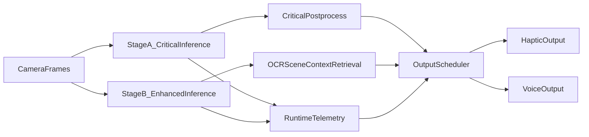

# MaxSight Critical Runtime Boundary Specification

## Purpose
Define strict runtime boundaries so non-critical capabilities never block or degrade safety-critical outputs.

This is the production contract between model, scheduler, and delivery channels.

## Safety Principle
Critical path must always produce hazard-aware outputs within latency budget, even when all secondary systems are degraded or unavailable.

## Runtime Partition

## Critical Path (Must Always Run)
- Stage A backbone + core detection outputs.
- Urgency, distance zone, directional cue extraction.
- Critical event generation (hazard present, approaching, immediate obstacle).
- Output scheduler emergency channel logic.
- Voice/haptic output dispatch for critical events.

Mapped anchors:
- `ml/models/maxsight_cnn.py` (Stage A and core heads).
- `ml/utils/output_scheduler.py` (priority/rate/uncertainty behavior).

## Secondary Path (Must Never Block Critical)
- OCR and text reading.
- Scene summaries.
- Retrieval/context enrichment.
- Social/context non-urgent narratives.

Secondary path can be:
- Skipped under load.
- Delayed.
- Disabled per policy.

## Hard Isolation Rules
1. Critical inference and postprocess execute on reserved budget and thread/queue path.
2. Scheduler always reserves output slots for critical alerts.
3. Secondary outputs are preempted when critical alerts are active.
4. Uncertainty suppression never suppresses critical hazards.
5. Secondary path failures cannot throw exceptions that interrupt critical loop.

## Latency and Budget Contracts

| Contract | Target |
|---|---|
| Critical path median latency | <= 350 ms |
| Critical path p95 latency | <= 600 ms |
| Secondary path hard budget per frame | Opportunistic only; skip if critical budget threatened |
| Scheduler minimum emergency dispatch interval | Immediate bypass allowed for emergency |
| Normal cross-channel interval | >= 300 ms (current scheduler baseline) |

## Degraded Modes

| Mode | Trigger | Behavior |
|---|---|---|
| D0 Normal | Budgets healthy | Critical + secondary active |
| D1 High load | Critical p95 nearing limit | Reduce secondary verbosity, skip retrieval |
| D2 Safety lock | Repeated budget violations | Disable secondary path; critical-only outputs |
| D3 Fault containment | Secondary component faults | Isolate failing module; keep critical loop alive |

## Output Policy
- Priority levels map to explicit output policy:
  - P0 emergency: immediate haptic + short voice warning.
  - P1 warning: high-priority channel, rate-limited.
  - P2 advisory: queued only when safe budget available.
- Alert deduplication required to prevent repetitive spam.
- Direction and urgency should remain concise and actionable.

## API/Event Contract (Runtime)
Critical events must include:
- `event_type` (hazard/obstacle/curb/vehicle/etc.).
- `urgency` (safe/caution/warning/danger).
- `direction` (left/center/right).
- `distance_zone` (near/medium/far) or `distance_meters`.
- `timestamp_source` and `timestamp_emit`.
- `confidence` and `uncertainty`.

Secondary events must include:
- `event_type` (ocr/summary/findability/social_context).
- `preemptible=true`.

## Failure Handling Requirements
- Fail-open for critical sensing path; fail-closed for non-critical enrichment.
- If any secondary module throws or times out, emit telemetry, disable module, continue critical loop.
- If critical model output is unavailable, emit explicit fallback warning state (never silent success).

## Test Requirements
- Load-test with secondary features enabled and verify critical latency/recall unchanged.
- Fault injection on OCR/retrieval and verify critical path continuity.
- Uncertainty stress test to confirm critical alerts bypass suppression.
- Scheduler stress test for overload and emergency preemption.

## Implementation Checklist
- Separate execution queues for critical and secondary pipeline segments.
- Add explicit guard in scheduler for critical bypass behavior.
- Add health-state machine to switch D0/D1/D2/D3 modes.
- Record per-stage timing and critical event SLA compliance in telemetry.
